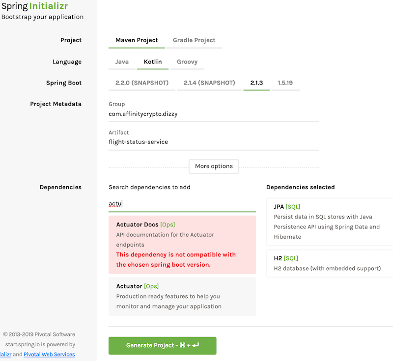
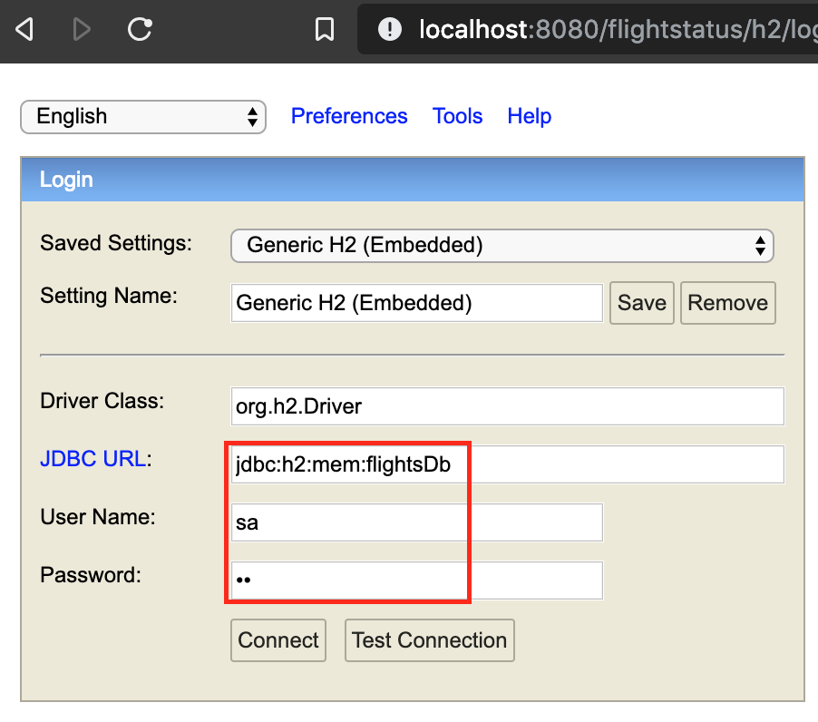
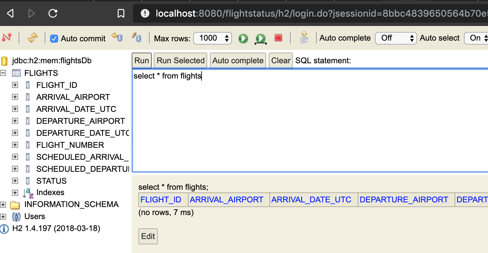
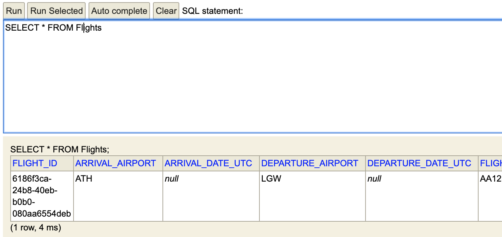

## Introductions


> Photo by Meg Kannan on Unsplash

I like [Spring][1].  
I like [Kotlin][2]. 
I like how the 2 [can work together][6].

This post could have ended here and I would be happy.

However there would not be much value, other than demonstrating a 
bad [spartan][3] approach to posting. 

Perhaps showing a simple showcase of how to get up and running with both
would be better :-) 

First a quick intro:

[SpringBoot][4] (SB) is a framework on top of the Spring framework.  
What this lame sentence<sup>haven't read it, all lameness is mine</sup> means 
is that SB is not something new in terms of dependency injection and the like.  
Instead, it takes the [convention over configuration][5] approach, setting 
all of Spring's switches and levers to sensible defaults. 

In their own, more eloquent words

> Spring Boot makes it easy to create stand-alone, production-grade Spring based Applications that you can "just run".
>  
>  We take an opinionated view of the Spring platform and third-party libraries so you can get started with minimum fuss. Most Spring Boot applications need very little Spring configuration.
>  
>  **Features**
>  * Create stand-alone Spring applications
>  * Embed Tomcat, Jetty or Undertow directly (no need to deploy WAR files)
>  * Provide opinionated 'starter' dependencies to simplify your build configuration
>  * Automatically configure Spring and 3rd party libraries whenever possible
>  * Provide production-ready features such as metrics, health checks and externalized configuration
>  
>  Absolutely no code generation and no requirement for XML configuration 

Kotlin has been around for a number of years now.  
A product of [JetBrains][7], it builds upon a number of lessons learnt 
over years of Java experience. What this means is that it has been created
as a natural evolution of Java, both syntactically as well as at the 
runtime library level. This makes it a breeze to work with when coming 
from a Java development background.  
Since it compiles to JVM bytecode, it can utilize existing Java libraries.  
Which is exactly our case here.

The one issue I encountered while working with Kotlin and SB, was settling
down on a configuration which works.

SB evolves fast.  
Kotlin evolves fast.  
JetBrains and Pivotal are both thankfully much faster than the [JCP][8] 
resulting in [compounding effects][9]. This also results in online articles and 
how-to guides becoming stale much faster. 

Enter [Spring Initializr][10]. 
<!--more-->

*Note*:  
All the code of this post can be found [in this repo][26].  
All unit & integration testing code is not referenced in this post.

## Setting things up


> Photo by Arget on Unsplash

Initializr is a god-send. 

Are you starting a new multi-month, enterprise project? Initializr.  
Are you doing a pair-programming interview and you are under extreme 
time-pressure? Initializr.  

It is [available online][11], ready to be used.



A couple of values typed and you can download the zipped project.

Even better, you can hit a REST endpoint and download from the command line.

```
curl https://start.spring.io/starter.tgz \
  -d groupId=com.affinitycrypto.dizzy \
  -d artifactId=flight-status-service \
  -d version=0.0.1 \
  -d name=FightStatus \
  -d description='Dizzy System - Flight Status service' \
  -d packageName=com.affinitycrypto.dizzy.flightstatus \
  -d dependencies=web,actuator,h2,data-jpa \
  -d language=kotlin \
  -d type=maven-project \
  -d baseDir=flight-status-service \
  | tar -xzvf -
```

Very handy indeed!

## Let's add some stuff


> Photo by Gary Lopater on Unsplash

### End goal

I want to create a simple m/s, which implements a tiny sliver of the 
[FlightStats REST API][11].

The functionality outline: 
* Exposes something naively resembling the [/route/status][12] endpoint. 
This will give a reader the status of the flight(s) of interest. It will
be a `GET /api/v1/flights/{departureAirport}/{arrivalAirport}/dep/{year}/{month}/{day}`.
* Has a `POST /api/v1/flights` endpoint allowing the update of the status(es).  
When creating/updating a flight apply some common-sense validation checks 
(arrival time > departure, when changing status update the relevant times, 
once a flight is landed/canceled cannot update anymore,...)
* Has a simple in-memory DB to keep track of things.

To keep things super-simple: 
* All times are in UTC
* Only storing airport's [IATA code][23], no other info
* No conversion to local time at any point (which would require storing 
airport timezone etc)

### Libraries

If you used the above cURL verbatim then you will have a Maven project with
* [Spring Web][13] which gets us Tomcat, all things REST and validation 
* [Spring Boot Testing][20] 
* [H2 SQL][14] as a no-frills, single-instance relational DB
* [Spring Data JPA][15] for ORM
* [Spring Actuator][16] for PROD utility endpoints
* the Kotlin and SB build plugins correctly configured, so that the 
generated Kotlin classes [become non-final][17].  

If you already have a correctly configured local Maven environment, 
(pointing to your mirror etc) you may want to remove the `repositories` 
and `pluginRepositories` section at the end of `pom.xml`.

The only changes I am doing are to 
* bump Kotlin to the latest version<sup>as of writing this</sup> 
* add [Springfox][27] for Swagger doc generation (unfortunately, not yet
part of Spring proper)
* add the [RestAssured][18] library for integration testing

<details>
<summary><b>Updates to `pom.xml`</b></summary>
<p>

```xml
    <properties>
    ...
        <kotlin.version>1.3.11</kotlin.version>
    </properties>

    <dependencyManagement>
    ...
        <dependencies>
            <dependency>
                <groupId>io.rest-assured</groupId>
                <artifactId>rest-assured</artifactId>
                <version>3.3.0</version>
            </dependency>
            <dependency>
                <groupId>io.springfox</groupId>
                <artifactId>springfox-swagger2</artifactId>
                <version>2.9.2</version>
            </dependency>
        </dependencies>
    </dependencyManagement>

    <dependencies>
    ...
        <dependency>
            <groupId>io.springfox</groupId>
            <artifactId>springfox-swagger2</artifactId>
        </dependency>
        <dependency>
            <groupId>io.rest-assured</groupId>
            <artifactId>rest-assured</artifactId>
            <scope>test</scope>
        </dependency>
    </dependencies>
```
</p>
</details>

### Properties

Let's add some basic configuration by editing `src/main/resources/application.properties`.

<details>
<summary><b>Additions to `application.properties`</b></summary>
<p>

```properties
# Spring's logging can be useful to trouble-shoot things 
logging.level.org.springframework=INFO

# URI base-path 
server.servlet.context-path=/flightstatus

# Enable H2's web console
spring.h2.console.enabled=true
spring.h2.console.path=/h2

# Datasource settings
#   In-memory db, UTC timezone
spring.datasource.url=jdbc:h2:mem:flightsDb;DB_CLOSE_DELAY=-1
spring.datasource.username=sa
spring.datasource.password=sa
spring.datasource.driver-class-name=org.h2.Driver
spring.jpa.properties.hibernate.jdbc.time_zone=UTC

# Actuator settings
info.app.name=Flight Status
info.app.description=Dizzy System - Flight Status service
info.app.version=0.0.1
```
</p>
</details>


Normally we would use the `spring.jpa.properties.hibernate.jdbc.time_zone` 
to change the timezone for all datetim operations.  
However, this [does not seem to work as expected][21]; we need a short
one-liner in the main class to fix it.

<details>
<summary><b>Update main class</b></summary>
<p>

```kotlin
@SpringBootApplication
class FightStatusApplication {
                             
    @PostConstruct
    fun started() {
        TimeZone.setDefault(TimeZone.getTimeZone("UTC"))
    }
}
```
</p>
</details>


Let's see what we have so far.<sup>Output formatted for readability</sup>

<details>
<summary><b>Running - Hitting Actuator</b></summary>
<p>

```
$ mvn spring-boot:run
...
many lines of output later
...
$ curl http://localhost:8080/actuator
{
  "_links": {
    "self": {
      "href": "http://localhost:8080/actuator",
      "templated": false
    },
    "health-component": {
      "href": "http://localhost:8080/actuator/health/{component}",
      "templated": true
    },
    "health-component-instance": {
      "href": "http://localhost:8080/actuator/health/{component}/{instance}",
      "templated": true
    },
    "health": {
      "href": "http://localhost:8080/actuator/health",
      "templated": false
    },
    "info": {
      "href": "http://localhost:8080/actuator/info",
      "templated": false
    }
  }
``` 
</p>
</details>

Great!  
Actuator is up and running.


If we create all the remaining components of the service in sub-packages
under `FightStatusApplication`, then SpringBoot will auto-detect everything
automatically.  
I.e. if we have `com.foo.FightStatusApplication`, then placing all our 
remaining Spring components (services, validators, DTOs, controllers,...)
in sub-packages (`com.foo.model`, `com.foo.service` etc), SB will create
the Spring context automatically. 

### Domain model

Kotlin [data classes][22] are THE way to create DTOs.  
In the Java world we would be using the [Lombok Data annotation][24] to 
achieve the same result. 

Let's create something which looks remotely plausible as a store of a 
flight's info.

<details><summary><b>FlightStatus data class</b></summary>
<p>

```kotlin
enum class StatusIndicator {
    Active,
    Canceled,
    Diverted,
    Landed,
    Redirected,
    Scheduled
}

@Entity
@Table(
        name = "Flights",
        uniqueConstraints = [
            UniqueConstraint(
                    name = "singleFlightEachDay",
                    columnNames = [
                        "flightNumber",
                        "departureAirport",
                        "arrivalAirport",
                        "scheduledDepartureDateUtc",
                        "scheduledArrivalDateUtc"
                    ])
        ]
)
data class FlightStatus(
        @Id
        val flightId: String = UUID.randomUUID().toString(),
        
        @Length(min = 3) val flightNumber: String = "",
        
        @Length(min = 3) val departureAirport: String = "",

        @Length(min = 3) val arrivalAirport: String = "",

        @JsonProperty("scheduledDeparture")
        val scheduledDepartureDateUtc: ZonedDateTime = ZonedDateTime.now(),

        @JsonProperty("departure")
        val departureDateUtc: ZonedDateTime? = null,

        @JsonProperty("scheduledArrival")
        val scheduledArrivalDateUtc: ZonedDateTime = ZonedDateTime.now(),

        @JsonProperty("arrival")
        val arrivalDateUtc: ZonedDateTime? = null,

        val status: StatusIndicator = StatusIndicator.Scheduled
)
```
</p>
</details>


I have added
* the `@Table` mapping with a multi-column uniqueness constraint
* basic validations on some fields to be executed in the web controller on bind
* some custom JSON deser field names
* several fields as nullable, since the 'record' will start its life 
partially initialized. Another approach could have been to initialize all 
fields to default marker values.

Let's create a CRUD JPA `Repository` having our custom query.  
On the back of the REST endpoint parameters, the query is filtering by  
* departure airport
* arrival airport
* departure calendar date, essentially `DAY@00:00:00.000 <= X <= DAY@23:59:59.999`

<details><summary><b>FlightStatus JPA Repository</b></summary>
<p>

```kotlin
interface FlightStatusRepository : CrudRepository<FlightStatus, String> {

    @Query("""SELECT f FROM FlightStatus f
            WHERE
                f.departureAirport = :depAir
            AND f.arrivalAirport = :arrAir
            AND f.scheduledDepartureDateUtc <= :depEnd
            AND f.scheduledDepartureDateUtc >= :depBegin""")
    fun findScheduledFlights(
            @Param("depAir")departureAirport: String,
            @Param("arrAir")arrivalAirport: String,
            @Param("depBegin")scheduledDepartureDateBeginUtc: ZonedDateTime,
            @Param("depEnd")scheduledDepartureDateEndUtc: ZonedDateTime) : List<FlightStatus>
}
```
</p>
</details>


...and the DTO validator.  
I have added some common-sense validations for good measure; needless to
say this is just a quasi-realistic example.

<details><summary<b>FlightStatusValidator</b></summary>
<p>

```kotlin
@Component
class FlightStatusValidator : Validator {

    companion object {
        @JvmStatic val CODE_AIRPORT_SAME_VALUE = "dizzy.status.airport.sameValue"
        @JvmStatic val CODE_SCHEDULED_ARRIVAL_TOO_SOON = "dizzy.status.scheduledArrival.tooSoon"
        @JvmStatic val CODE_SCHEDULED_ARRIVAL_BEFORE_DEPARTURE = "dizzy.status.scheduledArrival.beforeScheduledDeparture"
        @JvmStatic val CODE_ARRIVAL_BEFORE_DEPARTURE = "dizzy.status.arrival.beforeDeparture"
        @JvmStatic val CODE_ARRIVAL_TOO_SOON = "dizzy.status.arrival.tooSoon"
        @JvmStatic val CODE_STATUS_MISSING_DATES = "dizzy.status.missingDatesForStatus"
        @JvmStatic val CODE_STATUS_CANCELED_HAS_DATES = "dizzy.status.canceledHasDates"
    }

    override fun validate(target: Any, errors: Errors) {
        val flight = target as FlightStatus

        with(flight) {
            if (arrivalAirport == departureAirport) {
                errors.rejectValue(
                        "arrivalAirport",
                        CODE_AIRPORT_SAME_VALUE,
                        "Arrival and Departure airports must be different")
            }

            if (abs(ChronoUnit.HOURS.between(scheduledDepartureDateUtc, scheduledArrivalDateUtc)) < 1) {
                errors.rejectValue("scheduledArrivalDateUtc", CODE_SCHEDULED_ARRIVAL_TOO_SOON,
                        "Scheduled departure and arrival times must differ by at least 1 hour")
            }

            if (scheduledArrivalDateUtc!!.compareTo(scheduledDepartureDateUtc) < 1) {
                errors.rejectValue("scheduledArrivalDateUtc",
                        CODE_SCHEDULED_ARRIVAL_BEFORE_DEPARTURE,
                        "Scheduled arrival must not be before scheduled departure")
            }

            if (arrivalDateUtc != null && departureDateUtc != null
                    && arrivalDateUtc!!.compareTo(departureDateUtc) < 1) {
                errors.rejectValue("arrivalDateUtc", CODE_ARRIVAL_BEFORE_DEPARTURE,
                        "Actual arrival must not be before departure")
            }

            if (arrivalDateUtc != null && departureDateUtc != null
                    && abs(ChronoUnit.HOURS.between(departureDateUtc, arrivalDateUtc)) < 1) {
                errors.rejectValue("arrivalDateUtc", CODE_ARRIVAL_TOO_SOON,
                        "Actual departure and arrival times must differ by at least 1 hour")
            }

            if (status !in arrayOf(null, StatusIndicator.Active, StatusIndicator.Scheduled, StatusIndicator.Canceled)
                    && (arrivalDateUtc == null || departureDateUtc == null)) {
                errors.rejectValue("status", CODE_STATUS_MISSING_DATES,
                        "Actual departure and arrival times must be defined for this status value")
            }

            if (status == StatusIndicator.Canceled
                    && (arrivalDateUtc == null || departureDateUtc == null)) {
                errors.rejectValue("status", CODE_STATUS_CANCELED_HAS_DATES,
                        "Canceled flight cannot have actual arrival or departure dates")
            }
        }
    }

    override fun supports(clazz: Class<*>): Boolean =
            FlightStatus::class.java.isAssignableFrom(clazz)
}
```
</p>
</details>


### Service 

Trying to isolate the presentation/API layer from the actual persistence
code, let's add a [service class][25]. This will handle the logic and 
transformations of the CRUD operations.  

Again, definitely not ground-breaking code; a simple example of Kotlin.

<details><summary><b>FlightStatusService</b></summary>
<p>

```kotlin
@Service
class FlightStatusService(
        private val repository: FlightStatusRepository,
        private val validator: FlightStatusQueryValidator) {

    private val log = LoggerFactory.getLogger(FlightStatusService::class.java)

    fun getFlights(criteria: FlightStatusQuery): List<FlightStatus> {

        validate(criteria)
        
        log.debug("Searching for flights ", criteria)
        val dateEnd = ZonedDateTime.of(
                criteria.scheduledDepartureDateUtc.year,
                criteria.scheduledDepartureDateUtc.monthValue,
                criteria.scheduledDepartureDateUtc.dayOfMonth,
                23,
                59,
                59,
                999999,
                ZoneId.of("UTC"))
        val dateBegin = ZonedDateTime.of(
                criteria.scheduledDepartureDateUtc.year,
                criteria.scheduledDepartureDateUtc.monthValue,
                criteria.scheduledDepartureDateUtc.dayOfMonth,
                0,
                0,
                0,
                0,
                ZoneId.of("UTC"))
        return repository.findScheduledFlights(
                departureAirport = criteria.departureAirport,
                arrivalAirport = criteria.arrivalAirport,
                scheduledDepartureDateBeginUtc = dateBegin,
                scheduledDepartureDateEndUtc = dateEnd
        )
    }

    fun addFlight(flight: FlightStatus): FlightStatus {
        log.info("Inserting flight:", flight)
        val toAdd = flight.copy(
                flightId = UUID.randomUUID().toString(),
                scheduledArrivalDateUtc = flight.scheduledArrivalDateUtc.truncatedTo(ChronoUnit.MINUTES),
                scheduledDepartureDateUtc = flight.scheduledDepartureDateUtc.truncatedTo(ChronoUnit.MINUTES),
                departureDateUtc = flight.departureDateUtc?.let { it.truncatedTo(ChronoUnit.MINUTES) },
                arrivalDateUtc = flight.arrivalDateUtc?.let { it.truncatedTo(ChronoUnit.MINUTES) }
        )
        repository.save(toAdd)
        return toAdd
    }

    fun updateFlight(flight: FlightStatus): FlightStatus {
        log.info("Updating flight: ", flight.flightId)
        // make sure id exists
        val toUpdate = repository.findById(flight.flightId)
                .orElseThrow { EntityNotFoundException("Unknown flight id:" + flight.flightId) }
        // make sure we can update
        if (toUpdate.status !in arrayOf(null, StatusIndicator.Active, StatusIndicator.Scheduled)) {
            throw IllegalArgumentException("Cannot update flight with status " + toUpdate.status)
        }
        // update fields
        with(toUpdate) {
            repository.save(
                    toUpdate.copy(
                            status = flight.status,
                            departureDateUtc = flight.departureDateUtc?.let { it.truncatedTo(ChronoUnit.MINUTES) },
                            arrivalDateUtc = flight.arrivalDateUtc?.let { it.truncatedTo(ChronoUnit.MINUTES) }
                    )
            )
        }
        return toUpdate
    }

    private fun validate(criteria: FlightStatusQuery) {
        val err = BindException(criteria, "criteria")
        validator.validate(criteria, err)
        if (err.hasErrors()) {
            throw err
        }
    }
}
```
</p>
</details>

The service takes a smaller DTO with the query params. I have defined this 
as a separate class, with its own validator (omitted for brevity). 

### Controller

Continuing in this bottom-up approach of building the microservice, we 
have the REST controller.  
The class has the standard Spring annotations to mark it as request 
controller and enable bind validation.
 
<details><summary><b>FlightStatusController</b></summary>
<p>

```kotlin
@RestController
@RequestMapping("/api/v1/flights",
        consumes = [APPLICATION_JSON_VALUE],
        produces = [APPLICATION_JSON_VALUE])
@Validated
class FlightStatusController(
        private val service: FlightStatusService
) {

    private val log = LoggerFactory.getLogger(FlightStatusController::class.java)

    @GetMapping("/{departureAirport}/{arrivalAirport}/dep/{year}/{month}/{day}")
    fun flightStatus(
            @Length(min = 3) @PathVariable("departureAirport", required = true) depAirport: String,
            @Length(min = 3) @PathVariable("arrivalAirport", required = true) arrAirport: String,
            @PathVariable("year", required = true) year: Int,
            @Max(12) @PathVariable("month", required = true) month: Int,
            @Max(31) @PathVariable("day", required = true) day: Int
    ): List<FlightStatus> {

        val criteria = FlightStatusQuery(
                departureAirport = depAirport,
                arrivalAirport = arrAirport,
                scheduledDepartureDateUtc = ZonedDateTime.of(year, month, day, 0, 0, 0, 0, ZoneId.of("UTC"))
        )

        val flights = service.getFlights(criteria)
        log.info("Found {} matching flights", flights.size)
        return flights
    }

    @PostMapping
    fun addFlight(@Valid @RequestBody flight: FlightStatus): FlightStatus {

        return service.addFlight(flight)
    }

    @PutMapping
    fun updateFlight(@Valid @RequestBody flight: FlightStatus): FlightStatus {

        return service.updateFlight(flight)
    }

    @ExceptionHandler(ConstraintViolationException::class, BindException::class, DateTimeException::class)
    @ResponseStatus(HttpStatus.BAD_REQUEST)
    fun handleConstraintViolationException(e: Exception): ResponseEntity<String> {
        return ResponseEntity(e.message, HttpStatus.BAD_REQUEST)
    }
}
```
</p>
</details>

The controller also defines a `POST` and `PUT` endpoint to allow creation
and update of flight info. 

## Running it

Let's tie everything together.  
Fire up the microservice: `mvn spring-boot:run`

First, let's see our little DB in action.  
We have enabled the web console in our properties `spring.h2.console.enabled=true`, 
so we can connect our browser `http://localhost:8080/flightstatus/h2`.  
Type the same connection details as in the `application.properties`.



We can see our table and we can quickly fire off a SELECT query.



Very good!

Let's add some data

<details><summary><b>POSTing data with cURL</b></summary>
<p>

```
$ printf "%s" "
{  \"flightNumber\": \"AA123\",
    \"departureAirport\": \"LGW\",
    \"arrivalAirport\": \"ATH\",
    \"scheduledDeparture\": \"2019-03-23T19:45:00Z\",
    \"scheduledArrival\": \"2019-03-24T20:05:00Z\"
}" | curl \
   -H "Content-Type: application/json" \
   -X POST \
   -d @- \
   http://localhost:8080/flightstatus/api/v1/flights

```
</p>
</details>

We get back the initialized object as a response. 

Let's check our DB



Great!

We can now retrieve our object  
```
curl \
   -H "Content-Type: application/json" \
   http://localhost:8080/flightstatus/api/v1/flights/LGW/ATH/dep/2019/03/23
```

...and update it (or cause a validation error, as the example below will).  
```
$ printf "%s" "
{   \"flightId\": \"a633be3d-fb79-4cd1-8f38-410fd628104b\",
    \"flightNumber\": \"AA123\",
    \"departureAirport\": \"LGW\",
    \"arrivalAirport\": \"ATH\",
    \"scheduledDeparture\": \"2019-03-23T19:45:00Z\",
    \"scheduledArrival\": \"2019-03-24T20:05:00Z\",
    \"arrival\": \"2019-03-23T19:45:00Z\"
}" | curl \
   -H "Content-Type: application/json" \
   -X PUT \
   -d @- \
   http://localhost:8080/flightstatus/api/v1/flights
```


   [1]: https://spring.io/projects
   [2]: https://kotlinlang.org/
   [3]: https://dictionary.cambridge.org/dictionary/english/spartan
   [4]: https://spring.io/projects/spring-boot
   [5]: https://en.wikipedia.org/wiki/Convention_over_configuration
   [6]: https://kotlinlang.org/docs/tutorials/spring-boot-restful.html
   [7]: https://www.jetbrains.com/
   [8]: https://en.wikipedia.org/wiki/Java_Community_Process
   [9]: https://www.investopedia.com/walkthrough/corporate-finance/3/discounted-cash-flow/compounding.aspx
   [10]: https://github.com/spring-io/initializr/
   [11]: https://developer.flightstats.com/api-docs/
   [12]: https://developer.flightstats.com/api-docs/flightstatus/v2/route 
   [13]: https://docs.spring.io/spring/docs/current/spring-framework-reference/web.html
   [14]: http://www.h2database.com/html/main.html
   [15]: https://spring.io/projects/spring-data-jpa
   [16]: https://docs.spring.io/spring-boot/docs/current/reference/html/production-ready.html
   [17]: https://www.baeldung.com/kotlin-allopen-spring 
   [18]: http://rest-assured.io/
   [20]: https://docs.spring.io/spring-boot/docs/current/reference/html/boot-features-testing.html
   [21]: https://moelholm.com/2016/11/09/spring-boot-controlling-timezones-with-hibernate/
   [22]: https://kotlinlang.org/docs/reference/data-classes.html
   [23]: https://en.wikipedia.org/wiki/IATA_airport_code
   [24]: https://projectlombok.org/features/Data
   [25]: https://en.wikipedia.org/wiki/Service_layer_pattern
   [26]: https://www.github.com/sgerogia/flight-status
   [27]: https://springfox.github.io/springfox/docs/current