In this article I will cover the basics of deploying and using an ERC-721 contract, a.k.a. a non-fungible token or NFT.

If you just landed on this article (and are new to Solidity programming), I would suggest that you take a look at my 2 
other introductory blog posts: [Hello Ganache][13] and [Hello Truffle][14].  
They will help you understand some basic concepts and guide through the setup of some basic tools.

# Fungibility (or not)


> Photo by Kyaw Tun on Unsplash

Let's start with the [dictionary][1] definition of fungible    
> 1: being something (such as money or a commodity) of such a nature that one part or quantity may be replaced by another equal part or quantity in paying a debt or settling an account
>    `Oil, wheat, and lumber are fungible commodities.`
> 2: capable of mutual substitution : INTERCHANGEABLE
>    `...the court's postulate that male and female jurors must be regarded as fungible`

So non-fungible is anything which is unique, which cannot be substituted for something equal or identical. A corollary 
of the above is that in most cases non-fungible items cannot be divided in sub-items, e.g. like a euro is sub-divided in 100 cents.

The typical example here is art, where each work is (usually) unique. Another example is property and by extension 
ownership titles. Thinking a bit more widely we can find other non-fungible items, like event admission tickets, 
insurance contracts, fixed percentage fractional ownership, bonds and certain forms of debt,... the list goes on.  
Let our imagination wild, and even personal time is non-fungible: you are unique in the world and so is each [day/hour 
of your life][15].

An astute observer of these quick examples might notice the common theme of scarcity. A non-fungible "thing" is also 
scarce, i.e. there is a fixed supply of it, we cannot make new identical items at will.

## Ethereum's implementation 

[ERC 721][2] is a set of Ethereum smart contract APIs allowing the digital representation of non-fungible assets.  
It is composed of [3 interfaces][3]:  
* the core ERC 721 interface  
Allows for transfers of tokens between addresses (and optional approvals of these transfers)
* the "metadata" extension (optional)  
Defines a name and, most importantly, an external URL from where a client can retrieve a metadata JSON document.
* the "enumeration" extension (optional)  
The NFT contract can maintain a full list of issued NFTs, tracking their current owner.

The reference (and "gold standard") implementation of ERC 721 is [OpenZeppelin][4]; we will base our implementation on it.
The latest implementation of the OpenZeppelin contracts at the time of writing this is [4.0][5]. 

# The idea


> Photo by Kelly Sikkema on Unsplash

Let's keep things simple.  

The NFT will represent an 8-bit colour, and... that's it!  
What can be scarcer, more unique and more desirable to acquire than 256 colour codes?! Each token will:  
* have a global `id` corresponding to the [XTerm color id][6] <sup>[1](#footnote_1)</sup>, 
* a `name` corresponding to the same XTerm mapping, and
* a free text `title`, configurable on initial minting. 

The contract itself will pre-mint a few tokens in advance and assign them to the contract owner.  
Anyone can claim an unminted token (color) from their wallet; they will need to pay the knock-down price of 0.01 ETH 
(10000000 gwei) for the privilege.  
Once they own the token, they are able to ["hodl to the moon"][8] or trade in a NFT marketplace.

We will also create 2 simple Node apps, for better user experience:  
* a server-side to provide the token's metadata, and
* a client-side [dApp][18] to allow anyone to claim and purchase a yet-unclaimed token.

# The project 

The project is an adaptation and simplification from [the Kie codes][31] channel. All credits go to him. 

The contract itself was created using the [OpenZeppelin wizard][32]. The color picker at the heart of the client 
application is the easy-to-use [react-color][33]. 

You can get it ready-to-run as a Truffle box. Run the following command in a new folder.  
```
truffle unbox sgerogia/hello_nft_box
```

# Building and testing
<a name="building"></a>

Let's start by compiling the contracts. Open a terminal in the unboxed project's folder and... 
```truffle compile```  
  
We can see a number of contracts in the output; these are the OpenZeppelin base contracts we inherit from. 

Let's run the contract test suite. If you have created a [CoinMarketCap API key][27], use it here; otherwise omit it 
from the command.  
```COINMARKETCAP_API_KEY=<YOUR_KEY> truffle test```  
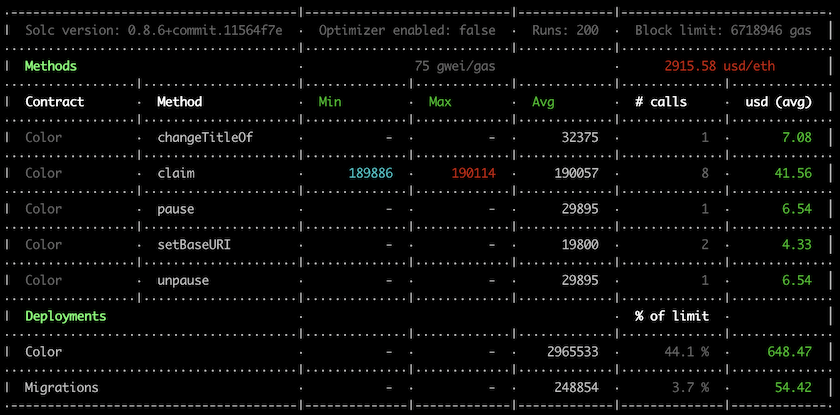
The [eth-gas-reporter plugin][12] gives us a nice cost report of all contract operations invoked in the test suite. 
We can control the cost with the [`optimizer` setting][9], to an extent. Changing to `false` 
and repeating the test, we can see there is a tangible difference in cost.  
  
The cost ramifications of contract code complexity is a recurring pattern in Solidity programming. In business terms, 
this is a true   

# Manual interaction 
<a name="interaction"></a>

Before anything else, follow the steps in the [annex](#metamask) to install Metamask and connect it to Ganache.

We start by deploying the contract.  
```truffle migrate --network ganache```  
Take a note of the `Color` contract address in the terminal.  


<a name="add_token"></a>We now need to make Metamask "aware" of our NFT token.  
Connected to the `Ganache` network and with the 1st Ganache account in scope, we add a new token.  
  
Pasting the contract address auto-populates the token name. When we click "Next"...  
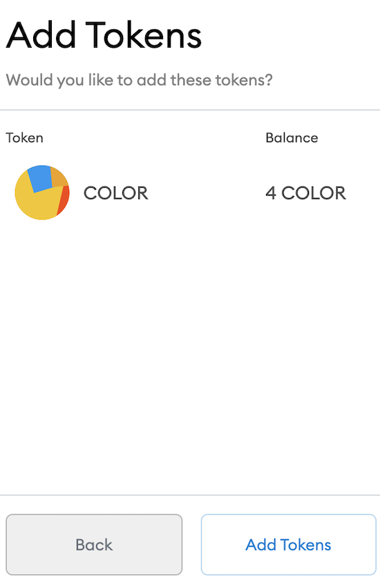  
we can see the first 4 colors. Remember that these were auto-minted on contract creation and belong to the contract 
deployer (by default, the first Ganache account).  
Pretty cool!

Open a Truffle console to mint a few more COLORs (`truffle console --network ganache`).  

Let's start by trying to get one for free from our 2nd Ganache account. Type the following into the Truffle console  
```
Color.deployed().then(function(instance) {colorApp = instance;})
colorApp.claim(6, "Real Teal", "This is the really real Teal!", {from: accounts[1]})
```  
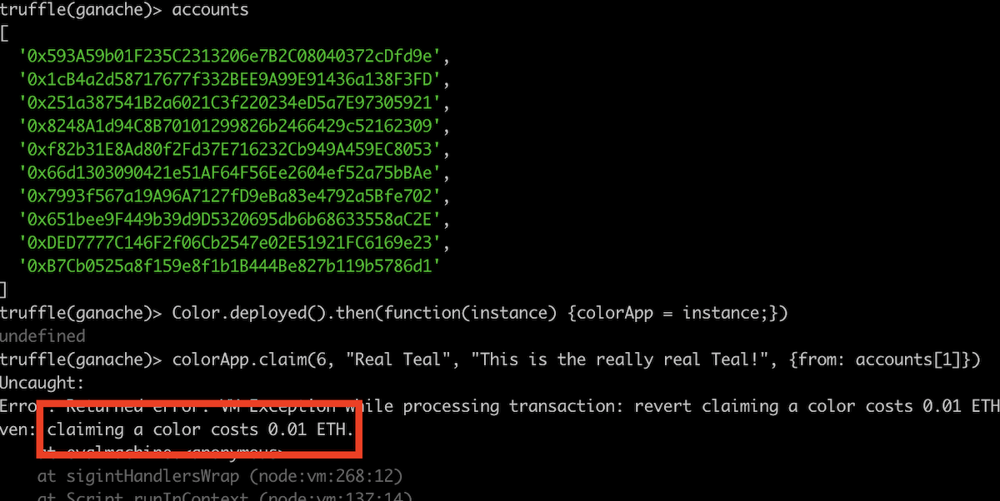  
The call fails due to the [check inside the `claim` method][10].

Repeating with the correct amount gives us a valid transaction.  
```
colorApp.claim(6, "Teal Teal Teal", "How real do you feel color Teal?", {from: accounts[1], value: web3.utils.toWei("0.01", "ether")})
```  
  
[Adding the COLOR NFT](#add_token) to the 2nd Metamask account, shows us that we have successfully purchased the token.
<sup>[2](#footnote_2)</sup>   


Let's try to double-claim a token from another account.  
```
colorApp.claim(6, "YOLO Teal", "I love Teal and I will steal it!", {from: accounts[2], value: web3.utils.toWei("0.01", "ether")})
```  
  
As expected, the contract enforces uniqueness.

# Using the app to view metadata 

It's now time to use our React Javascript app to give some better user experience.

Start by running the utility script from the top-level project folder.  
```
./scripts/compile.sh
```  
  
It copies the compiler's JSON output to the React apps' folders. This will allow the [Web3 client][16] to create a 
contract client instance, using the ABI.

Now it's time to run our metadata server. Copy the local contract address to the below command, inside the `app` directory.   
```
NETWORK=ganache CONTRACT_ADDRESS=<local contract address> npm run start
```  
  
The server starts and listens on port `8080`. 

Let's manually call the metadata endpoint for a token we minted previously (in a browser's address bar or using `curl`).  
```
http://localhost:8080/token/6
```  
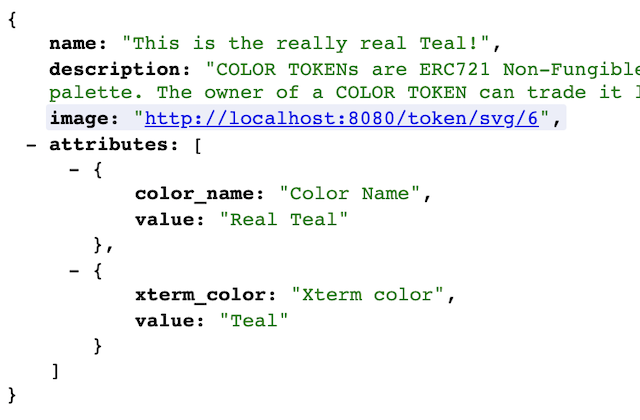  
We can see the information JSON returned as per the [EIP 721 schema][17]. In our case we return a combination of information 
retrieved from the contract and generated on-the-fly by the Node.js application. There is also an additional `attributes` 
key-value enumeration, supported by [OpenSea][18]. We will have a chance to see this in action in a minute.  

With our server still running, let's launch our client and connect it to our Metamask. Inside `app/client` let's run  
```
REACT_APP_API_BASE_URL=http://localhost:8080 REACT_APP_CONTRACT_ADDRESS=<Ganache contract address> npm start
```  
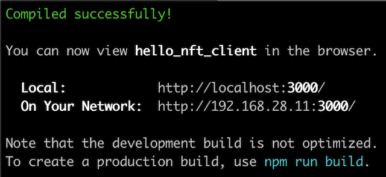
The browser opens and prompts us to allow the dApp to connect to our Metamask accounts.  
  
Tick your Ganache accounts and confirm the connection. Behind the scenes, the dApp is now fully connected to  
1. the contract deployed on our Ganache node (via the env. variables passed as command line arguments), and  
2. our Metamask wallet and the accounts we gave permission to. 

We can now select colors from the palette and see if they are free or taken.  
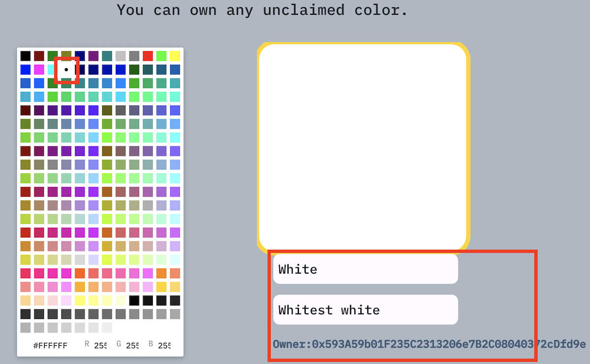  
If a token is already taken, the UI renders a simple SVG (from the JSON metadata) and the token's details (retrieved from the 
NFT contract).We can select any color which has been pre-minted on [contract deployment][19] or we have claimed manually
in the steps above.  
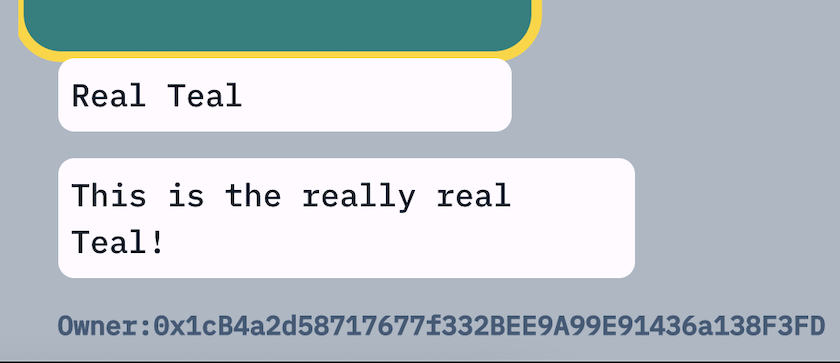

If a token is free, then we can see a claim form.  
  
When we claim, it prompts our current account in Metamask to accept.  
  
When the transaction is complete (i.e. Ganache has mined the new block), we can see the transaction in Metamask...  
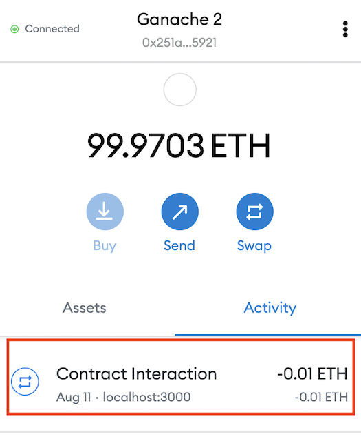  
and our dApp showing the new owner.  
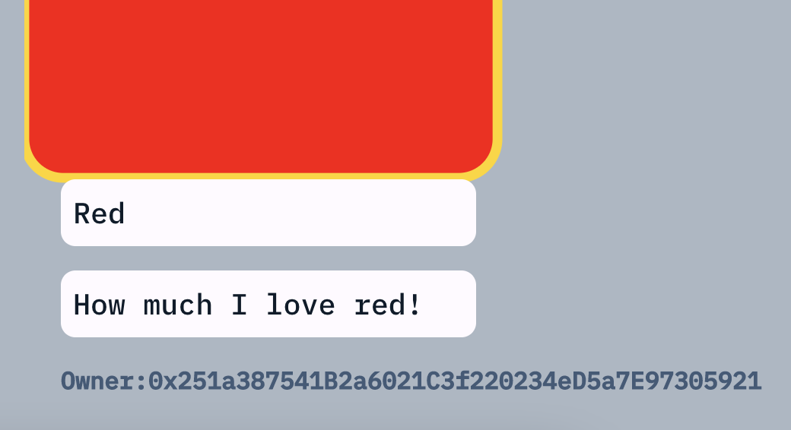

Awesome result!

# Trading on a marketplace


> Photo by Jezael Melgoza on Unsplash

We have achieved a lot in this guide. Let's tackle the ["final boss"][20] before we can deploy our NFT to a live environment,
for real users, with real money at stake.

So far we have been working in our local machine, with Ganache accounts pre-funded with 100 ETH each.  
Let's deploy to the Ethereum [Rinkeby testnet][21], so we can see and trade our NFTs on the testing site of the 
[OpenSea marketplace][22].

We will need to do 5 things:  
* Create an [Infura][23] account, so our code can interact with the public Ethereum networks,
* Fund our Metamask accounts with some Rinkeby ETH,
* Migrate our contract to the Rinkeby network,  
* Deploy our Node application on a public server (in our case Heroku), and
* Add our tokens to OpenSea testnet.

## 1. Infura account

After the straight-forward [registration][24], go to the [Ethereum dashboard][25] and create a new project.  
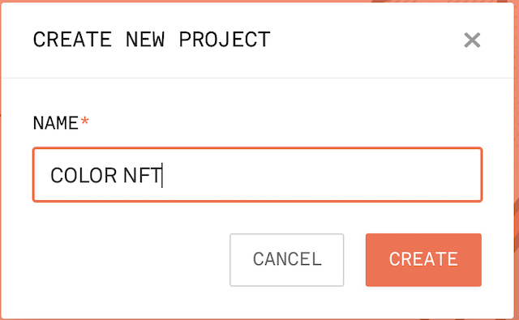  
In the project's settings, we can see make a note of the Rinkeby API link, composed of the project id. Leave security 
checkboxes unchecked for now.  
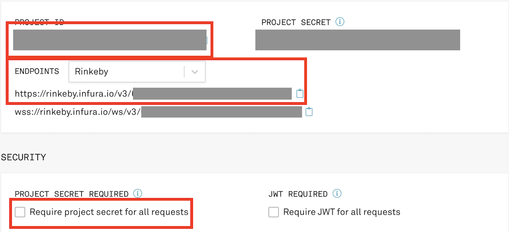

## 2. Rinkeby faucet

What makes testnet ETH worthless is that there is a faucet somewhere ready to hand out newly minted ETH.  
In the case of Rinkeby, the [faucet][26] performs throttling by requiring a verified social media link with the wallet 
address. Use this method to fund one or more of the imported Ganache accounts.  
  
Once done, we can see the Rinkeby balance in our Metamask updated.  


## 3. Migrate to Rinkeby  

In our project, Truffle comes pre-configured with a `rinkeby` provider (LINK to truffle-config). This will read its 
configuration settings from a local `.env` file, which you will create.  
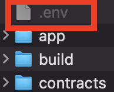      
Inside it add the 2 environment variables for the provider.  
```
INFURA_API_KEY=the Infura Project ID
PRIVATE_KEY=the funded account private key
```  
To export the private key, view the details of one of the Rinkeby-funded Metamask accounts.  
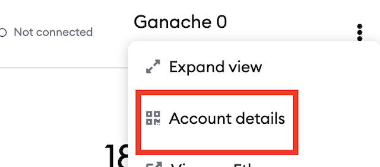  
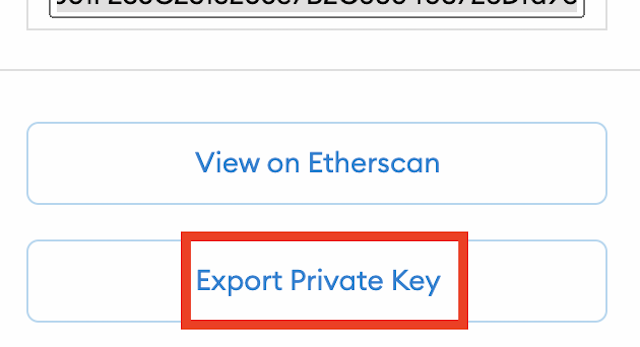

We can now migrate our contract to Rinkeby, using that Metamask account. <sup>[3](#footnote_3)</sup>  
```
truffle migrate --network rinkeby
```  
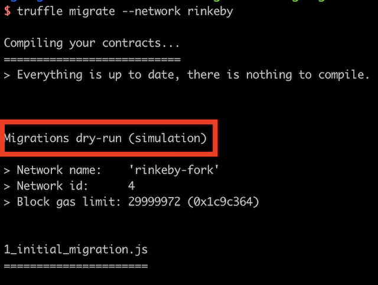  
We have configured Truffle to perform a deployment simulation in the Rinkeby network.  
This gives us the opportunity to kill the process before there are irrevocable changes.  
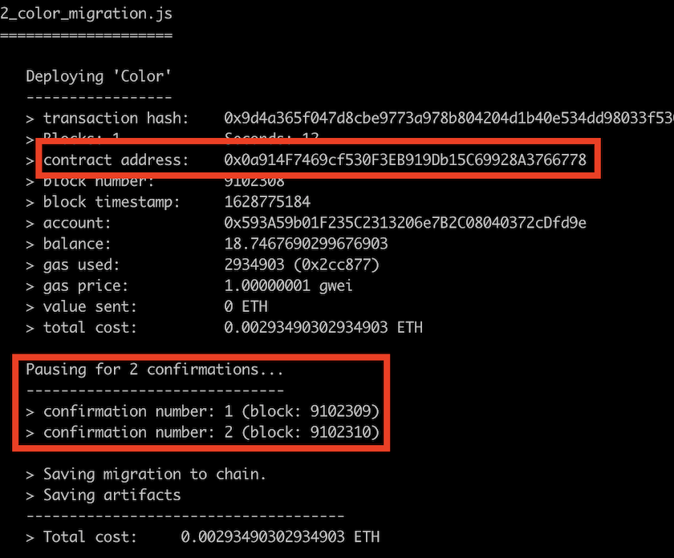  
Note down the contract's address. We can also see that our deployer waits for 2 network confirmations before declaring 
success.

[Adding the COLOR NFT](#add_token) to our Rinkeby deploying account, shows our new COLOR balance.  
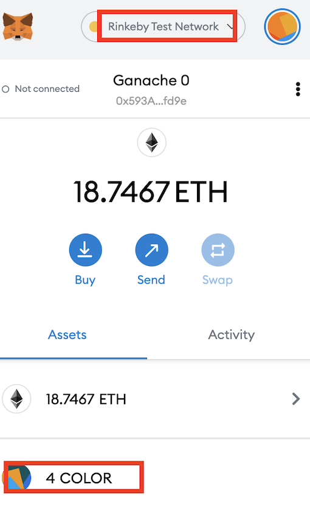

## 4. Deploy to Heroku

Follow the [Annex guide](#heroku) to create a Heroku account and prepare the project for deployment.


# Parting thought

And that's it!  
In this post we got a taste of the Truffle framework and how it facilitates the SDLC of smart contract programming.  


https://betterprogramming.pub/build-a-complete-environment-to-secure-smart-contracts-development-50c1531f32ce

Happy coding!

# Footnotes

1. <a name="footnote_1"></a>In practice the Xterm color list has 9 duplicate color codes (e.g. `#0000ff` has ids 12 and 21).  
   We will omit these in our client-side implementation. This brings the available number of colors to 245. It also opens 
   the way for some "exploits" from the client side (claiming a color id that should not be available).
2. <a name="footnote_2"></a>The observant reader will have noticed that the 2nd argument in the example command (`Teal Teal Teal`)
   does not match the [Xterm canonical color name][6], as we had specified in our instructions. Yet it succeeds.   
   There is a [missing check][11] in the contract, which is left as an exercise to the reader.
3. <a name="footnote_3"></a>Remember: this account will be the owner of the contract in Rinkeby, plus will be "rewarded"
   with the first COLOR NFTs which are auto-minted on deployment.

# Annex 1: Installing Metamask and connecting to Ganache
<a name="metamask"></a>

*This short guide assumes you are starting from scratch.*    
*If you already have Metamask installed, then you can just skim through it.* 

Let's start by installing the Metamask browser extension from the [official website][7].  
* It launches a setup wizard. Create a new wallet.    
  
  
* Your local wallet will be password-protected. Select a phrase.  
  

* Make a note of the recovery phrase; we will need it later on.  
  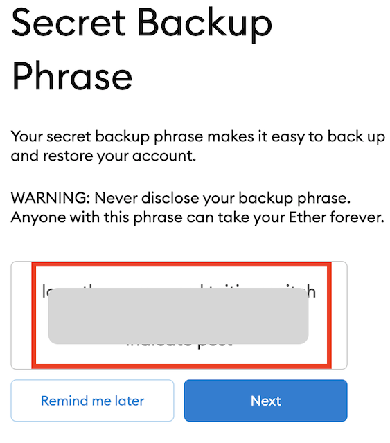  
  You will be asked to confirm your knowledge of the phrase.

* Metamask is now installed in your browser's extensions panel.  
  

* Let's create a connection to our local Ganache instance.  
  At the time of writing this, Metamask can only work with a local network having an id `1337`. In Ganache this can be 
  done by creating a custom workspace.  
  
  ...and setting the id in the "Server" tab.  
  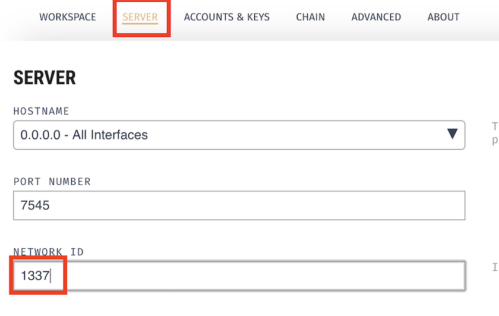  
  Once saved, we can create a new network connection in Metamask  
  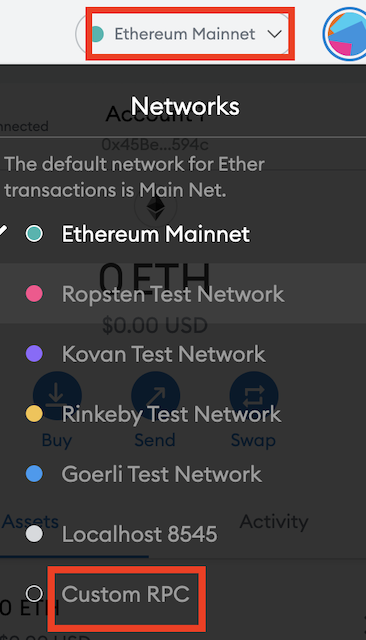  
  ...and add the correct settings.  
  

* Final step is to import the auto-created Ganache accounts in Metamask.  
  Click on the "Accounts" icon and "Import account".  
  

* In Ganache, click the key icon next to an account and copy the private key.  
    
  Paste it into the Metamask box  
  
  ...and give it an appropriate name.  
    
  
* Repeat the import for a few more of the Ganache accounts.  
  

# Annex 2: Creating a Heroku app
<a name="heroku"></a>

*This short guide assumes you are starting from scratch.*    
*If you are already familiar with Heroku, then you can just skim through it.*

* Create a [new account][28] and login on Heroku.

* In the [dashboard][29], create a new app.  
  
  
* In the app's settings, configure the necessary [environment variables][34], namely the smart contract's address and your 
  Infura API key.  
  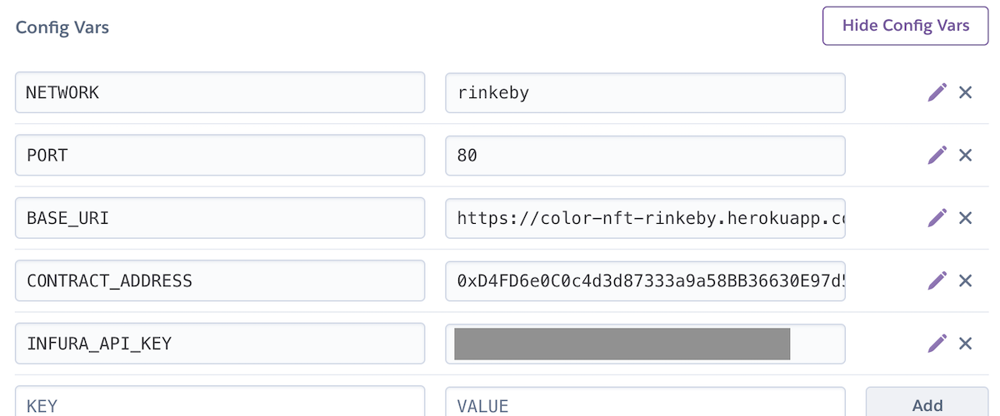

* Install the [Heroku CLI][30] on your machine (e.g. `brew tap heroku/brew && brew install heroku`). 

* In your project's `app` folder (Very important! Not from the top directory) 
```
heroku login
git init
heroku git:remote -a the_name_of_your_heroku_app 
```

* Deploy the code on Heroku by doing a Git commit.  
```
git add .
git commit -m "Some smart comment here"
git push heroku master
```  


* Let's test that the application works, from a browser or `curl`  
```https://color-nft-rinkeby.herokuapp.com/token/0```


  [1]: https://www.merriam-webster.com/dictionary/fungible
  [2]: https://eips.ethereum.org/EIPS/eip-721
  [3]: https://eips.ethereum.org/EIPS/eip-721#specification
  [4]: https://openzeppelin.com/
  [5]: https://docs.openzeppelin.com/contracts/4.x/
  [6]: https://jonasjacek.github.io/colors/
  [7]: https://metamask.io/download.html
  [8]: https://www.urbandictionary.com/define.php?term=to%20the%20moon
  [9]: https://github.com/sgerogia/hello_nft_box/blob/master/truffle-config.js#L111
  [10]: https://github.com/sgerogia/hello_nft_box/blob/master/contracts/Color.sol#L64
  [11]: https://github.com/sgerogia/hello_nft_box/blob/master/contracts/Color.sol#L66
  [12]: https://github.com/sgerogia/hello_nft_box/blob/master/truffle-config.js#L98
  [13]: https://sgerogia.github.io/Hello-world-Ganache/
  [14]: https://sgerogia.github.io/Hello-world-Truffle/
  [15]: https://medium.com/timerex/i-tokenized-my-time-and-made-it-an-asset-you-can-buy-trade-4457708a2520
  [16]: https://web3js.readthedocs.io/en/v1.4.0/
  [17]: https://eips.ethereum.org/EIPS/eip-721#:~:text=ERC721%20Metadata%20JSON%20Schema
  [18]: https://www.investopedia.com/terms/d/decentralized-applications-dapps.asp
  [19]: https://github.com/sgerogia/hello_nft_box/blob/master/contracts/Color.sol#L32
  [20]: https://www.urbandictionary.com/define.php?term=final%20boss
  [21]: https://ethereum.org/en/developers/docs/networks/
  [22]: https://testnets.opensea.io/
  [23]: https://infura.io/faq
  [24]: https://infura.io/register
  [25]: https://infura.io/dashboard/ethereum
  [26]: https://faucet.rinkeby.io/
  [27]: https://coinmarketcap.com/api/pricing/
  [28]: https://signup.heroku.com/login
  [29]: https://dashboard.heroku.com/apps
  [30]: https://devcenter.heroku.com/articles/heroku-cli
  [31]: https://www.youtube.com/playlist?list=PLuZkwckxno0o7_GZoOBp2gnX5DfakVcxy
  [32]: https://docs.openzeppelin.com/contracts/4.x/wizard
  [33]: https://casesandberg.github.io/react-color/
  [34]: https://github.com/sgerogia/hello_nft_box/blob/master/app/index.js#L5-L10
