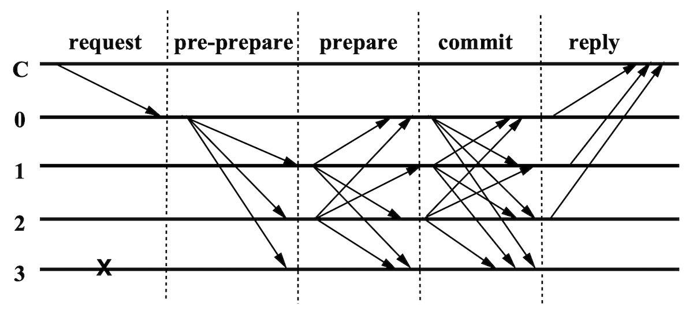
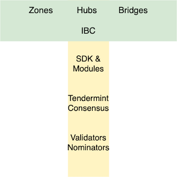
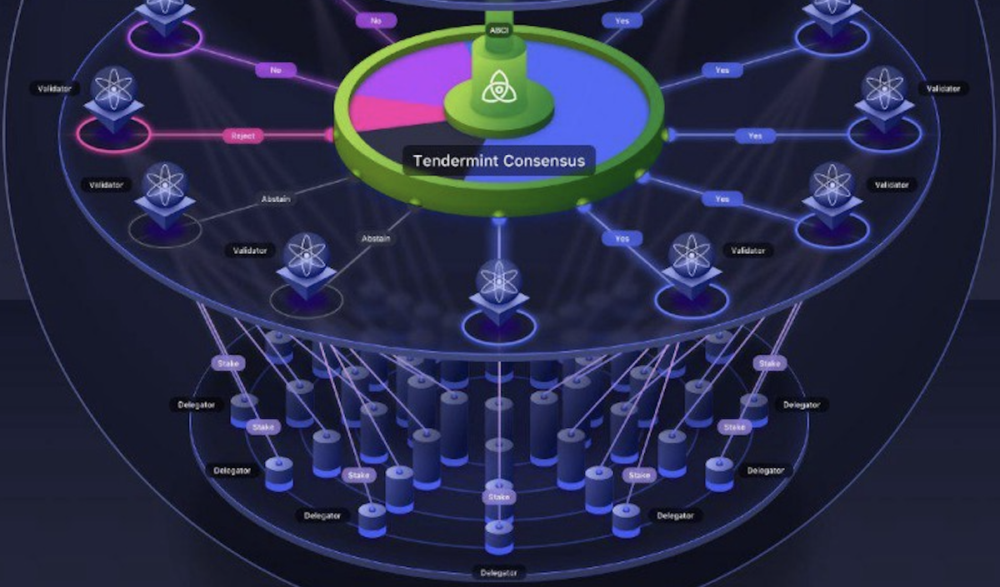
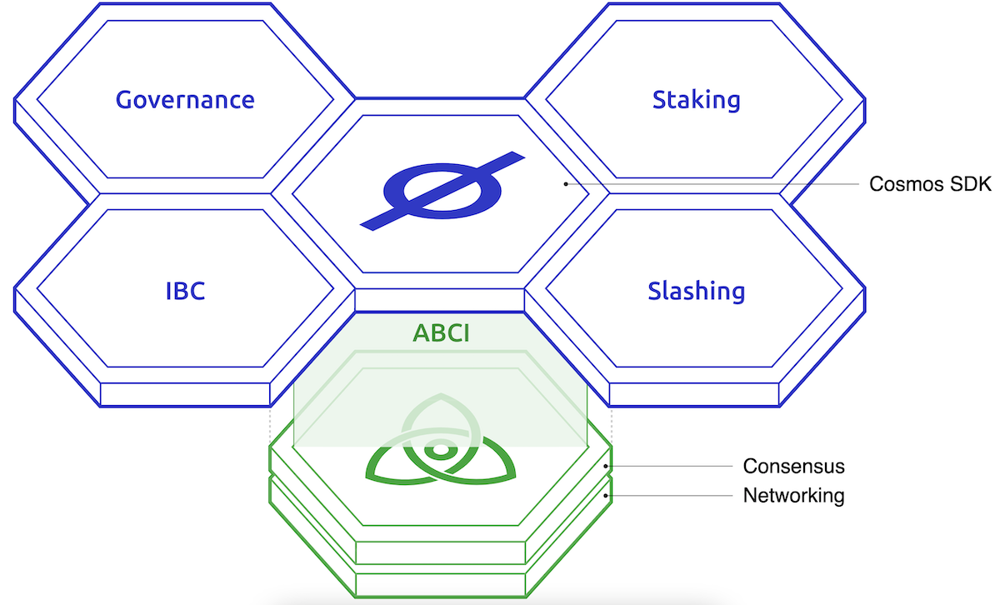
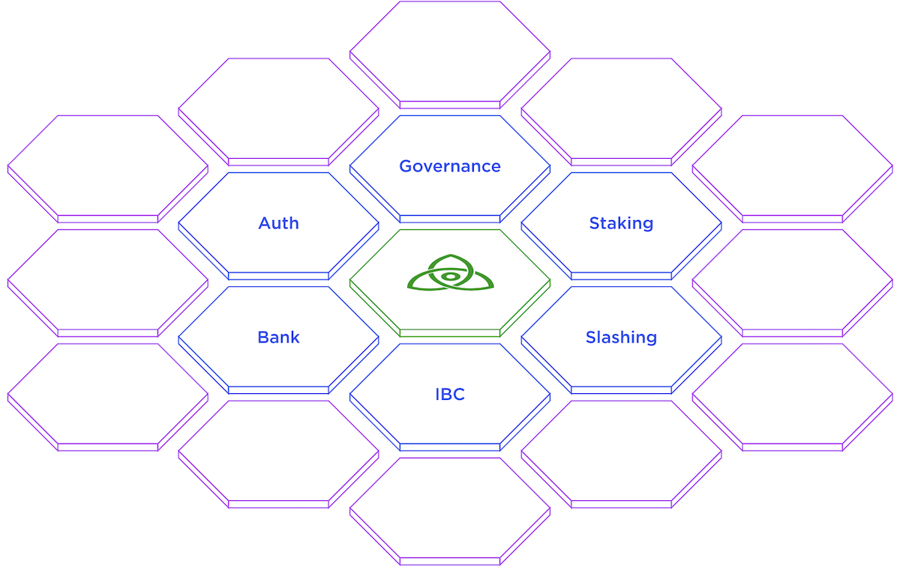
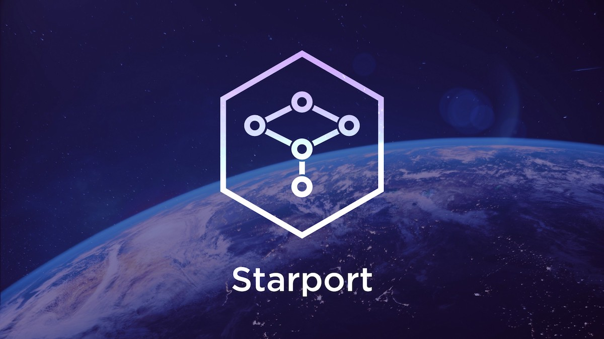
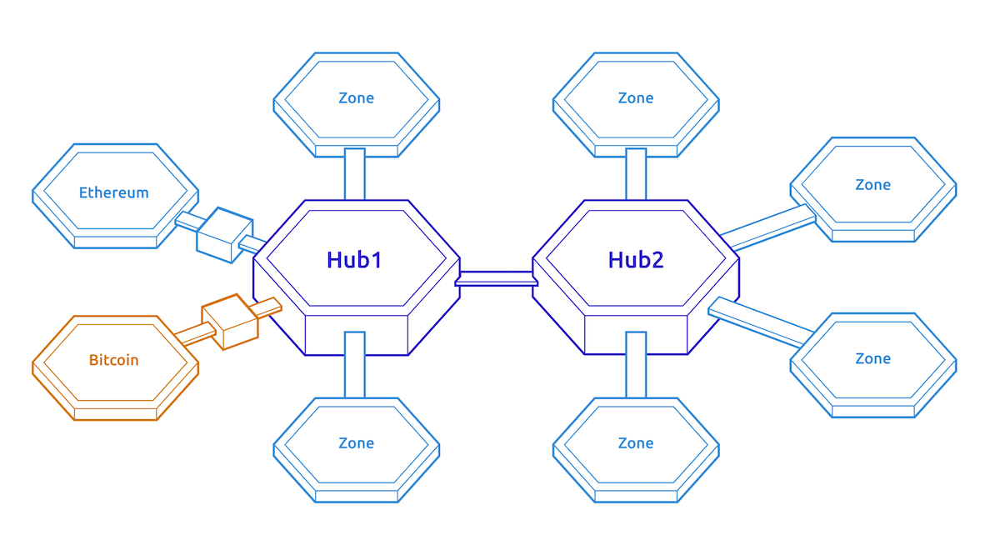
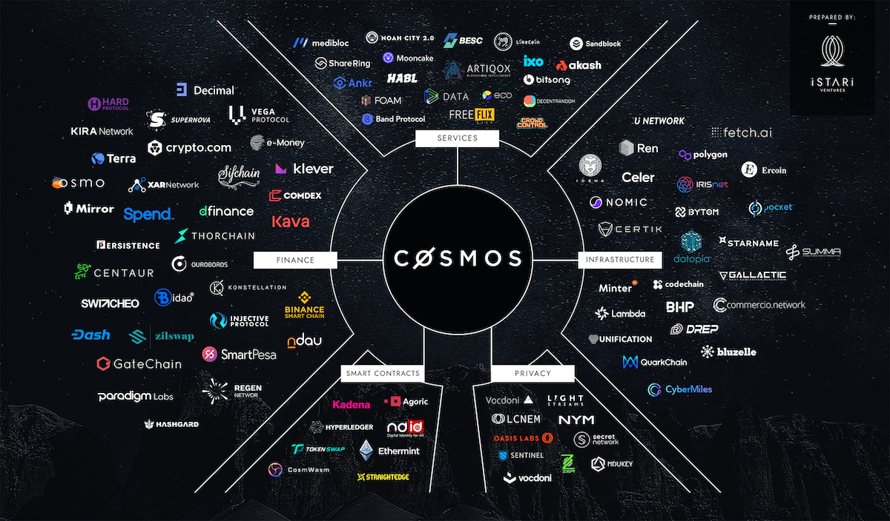

In this article we provide an introduction to Cosmos, its philosophy and basic building blocks. We will then use Starport
to build and deploy a Hello world blockchain.

# Byzantines and their generals

> Image from Wikipedia

At the core of electronic money and electronic transactions is the problem of agreeing on a shared state
i.e. reaching consensus on the outcome of a transaction, esp. the problem of double-spending
https://www.investopedia.com/terms/d/doublespending.asp

In the "meatspace"
https://dictionary.cambridge.org/dictionary/english/meatspace 
the double-spend problem is kind-of solved with bearer assets and instruments (https://www.investopedia.com/terms/b/bearer-instrument.asp in the broad sense)
The presence of the item itself is proof of ownership, due to the limitations of physical reality; when you give a coin 
or a check, you cannot magic it back into your hands. [1](#footnote_1)  

In the "bitspace" 
achieving agreement on a current shared state and future state transitions between multiple independent parties is very hard
 the presence of unrealible networks, faulty hardware and plenty of malicious actors makes sure of that

The easiest way out of this is to centralize the decision on state transitions to a trusted 3rd party. 
For example notary and land registry for property transactions, bank's ledger for financial transactions etc  
But then there is the obvious downside: what if the trusted party is not so trust-worthy anymore?

Which brings us back to the distributed consensus problem. 
This has been formalised in literature as the Byzantine generals problem. 
https://river.com/learn/what-is-the-byzantine-generals-problem/

## Bitcoin's solution 

> Photo by recha oktaviani on Unsplash

BTC whitepaper
https://www.ussc.gov/sites/default/files/pdf/training/annual-national-training-seminar/2018/Emerging_Tech_Bitcoin_Crypto.pdf

Bitcoin invented the concept of the blockchain to address the Byzantine generals problem .
It solves 2 problems at the same time 
* Achieving consensus
The proposer of a new "system state" (block) has to solve a very hard mathematical problem proof of work
  https://en.wikipedia.org/wiki/Proof_of_work  
(which is trivially easy to validate)
  and is rewarded for a correct solution.
  High difficulty barrier to overcome in order to be a bad actor, financial incentives to be a good citizen.
* Preventing double-spend 
This is a consequence of the above.
  At its heart the Bitcoin blockchain is a decentralized double-entry ledger.
  https://en.wikipedia.org/wiki/Double-entry_bookkeeping
  Once a new block is agreed upon, the global ledger is updated with the new transactions
  https://www.investopedia.com/terms/u/utxo.asp
  It is easy for any participant in the network to calculate and verify all participants' BTC balances   
  
The Bitcoin blockchain (and all its copy derivatives, like Litecoin, Doge etc) does one thing really well: decentralising 
trust in the domain of value storage and transfer.

## Sharing state: Ethereum

> Photo by Alex Motoc on Unsplash

At its core the Bitcoin blockchain is a state machine secured by PoW following the event sourcing model; it uses all the past UTXOs to 
calculate the current state of the world (the balances of each account).
https://academy.horizen.io/technology/expert/utxo-vs-account-model/

The Ethereum blockchain flips this on its head, putting the account and its balance at the core of its state machine.
In this model the global ledger records both the successful transactions, as well as the balances of both parties (sender 
and receiver).
Moving to this state machine model allowed a new breakthrough: the ability to introduce a programming language 
link to Solidity
to automatically control the global state a.k.a. smart contracts. [2](#footnote_2)

Smart contracts allowed the export of Bitcoin's "decentralized trust" model to a number of different domains (financial markets, 
asset ownership, insurance,...). The ability to build trust between any 2 parties without an intermediary was ground-breaking 
and upended multiple business models.   

To achieve execution of smart contracts, Ethereum created a global shared compute platform
shared by many different applications 
charged for the underlying compute resources through the system of gas
https://ethereum.org/en/developers/docs/gas/
competing for
https://etherscan.io/gastracker [3](#footnote_3)

it this last characteristic that makes Ethereum resemble a shared mainframe OS

## PBFT and Tendermint

> Diagram from "Practical Byzantine Fault Tolerance" (Castro and Liskov)

Both Bitcoin and Ethereum have solved the Byzantine generals problems in the context of a global state machine by using PoW
which is computationally intensive but consensus is achieved with relatively little communication
As long as honest actors control >50% of the hashrate
https://www.coindesk.com/tech/2021/02/05/what-does-hashrate-mean-and-why-does-it-matter/
then the proposed state changes (in the form of new blocks) can be trusted 

An alternative way to address this problem  
is Practical Byzantine Fault Tolerance (PBFT)
http://pmg.csail.mit.edu/papers/osdi99.pdf
proposed in 2001 
This is computationally light but requires multiple co-ordination steps over the network  

In this protocol a group of nodes, known to each other by their public keys, go through 3 rounds of network communication 
to achieve agreement on a valid next state. 
The protocol guarantees consensus if over 2/3 of nodes in the system are honest. [4](#footnote_4) 
It can also identify the non-conforming minority to the rest of the nodes. [5](#footnote_5)

The Tendermint protocol  
https://tendermint.com/static/docs/tendermint.pdf
https://arxiv.org/pdf/1807.04938.pdf
is an improvement over the original PBFT algorithm in 4 ways
https://blog.cosmos.network/tendermint-vs-pbft-12e9f294c9ab

* blocks are broken up in pieces. the pieces are communicated between nodes using a gossip protocol
* the Tendermint network stops operating if 2/3 of nodes cannot achieve agreement (i.e. about to fall in the "grey zone"
  of PBFT)
* blocks are strictly sequential (as a consequence of the above), and
* application state is Merkle-hashed, continuously updated on the nodes, rather than stored at regular checkpoints as 
  in PBFT

These improvements allow the Tendermint protocol to be deterministic and have absolute finality, 
i.e. once a block has been included it cannot be "revoked"
This should be be contrasted with the PoW model where a transaction's finality is probabilistic
https://medium.com/hackernoon/pos-pow-and-12-other-blockchain-protocols-you-didnt-know-about-3634b089d119
I.e. there is a small chance that the currently agreed-upon block does not belong to the correct chain [6](#footnote_6)

In plain English, the overhead for a transaction to be finalized is only determined by the network's throughput
not by any other overheads and delays "just in case"

## Proof of Stake

> Photo by Amol Tyagi on Unsplash

https://unhashed.com/cryptocurrency-coin-guides/blockchain-consensus-mechanisms/

In the PoS family of consensus algorithms, nodes lock up some of their cryptocurrency (the chain's native currency) into 
special staked accounts (i.e. escrow). Instead of demanding powerful processors, PoS has simpler algorithms with the 
focus (and the rewards) being on the amount of native tokens staked by the network nodes.  
This approach is a direct influence from game theory (e.g. "Skin in the Game" https://en.wikipedia.org/wiki/Skin_in_the_Game_(book)), 
with the fundamental assumption that "stakeholderism disincentivizes byzantine behavior". [7](#footnote_7)  
The introduction of the concept of slashing https://novuminsights.com/post/slashing-penalties-the-long-term-evolution-of-proof-of-stake-pos/ 
further increases the downside for misbehaving network nodes. 

There are similar algorithms in the wider PoS family, like Leased PoS https://golden.com/wiki/Leased_proof-of-stake_(LPoS)-BWKN998 
and Delegated PoS https://en.bitcoinwiki.org/wiki/DPoS.  
These allow additional participants (delegators or nominators), with smaller amounts of tokens and/or compute capacity, to 
pool their resources together and partake in the operation of the network and its rewards. This addresses to an extent 
the inherent problem of PoS which is eventual centralisation. [8](#footnote_8)

# Cosmos 

> Copied from <a href="https://v1.cosmos.network/intro">https://v1.cosmos.network/newsletters/community/2019-12/ </a>

Cosmos belongs to the group of "3rd generation blockchains". [9](#footnote_9)  
It is an evolution over previous blockchains architectures, taking a first principles approach to the deployment of 
decentralized applications (dApp).

At its core, it attempts to address 3 questions  
* How to make it easy and scalable for anyone to build and deploy their dApps?
* How to address the shortcomings of existing blockchain systems?
* How will the Web3 https://whatis.techtarget.com/definition/Web-30 world look like, when everything is decentralized (i.e. built as a blockchain or a dApp)?

The answer to these questions calls for an approach on 2 different dimensions

* Vertical  
  Modular internal code architecture, separation of concerns, extensibility for future use cases
* Horizontal   
  each Cosmos chain is independent of each other (sharding)
  Ability to integrate and interact with any other chain
  inter-chain RPC calls and value exchange 

## Vertical 

### Consensus 

> Copied from <a href="https://juliankoh.medium.com/a-deep-look-into-cosmos-the-internet-of-blockchains-af3aa1a97a5b">A deep look into Cosmos </a>

at the core of the Cosmos framework are the consensus and networking modules 
Define the foundation for how a Cosmos-compatible blockchain operates internally
i.e. participating nodes achieve consensus and advance the global state machine

this is very similar to the standard OSI model https://en.wikipedia.org/wiki/OSI_model of networking 
with consensus being at the place of TCP/IP protocols 

at this level the semantic model is very coarse grained 
contains transactions (akin to packets) contained in blocks (akin to data frames) 

### ABCI

> Copied from <a href="https://v1.cosmos.network/intro">https://v1.cosmos.network/intro </a>

ABCI (short for Application BlockChain Interface) is the abstraction layer 
between the underlying Tendermint consensus "engine" and the application logic 
https://docs.tendermint.com/v0.34/spec/abci/

it is a contract of blockchain-level events
exposed to the higher-level application logic 
the interface itself is implemented as gRPC events 

this allows for a clear separation of concerns and 
the flexibility for the dApp's logic to be implemented in practically any language

### SDK and modules 

> Copied from <a href="https://tendermint.com/sdk/">https://tendermint.com/sdk/ </a>

At its simplest viewing the Cosmos SDK is the reference implementation of the ABCI protocol 
https://tendermint.com/sdk/
In practice it defines re-usable building blocks for all the pieces of functionality a complex dApp might need
Some examples
* Bank: to track token balances in a store-of-value environment
* Governance: to implement various strategies of ecosystem governance
* Staking and Slashing: to implement (dis)incentives for a decentralized pool of Tendermint validators
etc

At its core, a Cosmos SDK module is a materialized view (or a persistent state storage) of the global event ledger. 
Incoming blockchain transactions (or, better, their payload) are decoded into application-specific messages and passed on to `Routers`. `Handlers` 
perform event validations, before passing on to `Keepers`, which are wrappers around a local key-value store (akin to a 
persistent Hashmap). [10](#footnote_10)

This standardized plugin-like interface allows the integration and re-use of modules and logic developed in any other open source dApp 
For example: verifiable credentials in Cosmos Cash
https://github.com/allinbits/cosmos-cash/tree/main/x/verifiable-credential
https://github.com/allinbits/cosmos-cash/blob/main/docs/Explanation/ADR/adr-005-registration-credential.md

### Starport

> Copied from the <a href="https://medium.com/tendermint/starport-the-easiest-way-to-start-building-a-blockchain-8ecc016573d0">Tendermint blog </a>

Starport https://docs.starport.network/ is a code scaffolding and productivity tool on steroids.
It greatly accelerates the zero-to-beta-and-testing development cycle by 
* generating the initial project structure, using the right Cosmos modules. Very similar to Spring Initializer http://start.spring.io/ or Spring Boot CLI https://docs.spring.io/spring-boot/docs/current/reference/htmlsingle/#getting-started-installing-the-cli)
* generating the MVC components of the dApp (back-end messages, web views). Very similar to Spring Roo https://projects.spring.io/spring-roo/
* facilitating local testing and debugging. Very similar to Truffle https://www.trufflesuite.com/

We will get a chance to see it in action in a few moments. 

## Horizontal 

### IBC

https://ibcprotocol.org/faq/

The primary purpose of IBC is to provide reliable, authenticated, ordered communication between modules running
on independent host ledgers.

To facilitate this heterogeneous interoperation, the interblockchain communication protocol utilises a bottom-up
approach, specifying the set of requirements, functions, and
properties necessary to implement interoperation between
two ledgers, and then specifying different ways in which
multiple interoperating ledgers might be composed which
preserve the requirements of higher-level protocols. IBC
thus presumes nothing about and requires nothing of the
overall network topology, and of the implementing ledgers
requires only that a known, minimal set of functions with
specified properties are available. Ledgers within IBC are
defined as their light client consensus validation functions,
thus expanding the range of what a “ledger” can be to
include single machines and complex consensus algorithms
alike.

Ledgers hosting IBC must provide a certain set of functions
for consensus transcript verification and cryptographic
commitment proof generation, and IBC packet relayers (offledger processes) are expected to have access to network
protocols and physical data-links as required to read the
state of one ledger and submit data to another.

The data payloads in IBC packets are opaque to the
protocol itself — modules on each ledger determine the
semantics of the packets which are sent between them.
For cross-ledger token transfer, packets could contain
fungible token information, where assets are locked on
one ledger to mint corresponding vouchers on another.
For cross-ledger governance, packets could contain vote
information, where accounts on one ledger could vote in
the governance system of another. For cross-ledger account
delegation, packets could contain transaction authorisation
information, allowing an account on one ledger to be
controlled by an account on another. For a cross-ledger
decentralised exchange, packets could contain order intent
information or trade settlement information, such that
assets on different ledgers could be exchanged without
leaving their host ledgers by transitory escrow and a
sequence of packets.

This bottom-up approach is quite similar to, and directly
inspired by, the TCP/IP specification [4] for interoperability
between hosts in packet-switched computer networks. Just
as TCP/IP defines the protocol by which two hosts communicate, and higher-level protocols knit many bidirectional
host-to-host links into complex topologies, IBC defines the
protocol by which two ledgers communicate, and higherlevel protocols knit many bidirectional ledger-to-ledger
links into gestalt multi-ledger applications. Just as TCP/IP
packets contain opaque payload data with semantics interpreted by the processes on each host, IBC packets contain
opaque payload data with semantics interpreted by the
modules on each ledger. Just as TCP/IP provides reliable,
ordered data transmission between processes, allowing a
process on one host to reason about the state of a process on
another, IBC provides reliable, ordered data transmission
between modules, allowing a module on one ledger to reason
about the state of a module on another.

### Internet of Blockchains

> Copied from <a href="https://m.kucoin.com/blog/en_US/what-is-cosmos-and-how-does-it-work">What is Cosmos</a>

- Bridge: Runs a full node of origin and mints "local" tokens on receipt (i.e. nostro/vostro, under custody)
- Zone: A Cosmos application. 
Could be decentralized (i.e. its own validator set) or a closed-loop application that needs to interact
- Hub: central multi-asset ledger. 
Each Zone has its own account, allowing the interchange of tokens (i.e. the Hub is a DEX, settlement layer). This prevents double-spends, as if we had p2p trx.
Cosmos can be a Hub of Hubs.
  

# A 'Hello world' example

# Parting thought

> Copyright Istari Ventures

# Footnotes

1. However we should not forget about the issue of counterfeiting. Hence all the measures taken 
to prove the authenticity and uniqueness of legacy bearer instruments. 
2. Solidity comes in stark contrast to Bitcoin's very simple Script language https://en.bitcoin.it/wiki/Script
3. At the time of writing this, Ethereum is in a live test to transition to a Proof of Stake 
   protocol https://ethereum.org/en/developers/docs/consensus-mechanisms/pos/
4. The protocol is non-deterministic if between 1/3 and 2/3 of nodes are "byzantine" (faulty or 
   malicious)
5. One obvious observation is the need for the nodes to be known in advance
   rather than the Bitcoin / Ethereum miners which can join and leave the network as they please
6. hence for Bitcoin and Ethereum transactions it is best practice to wait a few (or many) blocks before 
declaring the transaction final.  
7. Unlike mining equipment which could be repurposed, the capital spending in a PoS is tied 
   down in the native token. Attacking the PoS network as a staker is like setting fire to the town by burning your 
   house first. Of course there is always the case of a well-funded actors who wants to bring down the network at all costs.
8. Large stakeholders get the majority of the rewards, which makes them even larger. This leads 
   to an eventual network control concentration.
9. Bitcoin, Ethereum and their derivatives belong to 1st and 2nd generations, respectively. 
   Other 3rd generation blockchains include Solana https://solana.com/, Cardano https://cardano.org/ 
   and Polkadot https://polkadot.network/.
10. A simpler way of viewing modules is as smart contracts, implemented in a powerful 
    language, without compute restrictions. 

  [1]: 