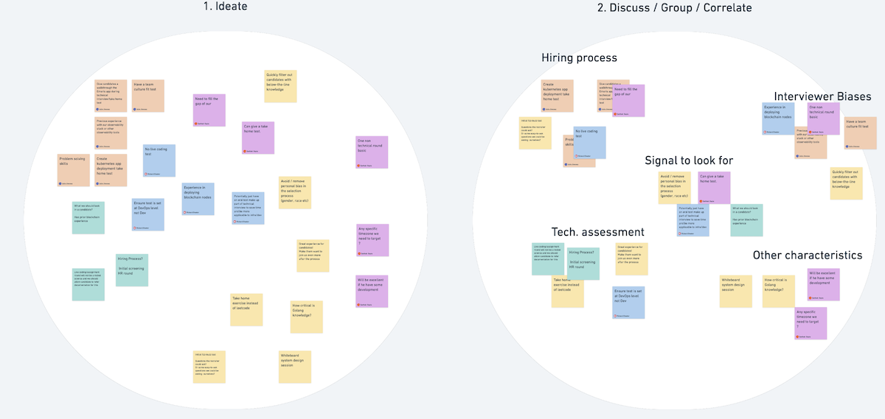

How can you effectively bring together a diverse group of people to decide on complex issues? Using the Double Diamond 
approach it becomes easy.

# Decisions, decisions 

> Photo by Jens Lelie on Unsplash

Companies and teams face complex and vague problems all the time. 
From defining a company's mission and vision, to planning a product's roadmap, to preparing for a complex technical 
release.  

As a leader or senior team member, you might be tempted to take it upon yourself to single-handedly create The Plan™. 

This might not be such a good idea, for a number of reasons.  
* [Unknown unknowns][13]. Regardless of your experience, you will always have blind spots you are not aware of.
* Team engagement improves buy-in, which in turn improves execution.
* The [wisdom of crowds][6] really is a thing.

Tapping into the "hive mind" is the best thing to do most of the time. 

On the other hand, it is important to avoid some well-known pitfalls of collaborative decision-making. [HIPPOism][8], 
[group think][7], [Dunning-Kruger effect][9] and "loudest ducks", [bikeshedding][10], [tyranny of the 
majority][11] have been pestering meetings since time immemorial.  
Whatever we do, we should be actively avoiding these issues.

Finally, in the current hybrid/remote-first environment, the process we choose should be equally effective in-person or over 
a video call.

# Double diamond

> Photo by Bas van den Eijkhof on Unsplash

The [Double Diamond][12] is a design process, originally developed by the British Design Council, to facilitate the 
product design process. 

It guides the design approach along 2 axes and 4 steps: 
* "Horizontal", by going wide in all possible solutions, then... 
   * Converging into a few viable options. After that...
* "Vertical", by going deep into the chosen approach (e.g. building prototypes). Finally...
   * Converging again to deliver the final solution.

This two-pronged approach allows the transition from the abstract to the specific with more confidence. 

This method can be adapted to assist any team to start addressing uncertainty, while achieving consensus.  

Let's see how with a concrete example.

# It's workshop time!

> Photo by Ravi Palwe on Unsplash

In this section I will describe how to organize a fully remote workshop. However, the method below can easily be adapted 
for in-person meetings. 

Here is our hypothetical scenario for context.  
> A newly-formed team, supporting a complex system, received the go-ahead to increase its head-count. 
> The team needs to come up with a candidate hiring process. 
> This requires buy-in, as the team members will be conducting interviews and candidate vetting themselves.

## 1. Preparation

Any successful meeting starts with an invitation providing clarity on purpose and expectations. 

Here is an example of how the invite's description could look like in our case.  
> We will have a workshop on how to structure our hiring funnel.
> Please start thinking on the subject, bringing along all your experiences; things to do and things to avoid.
> Before the session, please make sure you have edit access to < link to the tool >.

Next we need to get a collaboration board ready for the session.

There is a wealth of tools (e.g. [Miro][1], [Whimsical][2], [diagrams.net][3]) providing plenty of ready-made templates.  
If a template is not available, it is really easy to create a collaboration board from scratch. See the next image for inspiration.

> Example of an empty collaboration board

* There are plenty of colored stickies, one color assigned to each participant. 
* There are 3 distinct areas for: Ideation, Grouping and Voting.
* Finally, there are voting dots following the same color-per-participant pattern.

## 2. Ideation

The first phase of the meeting is about going wide and generating as many ideas as possible.

Once in the meeting, the facilitator gives a brief introduction.  
It is a good idea to both recap the goals of the meeting and make explicit that no ideas are off limits at this 
stage.  

Then it's time to ideate!

This section should be time-boxed. Maybe no more than 10 mins, enforced by the facilitator (e.g. by using the tool's 
[mechanism][4]).

One important note:  
No idea is off limits at this stage. But the way to express them should be specific.  

Consider the following example.

> Right & wrong examples of idea expression

The yellow stickies provide a simple and distinct idea each. They can be easily understood and provide a good basis for 
the next step.  
The orange one is mashing together multiple concepts, in this case describing a whole process. This makes it much harder 
to correlate later on. This verbose style should be avoided.

At the end of the ideation phase your board will look a bit like this.

> Board at the end of the ideation phase

Good stuff!  
It's now time for...

## 3. Grouping 

The previous step was all about *divergence*; allowing everyone to come up with ideas and different points-of-view.  

Now is the time to start synthesizing the different ideas and finding common patterns. In other words, *converge*.

Let's start by copying all stickies from area 1 to area 2.

> Starting the grouping phase

There are 2 ways of going about grouping the ideas, depending on the situation.

* "Few" stickies/participants[1](#footnote_1)  
The facilitator goes through the stickies, one participant at a time.  
  If the wording on the sticky is unclear, they ask the sticky's author to give a brief clarification of their idea. 
  Based on that, the facilitator starts grouping together similar ideas in emergent "themes". They can also "collapse" 
  together duplicate ideas.

* "Many" stickies/participants  
In this case, the facilitator gives a few minutes to all participants to start grouping all of their stickies collaboratively. 
  In effect, the team "swarms" around the problem of convergence. Some team members would gravitate towards finding 
  commonalities, while others provide names for the emergent groups. If the workshop has a large number of participants, 
  the facilitator could organize them into sub-groups with a subset of stickies. 
  This stage could feel a bit like creative chaos, but it is fine! The hive mind will eventually converge faster than 
  the individual. 

The end result will look something like the following image. 

> After the grouping phase

We are now about to enter the 2nd diamond by...

## 4. Voting & deciding

Depending on the goal of the workshop, we can have either the themes or the individual ideas up for voting.  
The facilitator transfers them to the 3rd area, changes them all to the same color (so as to remove personal preference) 
and prepares the voting "dots". 

> Preparing to vote

The dots each team member gets should be less than the number of identified ideas. 
A good rule of thumb is to have `N/2` votes, where `N` is the number of items to vote on. This ensures that  
* everyone has enough votes for their favourite themes, and
* people are forced to vote on what is truly important.[2](#footnote_2) 

It is also a good idea to introduce a "down-vote" or "veto" vote. This will allow participants to express a strong opinion 
*against* an idea (and avoid "tyranny of the majority").

Participants should be able to use their votes as they please. For example, use only some of them, if not enough items 
are of interest. Or use more than one on the same sticky, if they feel very strongly about an idea (i.e. "vote strategically"). 

> Voting complete!

Depending on the initial goals, the facilitator can now pick the top items to drill further down.  
Or just call it a day; the group has decided.

And there you have it!

A group of people, maybe not knowing each other so well and starting with little more than a blank digital canvas  
* ideated far and wide on all aspects of a vague problem, 
* made sure that all opinions were heard with equal weight, and 
* reached consensus on what is truly important to (or truly disliked by) everyone. 

And they did not even have to be in the same continent, let alone the same office.

Not bad, eh?

# Parting thought

> Photo by Ray Hennessy on Unsplash

The double diamond process is very powerful when it comes to vague, unscoped problems.  
Contrary to traditional meetings, the utility of this style of approach actually increases with the number of 
participants.[3](#footnote_3)
It can be used in any number of situations; from defining long-term roadmaps, to conducting [pre-mortems][5].
Even better, it can be used sequentially without losing its utility. E.g. do a double diamond to define a roadmap, then 
repeat to ideate on the most complex task(s).

Happy collaborating!

# Footnotes

1. Few and many are completely subjective quantities here, hence the quotes around the words.  
It is a direct dependency of stickies and participants vs available time.   
A very crude rule of thumb for a 1h workshop: under 10 participants and under 50 stickies is considered "few".
2. Too many voting dots would result in a long tail of not-so-important items receiving 1-2 votes.
3. In "normal" meetings, only one person can speak at a time. Usually the most senior or just 
the "loudest". In this style of workshop, the more diverse the participants (within reason), the more diverse the opinions to reveal and
   synthesize. 

  [1]: https://miro.com/templates/brainstorming/
  [2]: https://whimsical.com/projects
  [3]: https://app.diagrams.net/
  [4]: https://help.miro.com/hc/en-us/articles/360017730933-Timer
  [5]: https://en.wikipedia.org/wiki/Pre-mortem
  [6]: https://www.quizbeez.com/blog/crowd-wisdom-examples/
  [7]: https://en.wikipedia.org/wiki/Groupthink
  [8]: https://www.microlise.com/blog/agile-beware-the-hippo-in-the-room/
  [9]: https://en.wikipedia.org/wiki/Dunning%E2%80%93Kruger_effect
  [10]: https://en.wikipedia.org/wiki/Law_of_triviality
  [11]: https://en.wikipedia.org/wiki/Tyranny_of_the_majority
  [12]: https://www.justinmind.com/blog/double-diamond-model-what-is-should-you-use/
  [13]: https://en.wikipedia.org/wiki/Johari_window