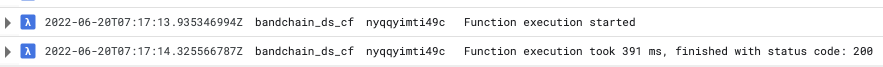

Oracles are a crucial piece in the smart contract stack. In this article we deep-dive in the Band Protocol. 

# From the world beyond 


> Photo by Cosmic TimeTraveler on Unsplash

In the blockchain domain the term *oracle* identifies any trusted source of information and events from the external world.  
The term has its root in ancient Greece. Oracles were the [undisputable voice of the gods][1]. A [golden source][2] of 
information from the “world beyond”.

Blockchains (and smart contracts on top of them) execute in a secure, isolated environment. They can be called by users 
as well as other smart contracts. For its logic to have real-world impact<sup>[1](#footnote_1)</sup>, a blockchain needs 
to react to real-world events and consume real-world information.  
For example:  
> “Is the ship docked in port?”  
“Has $100 landed in bank account Y?”  
“What is the current price of asset Z?”

These external stimuli result in the blockchain taking some action and recording a side-effect in its state machine forever. 
However, the finality of all blockchain actions raises an important question:  
How trustworthy is the oracle?  
What if it gives the wrong information when the contract requests it?

For example, a property purchase blockchain (or smart contract) may depend on a banking oracle to confirm that the fiat 
money funds have landed in the bank account. What if (by accident or malicious action) the banking oracle incorrectly 
reports that the funds are there, when they are not?  
The contract will be triggered, and the property title will be 
irrevocably transferred, when in fact it should not.

# The Band Protocol

 
> Photo by CHUTTERSNAP on Unsplash

The [Band Protocol][3] is  
> a cross-chain data oracle platform that aggregates and connects real-world data and APIs to smart contracts.

To achieve this, the protocol  
* gives incentives and rewards to third-party developers to create reliable primary data sources,
* takes the onus of higher level data aggregations away from clients by allowing on-chain aggregations with [WebAssembly][4] 
    oracle scripts,
* leverages existing [validator][5] infrastructure to make distributed data request calls,
* defines a generic data input/output schema, allowing data transfers across to other blockchains via [IBC][6].

## Architecture & data flow

Let's get a better understanding of Band by deep-diving in its architecture and data flow.  


> Band chain architecture and data flow

1. A developer deploys [Data Source(s)][7] and [Oracle script(s)][8]. Each one gets a unique identifier and its code is 
    stored on-chain.
2. A Band chain user (smart contract or another b/chain over IBC) makes a [RequestData][9] transaction.
3. The Oracle script is triggered, requesting data from the Data Sources. Band chain selects a [random 
   number of validators][10] to execute the Data Source logic.
4. In the validator's domain, the [Yoda][11] process listens for these messages. Once found, it fetches and verifies the Data 
   Source script, before...
5. Uploading it for synchronous execution to a [cloud function][12], again controlled by the validator. 
6. The Data Source is executed in the "sandbox" of the cloud function and fetches the required data...
7. which is passed back to the Yoda process. The process then... 
8. signs a [ReportData][13] message using the validator's key and posts the message to the chain. This is the point when Data Source 
   creators are [paid their fee][14] (if any) 
9. All the data samples are gathered by the Oracle, processed and, finally, a [Data Proof][15] is generated to be 
   consumed by the calling client.  

### Architecture discussion

Viewed from a very high level, the Band Protocol architecture does not deviate from the archetypical Oracle pattern, 
first [introduced by Ethereum][16]. An Oracle contract emits a special event, an associated out-of-chain, trusted process
listens to that event, fetches data and performs a method callback on the Oracle contract.

This pattern has already been productionized into a SaaS offering for the Ethereum ecosystem by [Provable][17] (formely Oraclize). 

Band's core improvement of this pattern lies along 2 axes: 
* Introduces a distributed and incentivized marketplace of data sources. This allows a Web3 application builder needing 
external data to only focus on building on-chain logic.    
* Makes the Oracle script a re-usable building block, akin to a reduce function in the [map-reduce][18] model.

Yoda and the cloud function are 2 additional off-chain components introduced by Band.
They are not mandatory though. They are reference implementations of an architecture pattern, attempting to solve 2 
issues faced by Band validators.
* Validation is a critical function in Proof-of-Stake; poor performance gets [penalized][19].  
Off-loading non-core functionality away from the validator process is priority 1. This includes the execution of Data 
Source code with unknown complexity (e.g. blocking network calls).
* Keeping code of unknown provenance (i.e. potentially malicious) away from the validator's network domain.

With the technical description out of the way, let's consider a semi-realistic use case.

# Flight oracle


> Photo by Bing Hui Yau on Unsplash

We will create a simple flight data oracle.

It will be able to answer the following question  
> Has flight X and date Y arrived?  
> If yes, what time (vs the scheduled one) and at which airport?

This could be useful in a number of scenarios, like an automatic flight insurance contract. 

Let's get prepared.

## Data provider

There are a number of API flight data providers out there.   
To keep things simple (and free) we will go with [AeroDataBox][20].

Create a free account and test the API using your key.
```
curl \
	--url https://aerodatabox.p.rapidapi.com/airports/iata/DXB \
	--header 'X-RapidAPI-Host: aerodatabox.p.rapidapi.com' \
	--header 'X-RapidAPI-Key: XXXXXX' 

curl \
	--url https://aerodatabox.p.rapidapi.com/flights/number/EK29/2022-06-01 \
	--header 'X-RapidAPI-Host: aerodatabox.p.rapidapi.com' \
	--header 'X-RapidAPI-Key: XXXXXX'

curl \
	--url https://aerodatabox.p.rapidapi.com/aircrafts/reg/A6-EEU \
	--header 'X-RapidAPI-Host: aerodatabox.p.rapidapi.com' \
	--header 'X-RapidAPI-Key: XXXX'
	
```

## Cloud function env

We will also need to setup our remote code executor (cloud function). 

You can find instructions on the Band chain's docs for [AWS][21] and [GCP][22]. 
If you want, you can build the cloud function deployable ZIP from [my fork][23]; I have forked and slightly [modified][24] 
it to add support for any binary.

Once your cloud function is deployed, test the configuration (example below is for GCP).
```
$ curl --location --request POST \
   '< your cloud function URL >' \
   --header 'Content-Type: application/json' \
   --data-raw '{ \
    "executable": "IyEvdXNyL2Jpbi9lbnYgcHl0aG9uMwoKaW1wb3J0IHN5cwoKZGVmIG1haW4oZGF0YSk6CiAgICByZXR1cm4gZGF0YQoKCmlmIF9fbmFtZV9fID09ICJfX21haW5fXyI6CiAgICB0cnk6CiAgICAgICAgcHJpbnQobWFpbigqc3lzLmFyZ3ZbMTpdKSkKICAgIGV4Y2VwdCBFeGNlcHRpb24gYXMgZToKICAgICAgICBwcmludChzdHIoZSksIGZpbGU9c3lzLnN0ZGVycikKICAgICAgICBzeXMuZXhpdCgxKQo=", \
    "calldata": "Hello lambda", \
    "timeout": 3000 \
}'
{"err":"","returncode":0,"stderr":"","stdout":"Hello lambda\n","version":"google-cloud-function:2.0.0"}
```

## Local environment 

Let's prepare our local dev environment. 

### Go & Band chain binaries 

* Install [Golang][25]  
Make sure that `GOPATH` and `PATH` are populated.  
They should be available for all scripts we will run from now on.  
```
$ echo $GOPATH
/something/foo/bar
$ echo $PATH
<something something>:$GOPATH/bin
```

* Build Band chain  
```bash
$ git clone https://github.com/bandprotocol/chain
$ cd chain && git checkout v2.3.3
$ make install
```

* Test them  
```
$ bandd version --long
$ yoda version --long
```

### Rust 

We will use Rust to build our WASM Oracle script.

* Install [Rust][26]

* Install the custom build target  
This should not normally be necessary, but it was in my case.  
`$ rustup target add wasm32-unknown-unknown`

### Python 3

We will use Python for our Data Source script. 

* Install [Python 3][27]  
`$ python3 --version`

* Install [Band's client][28] for Python  
`$ pip3 install pyband`

### Generate accounts

To interact with the Band chain (or any Cosmos chain, for that matter) we will need some [Accounts][29] on our machine. 

We can take a shortcut and use the [genesis file][30] script which comes in Band's sources.  
```
$ cd chain && ./scripts/generate_genesis.sh 
{"app_message"...
...
Genesis transaction written to ...
```

We can verify the creation with `$ ls ~/.band/`.

Let's view the keys in the [keyring][31] and take a note of the addresses.  
```
$ bandd keys list --keyring-backend test
- name: requester
  type: local
  address: band1m5lq9u533qaya4q3nfyl6ulzqkpkhge9q8tpzs
  pubkey: '{"@type":"/cosmos.crypto.secp256k1.PubKey","key":"A6rU4D6xY4ibvdSDdg8iLDSVF73O6ZB/vUH6iJsNRNqY"}'
  mnemonic: ""
- name: validator
  type: local
  address: band1p40yh3zkmhcv0ecqp3mcazy83sa57rgjp07dun
  pubkey: '{"@type":"/cosmos.crypto.secp256k1.PubKey","key":"AiS3jI4M4wP0Aqn+4RhteonBF82QvzdR6OGFF2rlFKMk"}'
  mnemonic: ""
```

The `validator` account will be the Data Source & Oracle owner and the `requester` the user. 

We are finally ready to...

# Get coding 


> Photo by Kevin Ku on Unsplash

You can clone the code referenced below from [this repo][32] and build everything with `$ make all`. 

## Data source

Our data source will take 2 arguments:  
* flight number, in [IATA format][33], and 
* [ISO-8601 date][34] 

It will return a comma-separated list of  
```
Flight Status, Arrival airport, Scheduled Time (ISO-8601 UTC), Arrival time (ISO-8601 UTC)
```

For example  
```
Arrived,LHR,2022-06-01 13:25Z,2022-06-01 13:03Z
```

We can implement this in [Python][35] and [Golang][36]. See the [Makefile][38] for details building and running unit tests.  
You can replace your own private AeroDataBox key in those scripts.

If you have created a cloud function, you can test your Data Sources using the [utility script][37], after replacing your 
cloud function's URL and using more recent date/flight.     
```
$ ./call_executor.sh ds -t p -a "'EK29' '2022-06-08'"
Info: Creating payload [Type: p, Program: ds, Arg: 'EK29' '2022-06-08']
Info: Calling remote function endpoint.
{"err":"","returncode":0,"stderr":"","stdout":"Arrived,LHR,2022-06-08 13:25Z,2022-06-08 13:00Z","version":"google-cloud-function:2.0.2"}
```

## Oracle

Though we could do something more interesting (e.g. combine results from multiple flight data providers), our oracle 
implementation is trivial. It calls the single data source type and returns its results verbatim.    
You can view the source code [here][39]. 

We are now ready to...

# Test locally


> Photo by Clint Patterson on Unsplash

We will need 3 separate terminal consoles. Make sure all of them have a correctly set `GOPATH` and `PATH`. 
* One running our local testnet Band validator  
`$ cd chain && ./scripts/start_bandd.sh`

* One running the Yoda process  
```
$ ch chain && ./scripts/start_yoda.sh 
...            
I[2022-06-17|15:52:52.010] 🚀  Starting WebSocket subscriber   
I[2022-06-17|15:52:52.014] 👂  Subscribing to events with query: tm.event = 'Tx' AND request.id EXISTS... 
I[2022-06-17|15:52:52.020] 🔍  Found 0 pending requests 
```

* One to run all our commands below (i.e. the client).

## Deploy Python data source

Replace addresses as appropriate from your created accounts. Note how we require a `fee` per call. Callers will need to 
be able to pay this in order to call us.   
```
$ bandd tx oracle create-data-source \
     --name "Flight Arrival Status (Python)" \
     --fee 50000uband \
     --description "AeroDataBox Flight Arrival Status using Python" \
     --script ./python/ds.py \
     --from validator \
     --owner band1p40yh3zkmhcv0ecqp3mcazy83sa57rgjp07dun \
     --treasury band1p40yh3zkmhcv0ecqp3mcazy83sa57rgjp07dun \
     --node http://localhost:26657 \
     --chain-id bandchain \
     --gas auto \
     --keyring-backend test \
     --yes
gas estimate: 58035
...
txhash: 85FE3DC7FA40FDAC1C010C8F73BBD069BA08D5C69BE8E8C4A662C7AC704D26F6     
```

We can view the unique Data Source id assigned by inspecting the transaction.  
```
$ bandd query tx 85FE3DC7FA40FDAC1C010C8F73BBD069BA08D5C69BE8E8C4A662C7AC704D26F6
...
- events:
  - attributes:
    - key: id
      value: "1"
    type: create_data_source
...
```  
We must replace this identifier in the oracle Rust script and rebuild.

## Deploy Oracle

Take a note of the `schema` argument which is crucial; more on this below.
```
$ bandd tx oracle create-oracle-script \
    --schema "{flight:string,date:string}/{status:string,arrival_airport:string,scheduled_time_utc:string,actual_time_utc:string}" \
    --name "Flight Arrival Status" \
    --description "This Oracle queries a single flight status data source to give the status of a flight on a given date." \
    --script "./oracle/target/wasm32-unknown-unknown/release/flight_arrivals.wasm" \
    --from validator \
    --owner band1p40yh3zkmhcv0ecqp3mcazy83sa57rgjp07dun \
    --node http://localhost:26657 \
    --chain-id bandchain \
    --gas auto \
    --keyring-backend test \
    --yes
gas estimate: 311124
...
txhash: AA206886A078B008207EB3B302B8B953D2C8F1B4AEF092CEE8DD0040AF22A9EE
```

Again, we can view the auto-assigned Oracle id by inspecting the transaction.  
```
$ bandd query tx AA206886A078B008207EB3B302B8B953D2C8F1B4AEF092CEE8DD0040AF22A9EE
...
logs:
- events:
  - attributes:
    - key: id
      value: "1"
    type: create_oracle_script
...
```

We are now ready to...

## Get data

Before calling our oracle, let's take a minute to understand [OBI][40], the schema definition we highlighted above.

OBI is a custom schema definition language and binary encoding standard. It is Band's way of passing arguments and 
results from/to Oracles. The underlying reason for this custom format is to allow the generation of one-way unambiguous 
hex hashes based on a schema. This is necessary to enable lookups and comparisons inside the chain's state store.  

Luckily the logic of encoding/decoding has been implemented in a number of languages, including Python.
See the utility script [obi_codec.py][41].  
```
$ python3 ./python/obi_codec.py '{"flight":"EK29", "iso_date":"2022-06-10"}'
00000004454b32390000000a323032322d30362d3130
```

Let's request some data from the Oracle we just deployed. Take note of the `fee-limit` and how it is a bit bigger than 
what the Data Source requires.<sup>[2](#footnote_2)</sup> In our local environment we only have 1 validator running, so 
we leave the validator-related values to 1.  
```
bandd tx oracle request \
    1 \                         # oracle script id (from deployment)
    1 \                         # desired num of validators to reply with data from data sources 
    1 \                         # min num of validators that must reply
    -c `python3 ./python/obi_codec.py '{"flight":"EK29", "iso_date":"2022-06-10"}'` \
    --from requester \          # account calling the function
    --fee-limit 60000uband \    # fees to pay for data sources (has to be a bit more than their fee)
    --node http://localhost:26657 \
    --chain-id bandchain \
    --gas auto \
    --keyring-backend test \
    --yes
gas estimate: 534165
...
txhash: 729EC77958BB405FF7781734561AF8C77637B8638E9DB9CCF9E0724EFB4CF237
```

When we inspect the transaction, we can see that it indeed has been broadcasted.  
```
$ bandd query tx 729EC77958BB405FF7781734561AF8C77637B8638E9DB9CCF9E0724EFB4CF237
...
raw_log: '[{"events":[{"type":"coin_received","attributes":[{"key":"receiver","value":"band1p40yh3zkmhcv0ecqp3mcazy83sa57rgjp07dun"},{"key":"amount","value":"50000uband"}]},{"type":"coin_spent","attributes":[{"key":"spender","value":"band1m5lq9u533qaya4q3nfyl6ulzqkpkhge9q8tpzs"},{"key":"amount","value":"50000uband"}]},{"type":"message","attributes":[{"key":"action","value":"/oracle.v1.MsgRequestData"},{"key":"sender","value":"band1m5lq9u533qaya4q3nfyl6ulzqkpkhge9q8tpzs"}]},{"type":"raw_request","attributes":[{"key":"data_source_id","value":"1"},{"key":"data_source_hash","value":"e84ea6e0efbc79a6f6d591d6f3d2f4d19ab78f90e25441c99728f2a7914d115e"},{"key":"external_id","value":"0"},{"key":"calldata","value":"EK29
  2022-06-17"},{"key":"fee","value":"50000uband"}]},{"type":"request","attributes":[{"key":"id","value":"1"},{"key":"client_id"},{"key":"oracle_script_id","value":"1"},{"key":"calldata","value":"00000004454b32390000000a323032322d30362d3137"},{"key":"ask_count","value":"1"},{"key":"min_count","value":"1"},{"key":"gas_used","value":"4441"},{"key":"total_fees","value":"50000uband"},{"key":"validator","value":"bandvaloper1p40yh3zkmhcv0ecqp3mcazy83sa57rgjde6wec"}]},{"type":"transfer","attributes":[{"key":"recipient","value":"band1p40yh3zkmhcv0ecqp3mcazy83sa57rgjp07dun"},{"key":"sender","value":"band1m5lq9u533qaya4q3nfyl6ulzqkpkhge9q8tpzs"},{"key":"amount","value":"50000uband"}]}]}]'
...
```

We also notice something else which is interesting: the Yoda process comes to life!  
```
...
I[2022-06-20|11:17:21.556] 🚚  Processing incoming request event         rid=2
I[2022-06-20|11:17:22.227] 📧  Sending report transaction attempt: (1/5) rids=[2]
I[2022-06-20|11:17:22.227] ✍️  Try to sign and broadcast report transaction(1/5) rids=[2]
I[2022-06-20|11:17:23.250] 😎  Successfully broadcast tx with hash: A0EDD1D4E70D9D595AAB97227C5896379BA9FE5E7CD43FB1FF6D2BED2B6EA4E8 rids=[2]
```
The validator has received our request and its Yoda process has forwarded it to its configured cloud function.   


> Cloud function logs
 
The Yoda process, using the validator's key, has submitted a transaction. Let's take a look at it.  
```
$ bandd query tx A0EDD1D4E70D9D595AAB97227C5896379BA9FE5E7CD43FB1FF6D2BED2B6EA4E8 
...
  body:
    extension_options: []
    memo: yoda:2.3.3/exec:google-cloud-function:2.0.2
    messages:
    - '@type': /cosmos.authz.v1beta1.MsgExec
      grantee: band1q7rt82crzm0u4vxz5x3wr464htyn2eewwwsvna
      msgs:
      - '@type': /oracle.v1.MsgReportData
        raw_reports:
        - data: QXJyaXZlZCxMSFIsMjAyMi0wNi0xNyAxMzoyNVosMjAyMi0wNi0xNyAxMzoxM1o=
          exit_code: 0
          external_id: "0"
        request_id: "2"
        validator: bandvaloper1p40yh3zkmhcv0ecqp3mcazy83sa57rgjde6wec
    non_critical_extension_options: []
    timeout_height: "0"
  signatures:
  - 2aDezm9E6HAFFy22EUwjCR+P40+40eAVUhF6eDgPBDJXRrFtmhGjL0pSnwTp2ZOnXL/0iKBC6DxFWbkeeJj2YA==
txhash: A0EDD1D4E70D9D595AAB97227C5896379BA9FE5E7CD43FB1FF6D2BED2B6EA4E8
```
This is a [ReportData][42] message, used to send an individual Data Source's response back to the Oracle.
We can also see the incremental `request_id`. 

Let's query the actual result.  
```
$ bandd query oracle request 2 --output json | jq -r .result.result | base64 -d
ArrivedLHR2022-06-17 13:25Z2022-06-17 13:13Z
```

Great!  
We got back our data, though as concatenated strings, rather than comma-separated.  
It is however great progress!

# Test on the testnet


> Photo by Alina Grubnyak on Unsplash

We would be missing a trick if we did not take our code and deploy on the public testnet.  

## Get tokens from faucet

We can re-use our 2 local accounts we created earlier. However, we need to fund them with tokens from the [testnet faucet][43].
Repeat for both accounts and change the address below accordingly.
```
$ curl -k -X POST \
    -d '{"address": "band1m5lq9u533qaya4q3nfyl6ulzqkpkhge9q8tpzs", "coins": ["1000000uband"]}' \
    https://laozi-testnet4.bandchain.org/faucet
{"txHash":"187737018A114570CAD60E80D99FD3F34E0270ACC61F19FD67E4453D74845570"}
```

We can then verify the new balance on the testnet.
```
$ bandd query bank balances band1m5lq9u533qaya4q3nfyl6ulzqkpkhge9q8tpzs \
    --node http://rpc-laozi-testnet4.bandchain.org:26657 \
    --chain-id band-laozi-testnet4 
balances:
- amount: "39999984"
  denom: uband
...
```

## Deploy Python data source 
We can re-use the commands from the local testnet almost verbatim. Replace addresses as appropriate from your created accounts.
The only 2 flags to modify are the `node` and `chain-id`.  
```
$ bandd tx oracle create-data-source \
     --name "Flight Arrival Status (Python)" \
     --fee 50000uband \
     --description "AeroDataBox Flight Arrival Status using Python" \
     --script ./python/ds.py \
     --from validator \
     --owner band1p40yh3zkmhcv0ecqp3mcazy83sa57rgjp07dun \
     --treasury band1p40yh3zkmhcv0ecqp3mcazy83sa57rgjp07dun \
     --node http://rpc-laozi-testnet4.bandchain.org:26657 \
     --chain-id band-laozi-testnet4 \
     --gas auto \
     --keyring-backend test \
     --yes
gas estimate: 58035
...
txhash: EE8834B35B6C007BDE199615565B722E23B72930933B1475D749A998FE84F4BD     
```

This time, we can directly see the deployed Data source on the [testnet explorer][44].  

> Deployed Data Source on the Band Testnet 

Take a note of the unique id (in this case `322`).

## Deploy Oracle

We need to replace the testnet Data Source id in the Oracle code and rebuild it. We can then deploy the Oracle on testnet.  
```
$ bandd tx oracle create-oracle-script \
    --schema "{flight:string,date:string}/{status:string,arrival_airport:string,scheduled_time_utc:string,actual_time_utc:string}" \
    --name "Flight Arrival Status" \
    --description "This Oracle queries a single flight status data source to give the status of a flight on a given date." \
    --script "./oracle/target/wasm32-unknown-unknown/release/flight_arrivals.wasm" \
    --from validator \
    --owner band1p40yh3zkmhcv0ecqp3mcazy83sa57rgjp07dun \
    --node http://rpc-laozi-testnet4.bandchain.org:26657 \
    --chain-id band-laozi-testnet4 \
    --gas auto \
    --keyring-backend test \
    --yes
gas estimate: 311124
...
txhash: 021B5C9A39BFF2BA248E4EC76EFE53814EE86AB5AA4DBFED77A78AEAF5B2A565
```

Once again, we can verify the deployment of the Oracle on the [testnet][45] and take a note of its unique id. 


> Deployed Oracle on the Band Testnet

Calling the Oracle with the id we noted from above. Note how we need to increase the `fee-limit` to be more than 5x the 
required for each Data Source invocation. This is because we defined the desired number of validators to 5 in the 
request arguments.    
```
bandd tx oracle request \
    0192 \                       # oracle script id (from deployment)
    5 \                         # desired num of validators to reply with data from data sources 
    3 \                         # min num of validators that must reply
    -c `python3 ./python/obi_codec.py '{"flight":"EK29", "iso_date":"2022-06-17"}'` \
    --from requester \          # account calling the function
    --fee-limit 300000uband \    # fees to pay for data sources (check their impl)
    --node http://rpc-laozi-testnet4.bandchain.org:26657 \
    --chain-id band-laozi-testnet4 \
    --gas auto \
    --keyring-backend test \
    --yes
gas estimate: 534165
...
txhash: 7E9706646BC89738EFCDD63398A342E6AECFEB474E375CD37E5D514EFF2375A9
```

We can see our updated call counter

> Oracle call counter

Clicking on the request itself...   

> Data request

we can see the submitted query and the returned data.  

> Data request details

Awesome result!!  
🎉🎉

# Discussion

Band chain is trying to optimise along a number of dimensions with mixed results.

**Data source "marketplace"**  
Band exhibits [platform-like][46] characteristics, allowing individual developers to expose interesting data sources. 
However, at the moment it only supports text scripts (e.g. Python), with some [very hard limits][51] and little-to-no documentation on the exact options.
Interpreted code gives no protection for IP and secrets<sup>[3](#footnote_3)</sup>.  
Developers could hide their proprietary information behind an API gateway (e.g. see this [example][48], i.e. Data Source -> Gateway -> golden source), but 
this adds another layer of abstraction and a centralized point of infrastructure to attack.  
An option would be to add support for binaries and/or Docker images.  
The former would run into chain space issues<sup>[4](#footnote_4)</sup> as well as platform compatibility issues. The latter 
seems to be [in the works][49], akin to how Provable supports it [centrally][53], but with zero references in the Band docs.

**Decentralized data gathering**  
Band introduces randomized [sampling of validators][52] to prevent sibyl attacks. It is not clear though if validators who
are intentionally non-responsive to data requests are getting slashed. This is an important consideration due to the next dimension.

**Optimisation of data access**  
As already mentioned, Band is introducing 2 non-mandatory components (Yoda and the cloud function) to address some 
important security and scalability concerns. Though solving a real problem, these impose additional infrastructure 
requirements on validators (deploy & monitor Yoda, deploy cloud function). They also implicitly result in a "lowest 
common denominator" problem: since these components are off-chain, it will take additional effort to update them to a 
newer version across validators.  

The additional infrastructure and complexity comes with a cost.  
Examining the list of [mainnet data source][54], we see that overall usage is low, a few Data Sources dominating call counts 
and then a long tail of hardly used Data Sources.  

This relatively low adoption, along with sparse documentation, make Band an interesting but very risky bet in the 
domain of oracles.  

# Parting thought


> Photo by Ray Hennessy on Unsplash

Oracles are a vital component for bridging on-chain processing with off-chain events.

Band chain tries to address some existing concerns in a new and interesting way.  
I hope this hands on deep-dive has helped you get a better understanding of oracles, their challenges and opportunities.

Until next time, happy coding!

# Footnotes

1. <a name="footnote_1"></a>In the "mechanical", rather than the abstract sense.
2. <a name="footnote_2"></a>If the supplied `fee-limit` is not enough, the transaction will fail with something like this
in its output
```
$ bandd query tx 20FE9A474FC5C40DC0DAA6AB27CF41D94E29DB325A2595293A65DECFB25D4574
...
logs: []
raw_log: 'out of gas in location: ReadFlat; gasWanted: 501505, gasUsed: 502139: out
  of gas'
...
```
3. <a name="footnote_3"></a>Note how our private API key is visible for everyone [on-chain][47].
4. <a name="footnote_4"></a>Notice how our Linux [cross-compiled][50] Golang data source ends up being over 7Mb. This 
would be way over the block size limit.  


  [1]: https://en.wikipedia.org/wiki/Oracle
  [2]: https://whatis.techtarget.com/definition/golden-record
  [3]: https://bandprotocol.com/
  [4]: https://blog.cosmos.network/announcing-the-launch-of-cosmwasm-cc426ab88e12
  [5]: https://www.investopedia.com/terms/p/proof-stake-pos.asp#:~:text=Under%20PoS%2C%20block%20creators%20are,to%20verify%20transactions%3B%20in%20return.
  [6]: https://ibcprotocol.org/
  [7]: https://docs.bandchain.org/whitepaper/terminology.html#data-sources
  [8]: https://docs.bandchain.org/whitepaper/terminology.html#oracle-scripts
  [9]: https://docs.bandchain.org/whitepaper/protocol-messages.html#msgrequestdata
  [10]: https://docs.bandchain.org/whitepaper/decentralized-validator-sampling.html
  [11]: https://docs.bandchain.org/technical-specifications/yoda.html
  [12]: https://docs.bandchain.org/technical-specifications/remote-data-source-executor.html
  [13]: https://docs.bandchain.org/whitepaper/protocol-messages.html#msgreportdata
  [14]: https://docs.bandchain.org/whitepaper/on-chain-payment-protocol.html
  [15]: https://docs.bandchain.org/whitepaper/system-overview.html#oracle-request-proof
  [16]: https://ethereum.org/en/developers/docs/oracles
  [17]: https://provable.xyz/
  [18]: https://en.wikipedia.org/wiki/MapReduce
  [19]: https://www.coinbase.com/cloud/discover/solutions/dont-get-slashed
  [20]: https://rapidapi.com/aedbx-aedbx/api/aerodatabox/
  [21]: https://github.com/bandprotocol/data-source-runtime/wiki/Setup-Yoda-Runtime-Using-AWS-Lambda
  [22]: https://github.com/bandprotocol/data-source-runtime/wiki/Setup-Yoda-Runtime-Using-Google-Cloud-Function
  [23]: https://github.com/sgerogia/bandchain-data-source-runtime
  [24]: https://github.com/bandprotocol/data-source-runtime/compare/master...sgerogia:master
  [25]: https://go.dev/doc/install
  [26]: https://www.rust-lang.org/tools/install
  [27]: https://www.python.org/downloads/
  [28]: https://pypi.org/project/pyband/
  [29]: https://docs.cosmos.network/master/basics/accounts.html
  [30]: https://hub.cosmos.network/main/resources/genesis.html#what-is-a-genesis-file
  [31]: https://docs.cosmos.network/master/run-node/keyring.html
  [32]: https://github.com/sgerogia/hello-bandchain
  [33]: https://www.iata.org/en/publications/directories/code-search/
  [34]: https://en.wikipedia.org/wiki/ISO_8601#Calendar_dates
  [35]: https://github.com/sgerogia/hello-bandchain/blob/main/python/ds.py
  [36]: https://github.com/sgerogia/hello-bandchain/blob/main/ds/ds.go
  [37]: https://github.com/sgerogia/hello-bandchain/blob/main/call_executor.sh
  [38]: https://github.com/sgerogia/hello-bandchain/blob/main/Makefile
  [39]: https://github.com/sgerogia/hello-bandchain/oracle/src/lib.rs
  [40]: https://github.com/bandprotocol/bandchain/wiki/Oracle-Binary-Encoding-(OBI)
  [41]: https://github.com/sgerogia/hello-bandchain/blob/main/python/obi_codec.py
  [42]: https://docs.bandchain.org/whitepaper/protocol-messages.html#msgreportdata
  [43]: https://docs.bandchain.org/technical-specifications/band-endpoints.html#laozi-testnet-4
  [44]: https://laozi-testnet4.cosmoscan.io/data-sources
  [45]: https://laozi-testnet4.cosmoscan.io/oracle-scripts
  [46]: https://sgerogia.github.io/Angel-investing-Part-1/
  [47]: https://laozi-testnet4.cosmoscan.io/data-source/323#code
  [48]: https://cosmoscan.io/data-source/34#code
  [49]: https://github.com/bandprotocol/chain/blob/master/yoda/executor/docker.go
  [50]: https://github.com/sgerogia/hello-bandchain/blob/main/Makefile#L16
  [51]: https://github.com/bandprotocol/chain/blob/master/x/oracle/types/constants.go
  [52]: https://docs.bandchain.org/whitepaper/decentralized-validator-sampling.html
  [53]: https://docs.provable.xyz/#data-sources-computation
  [54]: https://cosmoscan.io/data-sources