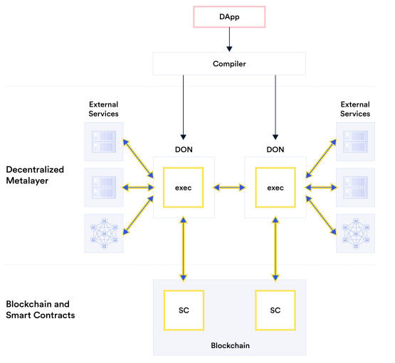
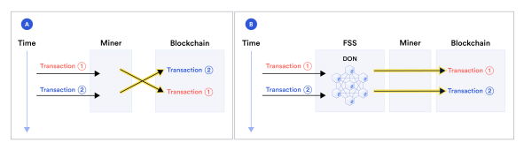
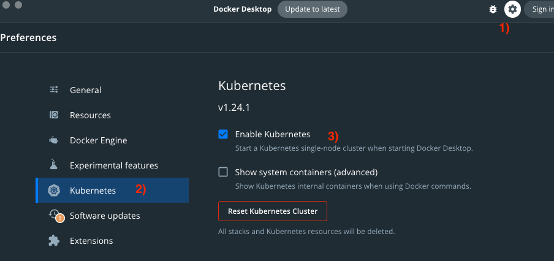
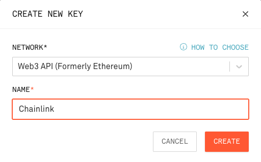
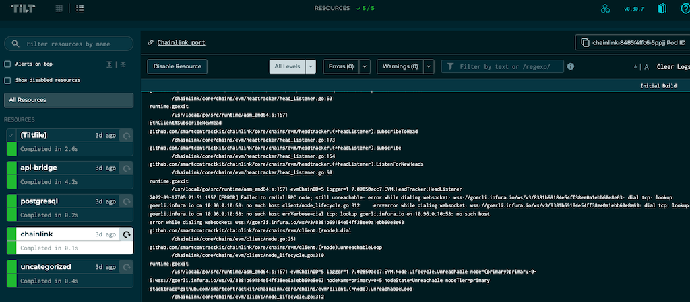
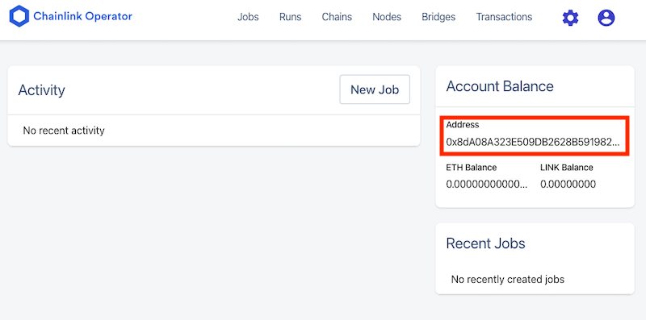

Continuing in the world of blockchain oracles 
covering one of the most popular protocols, Chainlink

# The world, according to Chainlink 


> Photo by Shubham Dhage on Unsplash

In my [previous blog post][1] I covered the basics of blockchain oracles 
and the internals of Band chain 
*If you have not read it, you may want to take some time to get acquainted with some basic concepts*  

Chainlink is arguably the biggest oracle protocol, having started its life in the Ethereum network
currently in its [second iteration][2], Chainlink oracles  
> provide tamper-proof inputs, outputs, and computations to support advanced smart contracts on any blockchain.

To achieve this, the protocol  
* gives incentives to oracle providers to create reliable data sources,
* performs all computations off-chain (Off-chain reporting) and stores the results on-chain, maintaining security while reducing gas cost, 
* gives them a powerful and "pliable" compute engine (the Chainlink node) for off-chain computations,  
* provides building blocks to extend the oracle functionality and connectivity to any chain and data source.

## Use cases

Before we deep-dive into the technicals of Chainlink, let's have a quick look on the different use cases it considers as 
relevant

*Images in this section are from the Chainlink [whitepaper][2]*<sup>[1](#footnote_1)</sup>

**Oracle data**


The vanilla use case is "off-chain data ingress": 
A smart contract (denoted as *Blockchain*) requests data from an oracle (denoted as *DON*). 
The oracle reaches out to a number of external services to fetch this data.

**Compaction of data**


This is a corollary / side-effect of the above use case 
but it's worth highlighting given the cost of computation gas on [some chains][3]

A smart contract requires a number of external data points from 3rd party services.  
A. In the simple case, the oracle is a simple pass-through. Each data point / service call becomes a new transaction in 
the calling chain.
B. The oracle contains "enough" logic to fan out calls to the external services and gather the required data. The different 
data points are compacted into a single payload back to the calling chain. This results in a single transaction, reducing 
overall cost. 

**Meta-layer**



The next step from the "oracle-as-off-chain-data-ingres" scenario is having a mesh of co-operating oracles acting as 
proxies to both the blockchain and non-blockchain worlds.
In this case, a dApp is calling one or more oracles which aggregate on- and off-chain data
This is a reincarnation of the [BFF][4] pattern, with the oracle taking over some of the logic which would reside inside the dApp 

**Oracle as an outgres**



This use case is hidden in the Meta-layer one.
An oracle can be used as an outgress (or smart forward proxy) for important smart contract and dApp calls
The most obvious case is ensuring transaction are first-in-first-out to prevent [MEV][5] front-runs. 

## Architecture & components

Let's take a quick tour of the data flow and different components involved in Chainlink


1. The Oracle developer deploys their oracle contract on an EVM-compatible chain (e.g. Ethereum) or [Solana][10].  
Their `<<custom>> Oracle` implementation extends the base `<<Chainlink>> Oracle` contract.<sup>[1](#footnote_2)</sup>
In the background they also setup their oracle node or Decentralized Oracle Network (DON). More on this in the 
['Oracle node' section](#oracle_node).   
The oracle is now ready to be used (e.g. it can be advertised in [Chainlink's oracle marketplace][6]). 
2. The dApp / smart contract developer needing oracle data deploy their code on the chain.  
Their contract (`Consumer`) extends the base Chainlink `Client` contract. 
3. When the `Consumer` contract needs data, it makes a [transferAndCall][7] [invocation][13] to the `Oracle` contract instance.  
This is the point that the oracle provider is paid their fee in the [LINK token][8].
4. The `Oracle` contract [emits][11] an [event][9] for the oracle node to pick up and take action.
5. (If there is a DON setup) The nodes in the network prepare themselves to reach a consensus on the result. More on 
this in the ['DON' section](#don).
6. The node(s) collect the data from the outside source(s).  
(If there is a DON) The nodes reach a consensus on the result and sign a response.
7. The oracle node [calls back][12] the `Oracle` contract with the result.
8. The `Oracle` contract calls back the `Consumer` contract with the data result. 

### Architecture discussion

The end-to-end data path and high-level components build upon the standard Oracle pattern, first [introduced by Ethereum][14].  
An Oracle contract emits a special event, an associated out-of-chain trusted process listens to that event, it fetches 
data and performs a method callback on the Oracle contract.

Similar to the Band protocol, Chainlink innovates by providing incentives for a distributed marketplace of oracle data.  
It moves a couple of steps further by  
* providing a "pliable" and configurable compute building block with the Chainlink node, 
* off-loading computation while trying to balance centralisation with the Decentralized Oracle Network (DON).

Let's examine both in a bit more detail.

### <a name="oracle_node"></a>Inside the Chainlink node 

From a technical PoV, the Chainlink node is a configurable process which can  
* listen to events from (and post callbacks to) a blockchain, and 
* execute arbitrary logic expressed as a [DOT graph][15]. 

From a conceptual PoV, the best way to visualize it is with a box of lego: it contains "bricks" and "templates".  
* Bricks  
These are the individual pieces of logic executed by the node, i.e. the vertices of the graph. These are [Tasks][16] 
(for standard computations and external calls), [Adapters][17] (for bespoke computations and calls) and [Initiators][18]
(for triggering of logic based on external conditions). 
* Templates 
[Jobs][19] are Chainlink's way of describing the "category" of a computation pipeline. E.g. is the job launched as a 
CRON or on a webhook call? A Job is the overall framework in which the individual data pipeline of Tasks, Adapters and 
Initiators will execute in.  

From a [product PoV][20] the reason for this technical choice (a highly configurable process) is clear.  
Node and validator [operators'][21] skill-set leans more towards DevOps and sysadmin than development. I.e. it is easier 
for them to spin up new services based on configuration, rather than coding. Zero-code deployments make a lot of sense. 

### <a name="don"></a>DON


A Decentralized Oracle Network (DON) is a subset of Chainlink nodes forming a committee and agreeing to serve clients 
on other chains (e.g. smart contracts). The DON's service is a combination of networking, storage and computation.

The DON could be organized in one of 2 ways:  
* [Basic Request Model][25]  
In this setup, described in the previous section, the DON fetches data from primary data sources after it has been 
requested by consumers.  
It is useful when the consumer can tolerate a delay between requesting and receiving the data.
* [Data Feed][23]  
This setup is used when data needs to be timely and acted upon immediately (e.g. price tickers).  
Here the oracle(s) in the DON provide data observations on regular intervals and these are stored in the oracle contract 
on-chain.

**[Off-chain Reporting][24]** (OCR)  
OCR is a lightweight [consensus protocol][26], designed to provide transparency in off-chain calculations.  
It has the same compaction effect as [ZK rollups][27] (many data points in a single transaction), but transparent; the 
result is signed by a majority of DON participants, and we know which oracle has reported what.

The OCR protocol has a predetermined list of oracles. It is a [PBFT][28] derivative, so it requires over 2/3 of participants to be well-behaved. , correct oracles receive payout from s.c.
Like PBFT, it has 4 stages, after leader election 
1. Start of epoch (cycle)
2. Followers submit observations 
3. Leader compiles the report 
4. Followers sign the report 

and then the leader submits the final report.

The main deviation from PBFT is the additional check for epoch invalidation. I.e. if the participants cannot reach a 
conclusion in a timely manner, the current epoch is cancelled and a new one starts.


With the technical description out of the way, let's re-visit our flight oracle use case.

# Flight oracle, the Chainlink way


> Photo by John McArthur on Unsplash

In the [previous article][1] we had created a flight oracle, providing information on flight arrivals. 

As a quick reminder:  
* Oracle consumer requests flight status by providing
  * flight number in [IATA format][39], and 
  * date in [ISO-8601][40] 
* Oracle responds with  
  * Flight [status][41] string, 
  * Arrival airport code, 
  * Scheduled Departure Time (ISO-8601 UTC), 
  * Actual Arrival Time (optional, ISO-8601 UTC)  

In this iteration, we will setup  
* an Oracle contract on the Rinkeby ETH testnet, callable by other smart contracts,
* a local Chainlink node, listening for instructions from that contract, 
* the node will be configured to use our flight oracle API, and
* submitting its report back to the oracle contract.


TODO insert schematic of setup

We will run our local node using K8s, orchestrated by Tilt.
The Chainlink node is using Postgres as its persistent storage.

> If you have not already followed the steps of the previous article, at the very least you will need to create a 
> [free AeroDataBox account][44].

Let's get prepared.

## Local environment 

First we need to setup our local dev environment. 

### Cluster 

**Docker**  
Follow the instructions in [Docker][30] for your machine type (Mac, Windows) 

Enable Kubernetes (K8s) support in Docker.  


**Kubectl, Helm & Tilt**  

If you do not have them, install   
* [kubectl][35]
* [Helm][36], and
* [Tilt][31] (installation [instructions][29])

Make sure you are using Docker Desktop as the K8s environment.  
`kubectl config use-context docker-desktop`

### Truffle 

We will use [Truffle][https://trufflesuite.com/docs/truffle/] to facilitate our communication with the Oracle contract.  
Follow its [installation][33] instructions. 
Do not worry about installing an Ethereum client, because we will be using the... 

### Infura API

We will need an [Infura API][34] token to communicate with the Rinkeby testnet.  
Head over, register for free and generate an API key. 



We are finally ready to...

# Get coding 


> Photo by ThisisEngineering RAEng on Unsplash

> You can find the code for this blog post in this [Github repo][37].  
> Clone locally and open a terminal inside it. We will assume this is your working directory, unless explicitly noted so.    

## Test local node

With Docker Desktop running, let's test launching the local node.  
```bash
INFURA_TOKEN=<YOUR TOKEN> tilt up
```

You will be prompted to open Tilt's web UI on [http://localhost:10350/](http://localhost:10350/).  


The Chainlink node will have finished booting, created its DB schema in Postgres and connected to the Ethereum Rinkeby network.  
Let's test the node's web UI on [http://localhost:6688/](http://localhost:6688/). Use the username and password 
you have defined in the [Tiltfile][38].  


## Oracle job

We mentioned above that the Chainlink node is a configurable piece of computing, like a box of lego.  
The logic of calling out to the API provider and processing the result can be expressed as an [Oracle job][42], namely 
a [Direct Request][43].

Going back to the previous [flight oracle article][45], we can use the Python [data source implementation][46] as a 
reference.  
The diagram below describes one way of arranging some of the available [tasks][16] in the job's acyclic graph to achieve our result.


The job first extracts the flight number & date from the [CBOR-encoded][47] payload before making the HTTP call. The JSON 
response is parsed to extract the individual fields. These are then compiled into a [multi-variable response][48] and sent
back to the Oracle.

You can view the resulting job script [in this file][49].

Next up is the...

## Oracle contract


Awesome stuff!!  
🎉🎉

# Discussion

Band chain is trying to optimise along a number of dimensions with mixed results.

**Data source "marketplace"**  
Band exhibits [platform-like][46] characteristics, allowing individual developers to expose interesting data sources. 
However, at the moment it only supports text scripts (e.g. Python), with some [very hard limits][51] and little-to-no documentation on the exact options.
Interpreted code gives no protection for IP and secrets<sup>[3](#footnote_3)</sup>.  
Developers could hide their proprietary information behind an API gateway (e.g. see this [example][48], i.e. Data Source -> Gateway -> golden source), but 
this adds another layer of abstraction and a centralized point of infrastructure to attack.  
An option would be to add support for binaries and/or Docker images.  
The former would run into chain space issues<sup>[4](#footnote_4)</sup> as well as platform compatibility issues. The latter 
seems to be [in the works][49], akin to how Provable supports it [centrally][53], but with zero references in the Band docs.

**Decentralized data gathering**  
Band introduces randomized [sampling of validators][52] to prevent sibyl attacks. It is not clear though if validators who
are intentionally non-responsive to data requests are getting slashed. This is an important consideration due to the next dimension.

**Optimisation of data access**  
As already mentioned, Band is introducing 2 non-mandatory components (Yoda and the cloud function) to address some 
important security and scalability concerns. Though solving a real problem, these impose additional infrastructure 
requirements on validators (deploy & monitor Yoda, deploy cloud function). They also implicitly result in a "lowest 
common denominator" problem: since these components are off-chain, it will take additional effort to update them to a 
newer version across validators.  

The additional infrastructure and complexity comes with a cost.  
Examining the list of [mainnet data source][54], we see that overall usage is low, a few Data Sources dominating call counts 
and then a long tail of hardly used Data Sources.  

This relatively low adoption, along with sparse documentation, make Band an interesting but very risky bet in the 
domain of oracles.  

# Parting thought


> Photo by Ray Hennessy on Unsplash

Oracles are a vital component for bridging on-chain processing with off-chain events.

Band chain tries to address some existing concerns in a new and interesting way.  
I hope this hands on deep-dive has helped you get a better understanding of oracles, their challenges and opportunities.

Until next time, happy coding!

# Footnotes

1. <a name="footnote_1"></a>In the following images and text, the terms "smart contract" and "blockchain" are used interchangeably.  
2. <a name="footnote_2"></a>In any but the most trivial cases, the oracle contract would be deployed behind a [proxy][22]
for easy upgrades. This is omitted here for brevity.  


  [1]: https://sgerogia.github.io/Band-Oracle/
  [2]: https://research.chain.link/whitepaper-v2.pdf
  [3]: https://ycharts.com/indicators/ethereum_average_gas_price
  [4]: https://samnewman.io/patterns/architectural/bff/
  [5]: https://ethereum.org/en/developers/docs/mev/
  [6]: https://market.link/overview
  [7]: https://github.com/ethereum/EIPs/issues/677
  [8]: https://coinmarketcap.com/currencies/chainlink/
  [9]: https://consensys.net/blog/developers/guide-to-events-and-logs-in-ethereum-smart-contracts/
  [10]: https://docs.chain.link/solana/
  [11]: https://docs.chain.link/docs/chainlink-framework/#chainlinkrequested
  [12]: https://docs.chain.link/docs/chainlink-framework/#recordchainlinkfulfillment
  [13]: https://docs.chain.link/docs/chainlink-framework/#sendchainlinkrequestto
  [14]: https://ethereum.org/en/developers/docs/oracles
  [15]: https://en.wikipedia.org/wiki/DOT_(graph_description_language)
  [16]: https://docs.chain.link/docs/tasks/
  [17]: https://docs.chain.link/docs/external-adapters/
  [18]: https://docs.chain.link/docs/external-initiators-introduction/
  [19]: https://docs.chain.link/docs/jobs/
  [20]: https://medium.com/agileinsider/what-is-the-product-mindset-af06e01adf70
  [21]: https://www.blockchainecosystem.io/ask/what-does-it-mean-to-be-a-blockchain-node-operator-are-there-any-blockchains-out-there-that-don-t-have-node-operators
  [22]: https://fravoll.github.io/solidity-patterns/proxy_delegate.html
  [23]: https://docs.chain.link/docs/architecture-decentralized-model/
  [24]: https://docs.chain.link/docs/off-chain-reporting/
  [25]: https://docs.chain.link/docs/architecture-request-model/
  [26]: https://research.chain.link/ocr.pdf
  [27]: https://ethereum.org/en/developers/docs/scaling/zk-rollups/
  [28]: https://pmg.csail.mit.edu/papers/osdi99.pdf
  [29]: https://docs.tilt.dev/install.html#macos
  [30]: https://www.docker.com/
  [31]: https://tilt.dev/
  [32]: https://trufflesuite.com/docs/truffle/
  [33]: https://trufflesuite.com/docs/truffle/getting-started/installation/
  [34]: https://infura.io/
  [35]: https://kubernetes.io/docs/tasks/tools/install-kubectl-macos/
  [36]: https://helm.sh/docs/intro/install/
  [37]: https://github.com/sgerogia/hello-chainlink
  [38]: https://github.com/sgerogia/hello-chainlink/blob/main/Tiltfile#L30-L31
  [39]: https://www.iata.org/en/publications/directories/code-search/
  [40]: https://en.wikipedia.org/wiki/ISO_8601
  [41]: https://doc.aerodatabox.com/#tag/Flight-API/operation/GetFlight
  [42]: https://docs.chain.link/docs/jobs/
  [43]: https://docs.chain.link/docs/jobs/types/direct-request/
  [44]: https://sgerogia.github.io/Band-Oracle/#data_provider
  [45]: https://sgerogia.github.io/Band-Oracle/#data_source
  [46]: https://github.com/sgerogia/hello-bandchain/blob/main/python/ds.py#L19-L32
  [47]: https://en.wikipedia.org/wiki/CBOR
  [48]: https://docs.chain.link/docs/any-api/get-request/examples/multi-variable-responses/
  [49]: https://github.com/sgerogia/hello-chainlink/blob/main/job/aerodatabox.toml