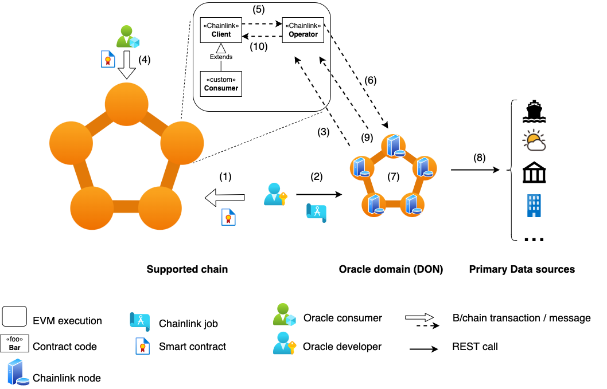

Continuing in the world of blockchain oracles 
covering one of the most popular protocols, Chainlink

# The world, according to Chainlink 


> Photo by Shubham Dhage on Unsplash

In my [previous blog post][1] I covered the basics of blockchain oracles 
and the internals of Band chain 
*If you have not read it, you may want to take some time to get acquainted with some basic concepts*  

Chainlink is arguably the biggest oracle protocol, having started its life in the Ethereum network
currently in its [second iteration][2], Chainlink oracles  
> provide tamper-proof inputs, outputs, and computations to support advanced smart contracts on any blockchain.

To achieve this, the protocol  
* gives incentives to oracle providers to create reliable data sources,
* performs all computations off-chain (Off-chain reporting) and stores the results on-chain, maintaining security while reducing gas cost, 
* gives them a powerful and "pliable" compute engine (the Chainlink node) for off-chain computations,  
* provides building blocks to extend the oracle functionality and connectivity to any chain and data source.

## Use cases

Before we deep-dive into the technicals of Chainlink, let's have a quick look on the different use cases it considers as 
relevant

*All images taken from the Chainlink [whitepaper][2]*<sup>[1](#footnote_1)</sup>

**Oracle data**


The vanilla use case is "off-chain data ingress": 
A smart contract (denoted as *Blockchain*) requests data from an oracle (denoted as *DON*). 
The oracle reaches out to a number of external services to fetch this data.

**Compaction of data**


This is a corollary / side-effect of the above use case 
but it's worth highlighting given the cost of computation gas on [some chains][3]

A smart contract requires a number of external data points from 3rd party services.  
A. In the simple case, the oracle is a simple pass-through. Each data point / service call becomes a new transaction in 
the calling chain.
B. The oracle contains "enough" logic to fan out calls to the external services and gather the required data. The different 
data points are compacted into a single payload back to the calling chain. This results in a single transaction, reducing 
overall cost. 

**Meta-layer**


The next step from the "oracle-as-off-chain-data-ingres" scenario is having a mesh of co-operating oracles acting as 
proxies to both the blockchain and non-blockchain worlds.
In this case, a dApp is calling one or more oracles which aggregate on- and off-chain data
This is a reincarnation of the [BFF][4] pattern, with the oracle taking over some of the logic which would reside inside the dApp 

**Oracle as an outgres**


This use case is hidden in the Meta-layer one.
An oracle can be used as an outgress (or smart forward proxy) for important smart contract and dApp calls
The most obvious case is ensuring transaction are first-in-first-out to prevent [MEV][5] front-runs. 

## Architecture & components

Let's take a quick tour of the data flow and different components involved in Chainlink



1. The Oracle developer deploys their oracle contract on an EVM-compatible chain (e.g. Ethereum) or [Solana][10].  
Their `<<custom>> Oracle` implementation extends the base `<<Chainlink>> Oracle` contract.
In the background they also setup their oracle node or Decentralized Oracle Network (DON). More on this in the 
['Oracle node' section](#oracle_node).   
The oracle is now ready to be used (e.g. it can be advertised in [Chainlink's oracle marketplace][6]). 
2. The dApp / smart contract developer needing oracle data deploy their code on the chain.  
Their contract (`Consumer`) extends the base Chainlink `Client` contract. 
3. When the `Consumer` contract needs data, it makes a [transferAndCall][7] [invocation][13] to the `Oracle` contract instance.  
This is the point that the oracle provider is paid their fee in the [LINK token][8].
4. The `Oracle` contract [emits][11] an [event][9] for the oracle node to pick up and take action.
5. (If there is a DON setup) The nodes in the network prepare themselves to reach a consensus on the result. More on 
this in the ['DON' section](#don).
6. The node(s) collect the data from the outside source(s).  
(If there is a DON) The nodes reach a consensus on the result and sign a response.
7. The oracle node [calls back][12] the `Oracle` contract with the result.
8. The `Oracle` contract calls back the `Consumer` contract with the data result. 

### Architecture discussion

The end-to-end data path and high-level components build upon the standard Oracle pattern, first [introduced by Ethereum][14].  
An Oracle contract emits a special event, an associated out-of-chain trusted process listens to that event, it fetches 
data and performs a method callback on the Oracle contract.

Similar to the Band protocol, Chainlink innovates by providing incentives for a distributed marketplace of oracle data.  
It moves a couple of steps further by  
* providing a "pliable" and configurable compute building block with the Chainlink node, 
* off-loading computation while trying to balance centralisation with the Decentralized Oracle Network (DON).

Let's examine both in a bit more detail.

### <a name="oracle_node"></a>Inside the Chainlink node 

From a technical PoV, the Chainlink node is a configurable process which can  
* listen to events from (and post callbacks to) a blockchain, and 
* execute arbitrary logic expressed as a [DOT graph][15]. 

From a conceptual PoV, the best way to visualize it is with a box of lego: it contains "bricks" and "templates".  
* Bricks  
These are the individual pieces of logic executed by the node, i.e. the vertices of the graph. These are [Tasks][16] 
(for standard computations and external calls), [Adapters][17] (for bespoke computations and calls) and [Initiators][18]
(for triggering of logic based on external conditions). 
* Templates 
[Jobs][19] are Chainlink's way of describing the "category" of a computation pipeline. E.g. is the job launched as a 
CRON or on a webhook call? A Job is the overall framework in which the individual data pipeline of Tasks, Adapters and 
Initiators will execute in.  

From a [product PoV][20] the reason for this technical choice (a highly configurable process) is clear.  
Node and validator [operators'][21] skill-set leans more towards DevOps and sysadmin than development. I.e. it is easier 
for them to spin up new services based on configuration, rather than coding. Zero-code deployments make a lot of sense. 

### <a name="don"></a>DON


### Architecture discussion

Viewed from a very high level, the Band Protocol architecture does not deviate from the archetypical Oracle pattern, 
first [introduced by Ethereum][16]. An Oracle contract emits a special event, an associated out-of-chain, trusted process
listens to that event, fetches data and performs a method callback on the Oracle contract.

This pattern has already been productionized into a SaaS offering for the Ethereum ecosystem by [Provable][17] (formely Oraclize). 

Band's core improvement of this pattern lies along 2 axes: 
* Introduces a distributed and incentivized marketplace of data sources. This allows a Web3 application builder needing 
external data to only focus on building on-chain logic.    
* Makes the Oracle script a re-usable building block, akin to a reduce function in the [map-reduce][18] model.

Yoda and the cloud function are 2 additional off-chain components introduced by Band.
They are not mandatory though. They are reference implementations of an architecture pattern, attempting to solve 2 
issues faced by Band validators.
* Validation is a critical function in Proof-of-Stake; poor performance gets [penalized][19].  
Off-loading non-core functionality away from the validator process is priority 1. This includes the execution of Data 
Source code with unknown complexity (e.g. blocking network calls).
* Keeping code of unknown provenance (i.e. potentially malicious) away from the validator's network domain.

With the technical description out of the way, let's consider a semi-realistic use case.

# Flight oracle


> Photo by Bing Hui Yau on Unsplash

We will create a simple flight data oracle.

It will be able to answer the following question  
> Has flight X and date Y arrived?  
> If yes, what time (vs the scheduled one) and at which airport?

This could be useful in a number of scenarios, like an automatic flight insurance contract. 

Let's get prepared.


## Local environment 

Let's prepare our local dev environment. 

### Go & Band chain binaries 

* Install [Golang][25]  
Make sure that `GOPATH` and `PATH` are populated.  
They should be available for all scripts we will run from now on.  
```
$ echo $GOPATH
/something/foo/bar
$ echo $PATH
< somethingsomething >:$GOPATH/bin
```

* Build Band chain  
```
$ git clone https://github.com/bandprotocol/chain
$ cd chain && git checkout v2.3.3
$ make install
```

* Test them  
```
$ bandd version --long
$ yoda version --long
```

### Rust 

We will use Rust to build our WASM Oracle script.

* Install [Rust][26]

* Install the custom build target  
This should not normally be necessary, but it was in my case.  
`$ rustup target add wasm32-unknown-unknown`

### Python 3

We will use Python for our Data Source script. 

* Install [Python 3][27]  
`$ python3 --version`

* Install [Band's client][28] for Python  
`$ pip3 install pyband`

### Generate accounts

To interact with the Band chain (or any Cosmos chain, for that matter) we will need some [Accounts][29] on our machine. 

We can take a shortcut and use the [genesis file][30] script which comes in Band's sources.  
```
$ cd chain && ./scripts/generate_genesis.sh 
{"app_message"...
...
Genesis transaction written to ...
```

We can verify the creation with `$ ls ~/.band/`.

Let's view the keys in the [keyring][31] and take a note of the addresses.  
```
$ bandd keys list --keyring-backend test
- name: requester
  type: local
  address: band1m5lq9u533qaya4q3nfyl6ulzqkpkhge9q8tpzs
  pubkey: '{"@type":"/cosmos.crypto.secp256k1.PubKey","key":"A6rU4D6xY4ibvdSDdg8iLDSVF73O6ZB/vUH6iJsNRNqY"}'
  mnemonic: ""
- name: validator
  type: local
  address: band1p40yh3zkmhcv0ecqp3mcazy83sa57rgjp07dun
  pubkey: '{"@type":"/cosmos.crypto.secp256k1.PubKey","key":"AiS3jI4M4wP0Aqn+4RhteonBF82QvzdR6OGFF2rlFKMk"}'
  mnemonic: ""
```

The `validator` account will be the Data Source & Oracle owner and the `requester` the user. 

We are finally ready to...

# Get coding 


> Photo by Kevin Ku on Unsplash


Awesome stuff!!  
🎉🎉

# Discussion

Band chain is trying to optimise along a number of dimensions with mixed results.

**Data source "marketplace"**  
Band exhibits [platform-like][46] characteristics, allowing individual developers to expose interesting data sources. 
However, at the moment it only supports text scripts (e.g. Python), with some [very hard limits][51] and little-to-no documentation on the exact options.
Interpreted code gives no protection for IP and secrets<sup>[3](#footnote_3)</sup>.  
Developers could hide their proprietary information behind an API gateway (e.g. see this [example][48], i.e. Data Source -> Gateway -> golden source), but 
this adds another layer of abstraction and a centralized point of infrastructure to attack.  
An option would be to add support for binaries and/or Docker images.  
The former would run into chain space issues<sup>[4](#footnote_4)</sup> as well as platform compatibility issues. The latter 
seems to be [in the works][49], akin to how Provable supports it [centrally][53], but with zero references in the Band docs.

**Decentralized data gathering**  
Band introduces randomized [sampling of validators][52] to prevent sibyl attacks. It is not clear though if validators who
are intentionally non-responsive to data requests are getting slashed. This is an important consideration due to the next dimension.

**Optimisation of data access**  
As already mentioned, Band is introducing 2 non-mandatory components (Yoda and the cloud function) to address some 
important security and scalability concerns. Though solving a real problem, these impose additional infrastructure 
requirements on validators (deploy & monitor Yoda, deploy cloud function). They also implicitly result in a "lowest 
common denominator" problem: since these components are off-chain, it will take additional effort to update them to a 
newer version across validators.  

The additional infrastructure and complexity comes with a cost.  
Examining the list of [mainnet data source][54], we see that overall usage is low, a few Data Sources dominating call counts 
and then a long tail of hardly used Data Sources.  

This relatively low adoption, along with sparse documentation, make Band an interesting but very risky bet in the 
domain of oracles.  

# Parting thought


> Photo by Ray Hennessy on Unsplash

Oracles are a vital component for bridging on-chain processing with off-chain events.

Band chain tries to address some existing concerns in a new and interesting way.  
I hope this hands on deep-dive has helped you get a better understanding of oracles, their challenges and opportunities.

Until next time, happy coding!

# Footnotes

1. <a name="footnote_1"></a>In the following images, smart contract and blockchain are used interchangeably.  


  [1]: https://sgerogia.github.io/Band-Oracle/
  [2]: https://research.chain.link/whitepaper-v2.pdf
  [3]: https://ycharts.com/indicators/ethereum_average_gas_price
  [4]: https://samnewman.io/patterns/architectural/bff/
  [5]: https://ethereum.org/en/developers/docs/mev/
  [6]: https://market.link/overview
  [7]: https://github.com/ethereum/EIPs/issues/677
  [8]: https://coinmarketcap.com/currencies/chainlink/
  [9]: https://consensys.net/blog/developers/guide-to-events-and-logs-in-ethereum-smart-contracts/
  [10]: https://docs.chain.link/solana/
  [11]: https://docs.chain.link/docs/chainlink-framework/#chainlinkrequested
  [12]: https://docs.chain.link/docs/chainlink-framework/#recordchainlinkfulfillment
  [13]: https://docs.chain.link/docs/chainlink-framework/#sendchainlinkrequestto
  [14]: https://ethereum.org/en/developers/docs/oracles
  [15]: https://en.wikipedia.org/wiki/DOT_(graph_description_language)
  [16]: https://docs.chain.link/docs/tasks/
  [17]: https://docs.chain.link/docs/external-adapters/
  [18]: https://docs.chain.link/docs/external-initiators-introduction/
  [19]: https://docs.chain.link/docs/jobs/
  [20]: https://medium.com/agileinsider/what-is-the-product-mindset-af06e01adf70
  [21]: https://www.blockchainecosystem.io/ask/what-does-it-mean-to-be-a-blockchain-node-operator-are-there-any-blockchains-out-there-that-don-t-have-node-operators
  