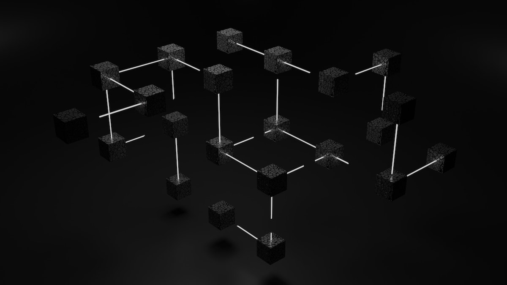
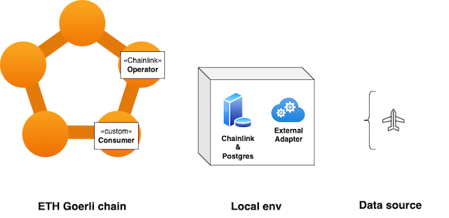
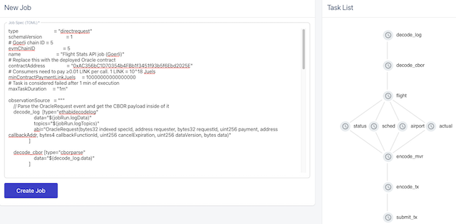

Continuing in the world of blockchain oracles, I am covering one of the most popular protocols, Chainlink.

# The world, according to Chainlink 


> Photo by Shubham Dhage on Unsplash

In my [previous blog post][1] I covered the basics of blockchain oracles, using the Band Protocol for a hands-on exercise.  
*If you have not read that post, you may want to take some time to get acquainted with some basic concepts, before proceeding.*  

Chainlink is arguably the biggest oracle protocol, having started its life in the Ethereum network.  
Currently in its [second iteration][2], Chainlink oracles    
> provide tamper-proof inputs, outputs, and computations to support advanced smart contracts on any blockchain.

To achieve this, the protocol  
* gives incentives and punishments to oracle and node providers to create reliable data sources,
* performs all computations off-chain (Off-chain reporting) and stores the results on-chain, maintaining security while 
  reducing gas cost, 
* gives them a powerful and "pliable" compute engine (the Chainlink node) for off-chain computations,  
* provides building blocks to extend the oracle functionality and connectivity to any chain and data source.

## Use cases

Before we deep-dive into the technicals of Chainlink, let's have a quick look on the different use cases it considers as 
relevant.  
*Use case images in this section are from the Chainlink [whitepaper][2].*<sup>[1](#footnote_1)</sup>

**Oracle data**


The vanilla use case is "off-chain data ingress":  
A smart contract (denoted as *Blockchain*) requests data from an oracle (denoted as *DON*). The oracle reaches out to a 
number of external services to fetch this data.

**Compaction of data**


This is a corollary / side-effect of the above use case. It is worth highlighting given the cost of computation gas on 
[some chains][3]. 

A smart contract requires a number of external data points from 3rd party services.  
A. In the simple case, the oracle is a simple pass-through. Each data point / service call becomes a new transaction in 
the calling chain.
B. The oracle contains "enough" logic to fan out calls to the external services and gather the required data. The different 
data points are compacted into a single payload back to the calling chain. This results in a single transaction, reducing 
overall cost. 

**Meta-layer**


The next step from the "oracle-as-off-chain-data-ingres" scenario is having a mesh of co-operating oracles acting as 
proxies to both the blockchain and non-blockchain worlds.  
In this case, a dApp is calling one or more oracles which aggregate on- and off-chain data. This is a reincarnation of 
the [BFF][4] pattern, with the oracle taking over some logic which would have resided inside the dApp. 

**Oracle as an outgres**


This use case is hidden in the Meta-layer one.  
An oracle can be used as an outgress (or smart forward proxy) for important smart contract and dApp calls. The 
most obvious case is ensuring transaction are first-in-first-out to prevent [MEV][5] front-runs. 

## Architecture & components

Let's take a quick tour of the data flow and different components involved in Chainlink. We will use the basic *Oracle 
data* use case.


1. (one-off) The Oracle operator deploys their oracle contract on a supported chain (e.g. Ethereum, [Solana][10]).  
The `<<Chainlink>> Operator` [contract][50] is what ties the whole system together.<sup>[2](#footnote_2)</sup>
In the background they also setup their oracle node or Decentralized Oracle Network (DON). More on this in the 
['Oracle node' section](#oracle_node). 
2. (one-off) The Oracle operator deploy their specific Chainlink job instance in the running Chainlink nodes (DON). The node 
automatically generates a unique job identifier and...
3. (one-off) the Oracle operator registers the node as a trusted address with the Oracle smart contract.  
The oracle data feed is now ready to be used; it is uniquely identified by the combination of [`oracle contract address`,
`job id`]. With that it can be advertised in [Chainlink's oracle marketplace][6] and other channels. 
4. (one-off) The dApp / smart contract developer needing oracle data update their code to use the [`oracle contract address`,
`job id`] and deploy their code on the chain.  
Their contract (`Consumer`) extends the base Chainlink `Client` contract. 
5. When the `Consumer` contract needs data, it makes a [transferAndCall][7] [invocation][13] to the `Operator` contract instance.  
This is the point that the Oracle contract deducts the [LINK token][8] fee from the consumer and holds it in escrow until 
the node returns the data.
6. The `Operator` contract [emits][11] an [event][9] for the specific job running on the Chainlink node to pick up and take action. 
7. (If there is a DON setup) The nodes in the network prepare themselves to reach a consensus on the result. More on 
this in the ['DON' section](#don).
8. The node(s) collect the data from the outside source(s).  
(If there is a DON) The nodes reach a consensus on the result and sign a response.
9. The oracle node [calls back][12] the `Operator` contract with the result.  
If the result is deemed timely, the payment is released to the node's wallet address.
10. The `Operator` contract calls back the `Consumer` contract with the data result. 

### Architecture discussion

The end-to-end data path and high-level components build upon the standard Oracle pattern, first [introduced by Ethereum][14].  
An Oracle contract emits a special event, an associated out-of-chain trusted process listens to that event, it fetches 
data and performs a method callback on the Oracle contract.

Similar to the Band protocol, Chainlink innovates by providing incentives for a distributed marketplace of oracle data.  
It moves a couple of steps further by  
* having the oracle contract (`Operator`) function as single-point-of-entry and "good behaviour" enforcer,
* providing a "pliable" and configurable compute building block with the Chainlink node, 
* off-loading computation while trying to balance centralisation with the Decentralized Oracle Network (DON).

Let's examine all three in a bit more detail.

### <a name="oracle_contract"></a>Oracle contract

The oracle contract (a.k.a. *Operator* contract) performs 2 functions:

* **Gateway to nodes**  
The contract controls which Chainlink nodes can serve specific job requests.  
Employing a general-purpose payload format for [requests][51] and [responses][52], it remains agnostic to the "what"
while focusing on the "how" of the interaction.

* **Node behaviour controller**  
The oracle contract can force Chainlink nodes to have ["skin in the game"][53] and be benevolent actors.  
High-value consumer data calls can require that Chainlink nodes bond an amount of LINK as guarantee of good behavior. In
case of poor performance / results, this amount gets slashed by the oracle contract.

### <a name="oracle_node"></a>Inside the Chainlink node 

From a technical PoV, the Chainlink node is a configurable process which can  
* listen to events from (and post callbacks to) a blockchain, and 
* execute arbitrary logic expressed as a [DOT graph][15]. 

From a conceptual PoV, the best way to visualize it is with a box of lego: it contains "bricks" and "templates".  
* Bricks  
These are the individual pieces of logic executed by the node, i.e. the vertices of the graph. These are [Tasks][16] 
(for standard computations and external calls), [Adapters][17] (for bespoke computations and calls) and [Initiators][18]
(for triggering of logic based on external conditions). 
* Templates 
[Jobs][19] are Chainlink's way of describing the "category" of a computation pipeline. E.g. is the job launched as a 
CRON or on a webhook call? A Job is the overall framework in which the individual data pipeline of Tasks, Adapters and 
Initiators will execute in.  

From a [product PoV][20] the reason for this technical choice (a highly configurable process) is clear.  
Node and validator [operators'][21] skill-set leans more towards DevOps and sysadmin than development. I.e. it is easier 
for them to spin up new services based on configuration, rather than coding.  
Zero-code deployments make a lot of sense for them. 

### <a name="don"></a>DON


A Decentralized Oracle Network (DON) is a subset of Chainlink nodes forming a committee and agreeing to serve clients 
on other chains (e.g. smart contracts). The DON's service is a combination of networking, storage and computation.

The DON could be organized in one of 2 ways:  
* [Basic Request Model][25]  
In this setup, described in the previous section, the DON fetches data from primary data sources after it has been 
requested by consumers. It is useful when the consumer can tolerate a delay between requesting and receiving the data.
* [Data Feed][23]  
This setup is used when data needs to be timely and acted upon immediately (e.g. price tickers).  
Here the oracle(s) in the DON provide data observations on regular intervals and these are stored in the oracle contract 
on-chain.

**[Off-chain Reporting][24]** (OCR)  
OCR is a lightweight [consensus protocol][26], designed to provide transparency in off-chain calculations.  
It has the same compaction effect as [ZK rollups][27] (many data points in a single transaction), but it is transparent. 
The result is signed by a majority of DON participants and we know which oracle has reported what.

The OCR protocol is working with a predetermined list of oracle nodes. It is a [PBFT][28] derivative, so it requires over 
2/3 of participants to be well-behaved. Only the correct oracles (according to consensus) receive a payout. 
Like PBFT, it has 4 stages, after leader election  
1. Start of epoch (cycle)
2. Followers submit observations 
3. Leader compiles the report 
4. Followers sign the report 

and then the leader submits the final report.

The main deviation from PBFT is the additional check for epoch invalidation. I.e. if the participants cannot reach a 
conclusion in a timely manner, the current epoch is cancelled and a new one starts.


With the technical descriptions out of the way, let's re-visit our flight oracle use case.

# Flight oracle, the Chainlink way


> Photo by John McArthur on Unsplash

In the [previous article][1] we created a flight oracle, providing information on flight arrivals. 

As a quick reminder:  
* Oracle consumer requests flight status by providing
  * flight number in [IATA format][39], and 
  * date in [ISO-8601][40] format.
* Oracle responds with  
  * Flight [status][41] string, 
  * Arrival airport code, 
  * Scheduled Departure Time (ISO-8601 UTC), 
  * Actual Arrival Time (optional, ISO-8601 UTC)  

In this iteration, we will    
* create a simple flight data consumer contract, deployed on the Goerli ETH testnet,
* deploy an [oracle contract][50] on the Goerli ETH testnet as gateway,
* operate a local Chainlink node, listening for instructions from that oracle contract. 
* The node will be configured to use our flight oracle API via an [External Adapter][76], and
* will submit its report back to the oracle contract.



We will run our local node using K8s, orchestrated by Tilt. The Chainlink node is using Postgres as its persistent storage.

> If you have not already followed the steps of the previous article, at the very least you will need to create a 
> [free AeroDataBox account][44].

Let's get prepared.

## Local environment 

First we need to setup our local dev environment. 

### Cluster 

**Docker**  
Follow the instructions in [Docker][30] for your machine type (Mac or, Windows) 

Enable Kubernetes (K8s) support in Docker.  


**Kubectl, Helm & Tilt**  

If you do not have them, install   
* [kubectl][35]
* [Helm][36], and
* [Tilt][31] (installation [instructions][29])

Make sure you are using Docker Desktop as the K8s environment.  
`kubectl config use-context docker-desktop`

### Node & nvm

We will use [Node.JS][59] and [nvm][60] to build and deploy our smart contracts.   
Follow the [nvm installation][60] instructions.  

The code has been tested to work with Node `18.7.0`, so I suggest you install that.  
```bash
nvm install 18.7.0
nvm use 18.7.0
```

### Python3

We will use a Python script as our External Adapter.   

Install [Python3][77] in order to execute it. 

### Infura & Etherscan APIs

We will need an [Infura API][34] token to communicate with the Goerli testnet.  
Head over, register for free and generate an API key. 


We will also need an Etherscan API key to auto-verify our deployments. Go ahead and create a [free account][58]. 

### Metamask

Check the detailed instructions in the [Annex at the end of this post](#annex1).

We are finally ready to...

# Get coding 

  
> Photo by ThisisEngineering RAEng on Unsplash

> You can find the code for this blog post in this [Github repo][37].  
> Clone locally and open a terminal inside it. We will assume this is your working directory, unless explicitly noted so.    

## Launch local node

With Docker Desktop running, let's test launching the local Chainlink node.  
```bash
INFURA_TOKEN=<YOUR_INFURA_TOKEN> \ 
RAPIDAPI_TOKEN=<YOUR_AERODATABOX_API_TOKEN> \
tilt up
```

Tilt will take care of co-ordinating between the different resources (env files, external adapter, DB and Chainlink node).  
You will be prompted to open Tilt's web UI on [http://localhost:10350/](http://localhost:10350/).  


We can see that the external adapter (`api-bridge`) has completed initialisation.  
You can quickly test that it is working and can make connections to the external flight data API with `curl`. Adjust 
flight and date accordingly.  
```bash
curl -X POST \
	--url http://localhost:5000/data \
	--data-binary '{"flight":"EK29","date":"2022-09-08"}'

{"actualTimeUtc": "2022-09-08 13:19Z",...}
```

The Chainlink node will have finished booting, created its DB schema in Postgres and connected to the Ethereum Goerli network.  
Let's test the node's web UI on [http://localhost:6688/](http://localhost:6688/). Use the username and password 
you have defined in the [Tiltfile][38].  


We can see that the node's wallet has a balance of zero. Take a note of its address.  
Go to your testnet Metamask and transfer some Goerli ETH and Goerli LINK to the node's wallet.  


Refresh the node's web UI to see the updated balance.

Leave the Tilt cluster running, as we turn our attention to the...

## Oracle contract

At the time of writing this, Chainlink defines 2 types of oracle contracts
* [Oracle][61], which can handle data responses [up to 32 bytes in length][62]
* [Operator][50], which can handle data responses [of arbitrary size][63]

Since our flight data response can be larger than 32 bytes, we create a [simple stub import][64] of the Operator contract
for deployment.

The [`deploy`][65] folder contains a set of re-usable contract deploy scripts, based on Hardhat.  
Let's deploy the `Operator` contract on Goerli.
```bash
INFURA_TOKEN=<YOUR_INFURA_API_KEY> \
ETHERSCAN_API_KEY=<YOUR_ETHERSCAN_API_KEY> \
PRIVATE_KEY=<YOUR_ORACLE_METAMASK_ACCOUNT_PRIVATE_KEY> \
npx hardhat deploy --network goerli --tags oracle
...
deploying "Operator" (tx: 0xf45a12e9da5ee79ed41cb9520dbd388f85284b75ca15531ff489917fec238c8e)...: deployed at 0xAC356bC1D70354b4FBb1f3451f93b5f6Ebd2025E with 3754056 gas
Operator Deployed!
...
```

Note down the contract's address (`0xAC3...`); we will need it!

Let's interact with the Operator contract, using the custom [Hardhat commands][71] we have created. We will add our node
to the list of trusted addresses (i.e. it can send back results to the Oracle contract).

First let's check if the node is trusted.
```bash
INFURA_TOKEN=<YOUR_TOKEN> \
PRIVATE_KEY=<YOUR_ORACLE_ACCOUNT_KEY> \
npx hardhat is-auth-sender \
--contract <YOUR_ORACLE_ADDRESS> \
--address <YOUR_NODE_ADDRESS> \
--network goerli
Checking auth. sender 0xC4... from Operator contract 0xAC... on network goerli
Authorized: false
```

Let's update the value...
```bash
INFURA_TOKEN=<YOUR_TOKEN> \
PRIVATE_KEY=<YOUR_ORACLE_ACCOUNT_KEY> \
npx hardhat set-auth-senders \
--contract <YOUR_ORACLE_ADDRESS> \
--addresses <YOUR_NODE_ADDRESS> \
--network goerli
Updating auth. senders in Operator contract 0xAC3... on network goerli
Done
```

...and check again, after 10-20 seconds, when the blockchain state will have been updated.
```bash
INFURA_TOKEN=<YOUR_TOKEN> \
PRIVATE_KEY=<YOUR_ORACLE_ACCOUNT_KEY> \
npx hardhat auth-senders \
--contract <YOUR_ORACLE_ADDRESS> \
--network goerli
Fetching auth. senders from Operator contract 0xAC3... on network goerli
Authorized senders: [ '0xC4E...' ]
```

Great job!

Speaking of which, time to look into the...

## Oracle job

We mentioned above that the Chainlink node is a configurable piece of computing, like a box of lego.  
The logic of calling out to the External Adapter and processing the result can be expressed as an [Oracle job][42], namely 
a [Direct Request][43].

Going back to the previous [flight oracle article][45], we can use the Python [data source implementation][46] as a 
reference.  
The diagram below describes one way of arranging some available [tasks][16] in the job's acyclic graph to achieve our result.


The job first extracts the flight number & date from the [CBOR-encoded][47] payload. This payload originates from the 
consumer contract and is passed down by the Oracle contract.  
It then requests flight data (HTTP call) through the local bridge process. The JSON response is parsed to extract 
the individual fields. These are then compiled into a [multi-variable response][48] and sent back to the Oracle.

You can view the resulting job script [in this file][49]. 

### Job deployment

The Oracle job script has a placeholder for the Oracle contract address, to monitor for `OracleRequest` events.

In the node's web ui, click `New job`. In the text box, paste the [job TOML script][49].  
Replace the placeholder with the Oracle contract address we just deployed. If there are no syntax errors,
the side panel will show a nice graph of the tasks.  


After clicking `Create job`, we can see our new job on the node.  
  

Take careful note of the `External Job ID`.

## External bridge

You may have noticed that our Oracle Job script references the [bridge process by name][].  
We need to register our little server as a `Bridge` to the node.   
Click on the `Bridges` menu and point to `127.0.0.1:5000`. Make sure to only use lowercase for the name.  


We now have all the ingredients we need.    
* A running and funded Chainlink node,  
* running bridge process with API key, 
* deployed Oracle job, and 
* a deployed Oracle contract
* ...trusting our Chainlink node.

We can reference these in our...

## Consumer contract

Our flight data [consumer contract][67] is intentionally quite simple.  
After being initialized with a target Oracle and job id, it exposes method `requestFlightData` to fetch info for a 
flight and date combination. After the Oracle responds, our contract emits a `DataFulfilled` event and updates its 
internal state variables (`flightStatus`, `arrivalAirport`,...). 

This functionality is demonstrated in the suite of [unit tests][68] contained in the project. These tests mock away the 
2 external contract dependencies (ERC-20 LINK token & Operator contracts).       
Go ahead and execute the unit tests with `npx hardhat test`.

Having made sure the consumer contract works as expected, let's deploy it. 
In [`helper-hardhat-config.js`][69] replace the placeholder `jobId` value with the newly deployed Job id from above 
**without the dashes**.<sup>[3](#footnote_3)</sup>  
Then deploy with  
```bash
INFURA_TOKEN=<YOUR_INFURA_API_KEY> \
ETHERSCAN_API_KEY=<YOUR_ETHERSCAN_API_KEY> \
PRIVATE_KEY=<YOUR_ORACLE_METAMASK_ACCOUNT_PRIVATE_KEY> \
npx hardhat deploy --network goerli --tags api
...
deploying "FlightDataConsumer" (tx: 0x...)...: deployed at 0x0067... with 2190227 gas
...
Run the Flight Data Consumer contract with the following commands:
...
```

Note down of the deployed consumer contract address, as we will need it for our end-to-end test.

Fund the consumer contract with some ETH and LINK, so it can execute its calls.  
Using any of the 2 accounts you have created in Metamask, make the transfer to the contract's address.  


## Bring it all together!


> Photo by Lou Levit on Unsplash

Let's interact with the consumer contract and see the round-trip of information on- and off-chain.

First let's check the current values of the consumer contract member variables.
```bash
INFURA_TOKEN=<YOUR_TOKEN> \
PRIVATE_KEY=<YOUR_CONSUMER_ACCOUNT_KEY> \
npx hardhat read-data \
--contract <YOUR_FLIGHT_DATA_CONSUMER_ADDRESS> \
--network goerli
Reading data from Flight Data Consumer contract ...
Status: , Airport: , Sched. arrival: , Actual arrival: ,
```

Let's initiate a request for some data from our Oracle.<sup>[4](#footnote_4)</sup>  
```bash
INFURA_TOKEN=<YOUR_TOKEN> \
PRIVATE_KEY=<YOUR_CONSUMER_ACCOUNT_KEY> \
npx hardhat request-data \
--contract <YOUR_FLIGHT_DATA_CONSUMER_ADDRESS> \
--network goerli \
--flight EK29 \
--date 2022-09-07
...
Contract 0x0067... external data request successfully called. Transaction Hash: 0xd302...
...
```

Copy the transaction hash and search for it on [Goerli Etherscan][70].  
  
We can see the arguments we have passed in the *Logs* tab.  

After 10-20 seconds, the Chainlink node receives the emitted `OracleRequest` event   


...and triggers the job execution.  


We can click on it and view the execution details.  


After a few more seconds (allowing for the blockchain to commit the transaction), we can go back to the Consumer contract 
and confirm it has been updated.  
```bash
INFURA_TOKEN=<YOUR_TOKEN> \
PRIVATE_KEY=<YOUR_CONSUMER_ACCOUNT_KEY> \
npx hardhat read-data \
--contract <YOUR_FLIGHT_DATA_CONSUMER_ADDRESS> \
--network goerli
Reading data from Flight Data Consumer contract ...
Status: Arrived, Airport: LHR, Sched. arrival: 2022-09-09 13:25Z, Actual arrival: 2022-09-09 13:16Z
```

Awesome stuff!!  
🎉🎉

If you have made it this far, you can pat yourself on the back! 
We have covered A LOT of ground in this tutorial. 

# Discussion


> Photo by Dylan Gillis on Unsplash

Let's take a step back and compare the architectures of Chainlink vs Band Protocol (see previous [blog post][1])

From an abstract level they are very similar:  
* An Oracle contract called by Consumers. 
* An off-chain process listening for Oracle events
* The Oracle gathering the generated data and passing them back.

In terms of platform cohorts, they differ.  
* Chainlink assumes (in fact, it forces!) that data providers (*Node Operators*) maintain their own hardware infrastructure. It assists them
 by providing the Chainlink node as a configurable and versatile process tool. Consensus if left for the underlying chain, 
 while nodes focus on data handling. In this model, the data consumer puts trust on the Node Operator's infrastructure.
* Band utilizes the existing infrastructure of *Validators* to handle data retrieval.  
Band's platform apeals to the user cohort of independent *Oracle Developers*, not wanting to maintain their own infrastructure. 
They develop the data retrieval code and Oracle contracts, deploy them on-chain and Validators take care of the execution. 
In this model, consensus and data quality are inherently intertwined: if you trust the chain's consensus validation, you 
also trust the data.  

If you have gone through both Band and Chainlink blog posts, you may have noticed that Chainlink poses a higher 
barrier-to-entry for an Oracle provider. This is a big drawback, which offerings like [Node-as-a-Service][72] are 
attempting to cover.  
On the other hand, the maturity of Chainlink (supported blockchains, development community) makes it
more attractive in terms as a business proposition. In plain words, the immediate [TAM][73] is larger, therefore more 
requests and revenue is to be expected.   

In the case of Band, the ability to allow any "unvetted" developer to become an Oracle Provider is mitigated by transparency; all
Oracle and Data Source code lives on-chain for anyone to scrutinise. This poses a problem as there is no room for [IP][74] 
protection. Recall how in the Band blog post, we had to effectively [reveal the API key on-chain][75]. The only mitigation would be, ...you 
guessed it!, for the Oracle Developer to deploy their proprietary code on their own infrastructure.

# Parting thought


> Photo by Ray Hennessy on Unsplash

Blockchains are upending most existing business models around us.  
Oracles are a key component in this decentralisation journey.  
Maybe THE key.  

Chainlink is the undisputed leader in this domain by a margin.  
Hopefully this hands-on deep-dive has helped you get a better understanding of Chainlink and its capabilities.

Until next time, happy coding!

# Footnotes

1. <a name="footnote_1"></a>In the following images and text, the terms "smart contract" and "blockchain" are used interchangeably.  
2. <a name="footnote_2"></a>This step is optional because 1) the node operator may either already have an existing Oracle 
contract deployed, or 2) they may decide to use someone else's contract. In any but the most trivial cases, the oracle 
contract would be deployed behind a [proxy][22] for easy upgrades. This is omitted here for brevity.  
3. <a name="footnote_3"></a>I.e. for a job id `cebdc07d-02ab-4efc-a2e8-ebc736edd2b7`, you use the value `cebdc07d02ab4efca2e8ebc736edd2b7`.
4. <a name="footnote_4"></a>The free tier of the AeroDataBox API only gives data for ±7 days from the current day. Keep that in mind 
while testing. You can do a quick smoke test of the validity of your flight/date combination with `curl --url https://aerodatabox.p.rapidapi.com/flights/number/<FLIGHT>/<DATE> 
--header 'X-RapidAPI-Host: aerodatabox.p.rapidapi.com' --header 'X-RapidAPI-Key: <YOUR_KEY>'`


# <a name="annex1"></a>Annex 1: Installing Metamask, connecting to Goerli, using faucets 

*This short guide assumes you are starting from scratch.*    
*If you already have Metamask installed, then you can just skip to the relevant parts.*

**Be extremely careful, which network you are connected to AT ALL TIMES when in test/development. Sending mainnet ETH to 
a testnet address will result in loss of funds.** 

Let's start by installing the Metamask browser extension from the [official website][7].  
* It launches a setup wizard. Create a new wallet.    
  

* Your local wallet will be password-protected. Select a password.  
  

* Metamask is now installed in your browser's extensions panel.  
  

* Select the Goerli network from the drop-down.  
  If you cannot see Goerli, you may need to toggle showing more networks.   
  

* We need to add testnet LINK as an asset to our wallet.  
  In the [LINK contracts page][55], find Goerli and click the `Add to wallet button`.  
    
  Next add the testnet LINK token to Metamask.  
  

* Next up is funding our Metamask with testnet ETH.  
  Select one of the [Goerli faucets][56] and use your Metamask account address to receive.  
  

* We also need to receive some testnet LINK.  
  Go to the [faucet page][57], connect your wallet and click `Send`.
  

* We will use multiple accounts from the same wallet, pretending we are different actors.  
  Go to the `Account Details` of the default Metamask account. Click the pencil and rename to `Oracle` so we know what 
  is what.  
  

* Finally, create a 2nd account. We will use it as the owner of the Oracle consumer contract.  
  Name the account as `Consumer` or similar.
    
  You can transfer some GoerliETH and LINK between the 2 accounts, or fund directly from a faucet.  
  You will need to add the testnet LINK token asset to the 2nd account.

* To view an account's private key (used for interacting with the contracts), we go to their details.  
    
  Then we choose to `Export`.  
  

Check your balance on both accounts; we are all set for testing.  


  [1]: https://sgerogia.github.io/Band-Oracle/
  [2]: https://research.chain.link/whitepaper-v2.pdf
  [3]: https://ycharts.com/indicators/ethereum_average_gas_price
  [4]: https://samnewman.io/patterns/architectural/bff/
  [5]: https://ethereum.org/en/developers/docs/mev/
  [6]: https://market.link/overview
  [7]: https://github.com/ethereum/EIPs/issues/677
  [8]: https://coinmarketcap.com/currencies/chainlink/
  [9]: https://consensys.net/blog/developers/guide-to-events-and-logs-in-ethereum-smart-contracts/
  [10]: https://docs.chain.link/solana/
  [11]: https://docs.chain.link/docs/chainlink-framework/#chainlinkrequested
  [12]: https://docs.chain.link/docs/chainlink-framework/#recordchainlinkfulfillment
  [13]: https://docs.chain.link/docs/chainlink-framework/#sendchainlinkrequestto
  [14]: https://ethereum.org/en/developers/docs/oracles
  [15]: https://en.wikipedia.org/wiki/DOT_(graph_description_language)
  [16]: https://docs.chain.link/docs/tasks/
  [17]: https://docs.chain.link/docs/external-adapters/
  [18]: https://docs.chain.link/docs/external-initiators-introduction/
  [19]: https://docs.chain.link/docs/jobs/
  [20]: https://medium.com/agileinsider/what-is-the-product-mindset-af06e01adf70
  [21]: https://www.blockchainecosystem.io/ask/what-does-it-mean-to-be-a-blockchain-node-operator-are-there-any-blockchains-out-there-that-don-t-have-node-operators
  [22]: https://fravoll.github.io/solidity-patterns/proxy_delegate.html
  [23]: https://docs.chain.link/docs/architecture-decentralized-model/
  [24]: https://docs.chain.link/docs/off-chain-reporting/
  [25]: https://docs.chain.link/docs/architecture-request-model/
  [26]: https://research.chain.link/ocr.pdf
  [27]: https://ethereum.org/en/developers/docs/scaling/zk-rollups/
  [28]: https://pmg.csail.mit.edu/papers/osdi99.pdf
  [29]: https://docs.tilt.dev/install.html#macos
  [30]: https://www.docker.com/
  [31]: https://tilt.dev/
  [32]: https://trufflesuite.com/docs/truffle/
  [33]: https://trufflesuite.com/docs/truffle/getting-started/installation/
  [34]: https://infura.io/
  [35]: https://kubernetes.io/docs/tasks/tools/install-kubectl-macos/
  [36]: https://helm.sh/docs/intro/install/
  [37]: https://github.com/sgerogia/hello-chainlink
  [38]: https://github.com/sgerogia/hello-chainlink/blob/main/Tiltfile#L30-L31
  [39]: https://www.iata.org/en/publications/directories/code-search/
  [40]: https://en.wikipedia.org/wiki/ISO_8601
  [41]: https://doc.aerodatabox.com/#tag/Flight-API/operation/GetFlight
  [42]: https://docs.chain.link/docs/jobs/
  [43]: https://docs.chain.link/docs/jobs/types/direct-request/
  [44]: https://sgerogia.github.io/Band-Oracle/#data_provider
  [45]: https://sgerogia.github.io/Band-Oracle/#data_source
  [46]: https://github.com/sgerogia/hello-bandchain/blob/main/python/ds.py#L19-L32
  [47]: https://en.wikipedia.org/wiki/CBOR
  [48]: https://docs.chain.link/docs/any-api/get-request/examples/multi-variable-responses/
  [49]: https://github.com/sgerogia/hello-chainlink/blob/main/job/aerodatabox.toml
  [50]: https://github.com/smartcontractkit/chainlink/blob/develop/contracts/src/v0.7/Operator.sol
  [51]: https://github.com/smartcontractkit/chainlink/blob/develop/contracts/src/v0.7/Operator.sol#L98-L107
  [52]: https://github.com/smartcontractkit/chainlink/blob/develop/contracts/src/v0.7/Operator.sol#L164-L170
  [53]: https://dictionary.cambridge.org/dictionary/english/have-skin-in-the-game
  [54]: https://docs.chain.link/docs/any-api/testnet-oracles/#operator-contracts
  [55]: https://docs.chain.link/docs/link-token-contracts/#ethereum
  [56]: https://faucetlink.to/goerli
  [57]: https://faucets.chain.link/
  [58]: https://etherscan.io/apis
  [59]: https://nodejs.org/en/
  [60]: https://www.linode.com/docs/guides/how-to-install-use-node-version-manager-nvm/
  [61]: https://github.com/smartcontractkit/chainlink/blob/develop/contracts/src/v0.6/Oracle.sol
  [62]: https://github.com/smartcontractkit/chainlink/blob/develop/contracts/src/v0.6/Oracle.sol#L131
  [63]: https://github.com/smartcontractkit/chainlink/blob/develop/contracts/src/v0.7/Operator.sol#L208
  [64]: https://github.com/sgerogia/hello-chainlink/blob/main/contracts/Operator.sol
  [65]: https://github.com/sgerogia/hello-chainlink/tree/main/deploy
  [66]: https://github.com/sgerogia/hello-chainlink/blob/main/scripts/deploy.js
  [67]: https://github.com/sgerogia/hello-chainlink/blob/main/contracts/FlightDataConsumer.sol
  [68]: https://github.com/sgerogia/hello-chainlink/blob/main/test/FlightDataConsumer_unit_test.js
  [69]: https://github.com/sgerogia/hello-chainlink/blob/main/helper-hardhat-config.js#L19
  [70]: https://goerli.etherscan.io/
  [71]: https://github.com/sgerogia/hello-chainlink/tree/main/tasks
  [72]: https://naas.link/
  [73]: https://corporatefinanceinstitute.com/resources/knowledge/strategy/total-addressable-market-tam
  [74]: https://www.wipo.int/about-ip/en/
  [75]: https://github.com/sgerogia/hello-bandchain/blob/main/python/ds.py#L12
  [76]: https://docs.chain.link/docs/external-adapters/
  [77]: https://www.python.org/downloads/
  [78]: https://github.com/sgerogia/hello-chainlink/blob/main/job/aerodatabox.toml#L27