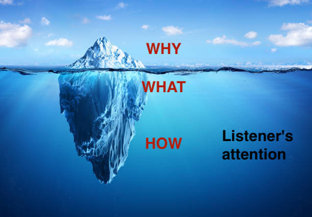

This blog post introduces a simple mental model for technical people to get your message across more effectively.  

# Introduction 

> In my organisation it is very easy to sit down, get my message across and decide on the most complex issues.  

Said. Noone. Ever.   

Any problem that is worth discussing will probably have more than one option
trade-offs, pros-cons

Different people are involved in decision process 

Subject-matter experts (SMEs, a.k.a "techies") are more often than not frustrated
by how little their voice is heard 
poorly their message is received 

Classical example which every software engineer can relate to
the perennial discussion on [technical investment][2] 
to be shot down 
Even worse the technical suggestion can be completely misunderstood, sometimes with [catastrophic results][1]

Why is this happening?  
Is it because of too many people involved as the organisation grows?   
Is it because of "politics" and "midwits up-and-down the org"?

I will argue that it is not the case.  

As a technical expert it is **your** responsibility to make your message understood by the audience.  
Not the other way round.

This brief article introduces a simple mental model to keep in mind when communicating 
By the end of it, the cover image (radio on tho of an iceberg) will have been imprinted in your memory 
as a quick memento each time you reach out to an audience of any size 

# The iceberg

Let's start with the iceberg.  

This is your message.  
The attention span of your audience is the water surrounding it. 

The part that most people struggle with is that different people have different attention spans.
Or to stay with the iceberg metaphor, sometimes it floats in sweet water sometimes in the Dead Sea.  
This greatly determines how much of your message is relevant. 

This is not just about technical knowledge.  
In fact in a team or organisation large enough, it is mostly about available time.

## Start with Why[1](#footnote_1)

The more senior (in terms of remit) the audience, the less time they can devote to the subject (in fact, any subject!)
The tasks at hand is one of many they need to turn their attention to. 
Therefore the WHY becomes the single most important part of the message.

Why do we need to take a decision or act?
What is at stake, what will be the impact?

# The radio

# Parting thought

> Photo by Chris Lawton on Unsplash

Memos instead of slides
https://www.forbes.com/sites/quora/2018/08/22/jeff-bezos-banned-powerpoint-presentations-at-amazon-meetings-heres-what-replaced-them

# Footnotes

1. This is greatly influenced by Simon Sinek's [Golden circle][3] model.     
 *Start with Why* is also one of the core values of [GoCardless][4], one of my previous employers. 

  [1]: https://mcdreeamiemusings.com/blog/2019/4/13/gsux1h6bnt8lqjd7w2t2mtvfg81uhx
  [2]: https://www.swarmia.com/blog/balancing-engineering-investments/
  [3]: https://www.smartinsights.com/digital-marketing-strategy/online-value-proposition/start-with-why-creating-a-value-proposition-with-the-golden-circle-model
  [4]: https://gocardless.com/g/values-operating-principles/