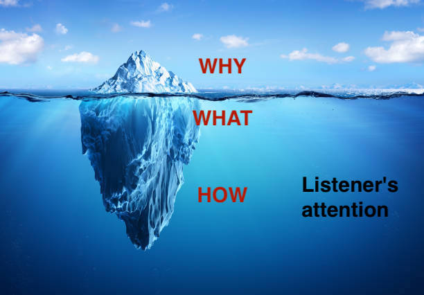
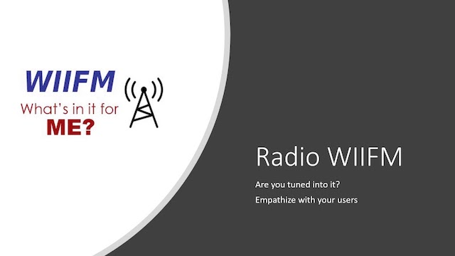

This short blog post introduces a simple mental model to get complex messages across more effectively.  

# Introduction 

> In my organisation it is very easy to sit down, get my message across and decide on the most complex issues.  

Said. Noone. Ever.   

Any problem that is worth discussing will probably have more than one option, each one with its trade-offs.  
Different people might be involved in the decision process (the infamous *stakeholders*).  

Subject-matter experts (SMEs, a.k.a "techies") are more often than not frustrated. Either by how little their voice is 
heard, or how poorly their message is received.  

A classic example (which every software engineer can relate to): the perennial discussion on [technical investment][2].   
There are countless stories on how improvement suggestions are shot down. Or, even worse, they are [catastrophically][1] 
misunderstood.

Why is this happening?  
Is it because of too many people involved as the organisation grows?   
Is it because of "politics" and "midwits up-and-down the org"?

I will argue that it is not the case. Not as often as we think.   

As a technical expert it is **your** responsibility to make your message understood by the audience.  
Not the other way round.
And this is what this post is about; it introduces a simple mental model to keep in mind when communicating to a wide
audience.

By the end of it, hopefully, the silly image of the radio on the iceberg will have been imprinted in your memory, as a
quick future memento. 

Let's start with...

# The iceberg

The iceberg is your message.  
The attention span of your audience is the water surrounding it. 

Over the years one consistent pattern I have seen technical people struggle with: different audiences have different 
attention spans. Or to stay with the iceberg metaphor, sometimes it floats in sweet water sometimes in the [Dead Sea][6].  
This greatly determines how much of your message is relevant *to them*. 

## Start with Why

Just like the core values of an organisation (see Simon Sinek's [Golden circle][3] model[1](#footnote_1)), 
each important conversation has an underlying motivation, a fundamental reason.  
This is something that everyone can relate to and understand, regardless of technical aptitude. 

The *Why* is the answer to one or more of the following questions  
> What is the problem we are facing?  
> Why do we need to take a decision? Why should act?  
> What is at stake? What will be the impact?

This is not just about technical knowledge. It is mostly about the listener's available time.

This is especially true for the leadership members of your audience (e.g. executives).  
Their attention is drawn between multiple competing priorities. They have less time than others to devote in deep-diving 
to this subject (in fact, any subject!).  
Seeing the potential impact, an executive can quickly determine if they prefer to get involved in the details or fully 
trust their team.   

The *Why* becomes the single most important part of the message.  
This what you must be leading up with.

Let's use a simplistic example of a *Why* and build upon it in later sections.  
> Our product has 10x the users from last year.
> The median Product table query has become 2x slower.
> The system slow-down is increasing user issues and increased volume for our support department.

There are many better ways the above could be expressed.  
But you get the idea.

## The What

With the *Why* we have established the underlying reason and driving force of this issue. 

The action to take, the *What*, is the next important layer of our message.

This part is progressively directed towards the other SMEs in the organisation. Here we get technical and start outlining 
the solution. Or we could be describing the options, if this is about choosing.

In any case, the *What* should be as concise as possible.  
Experienced team members will be able to quickly visualise the outcome in their heads.

Let's continue with our scenario from above.

A possible *What* could be  
> We will shard the Product table along dimension X

Or, if in the context of an options discussion  
> We have the following options
> * Shard the Product table along dimension X
> * Replace our MySQL database with XYZ
> * ...
 
Even in this hypothetical scenario, if you are even a bit technical, you can already start thinking of pros/cons by 
reading through the brief sentences.  
And this is the point of this next layer of your message. To outline your proposal/idea and prime your audience for the 
ensuing discussion.  
The more experienced members of your audience will be able to fill in the gaps quickly. Hence the conciseness of the *What*. 

This leads us to the last layer... 

## The How

This is where you really get "into the weeds".  

This is the place to detail the plan of execution and allow everyone to sense check the assumptions.[2](#footnote_2)  
It is also a chance to provide deep technical and implementation details for the benefit of the more junior members of the 
team. This is where everyone can get on the same page, learn and partake in the discussion.

Continuing in our fictitious example, the *How* section of the sharding proposal could include  
* rolling out of new infrastructure
* changes to the application code
* changes to the UX
* go-live sequence of events  
etc

With the gist given in the previous layers, this part could be as detailed as needed. 

With the layering of the message out of the way, you may be wondering...

# What about the Radio?

An executive I worked with used to say  
> Everyone tunes in to WII FM! Everyone!

The *What's in it for me*  phrase may come across as strictly utilitarian or even [zero-sum][5]. It is not!  

It is a reminder to constantly empathise with our audience and think about their internal drivers and interests. Easy as it 
may sound, this takes constant reflection and "knowing your audience". It can go from something as abstract as their values 
to as concrete as how little their attention span is or what are their reward incentives.[3](#footnote_3)

In all cases, the goal is to get the audience's attention and (why not?) make them see the benefits of your case.

For example
* A Product Manager might wince at *sharding of table XYZ*.  
 But they would pay close attention to *Improve UI responsiveness by 2x*.
* A Sales executive may run for the door in any technical conversation.  
 They will also probably be interested to hear about *reducing large account incidents by XYZ*  
etc

Putting yourself in your audience's shoes, knowing their motivations and incentives, is the key to help you shape 
your message correctly. 

# Parting thought

> Photo by Chris Lawton on Unsplash

And that was it!  
Short and simple, as promised.

Technical experts always have the knowledge and potential to make an outsized impact in any team and organisation.  
It is **our** responsibility to harness this potential for positive change by crafting our message and make it 
understandable by our audience.

Until next time, happy ideation!

# Footnotes

1. *Start with Why* is also one of the core values of [GoCardless][4], one of my previous employers. 
2. After all, the devil is in the details. ;-) 
3. It could actually be argued that the "iceberg message" mental model is a more concrete version of WIIFM. 

  [1]: https://mcdreeamiemusings.com/blog/2019/4/13/gsux1h6bnt8lqjd7w2t2mtvfg81uhx
  [2]: https://www.swarmia.com/blog/balancing-engineering-investments/
  [3]: https://www.smartinsights.com/digital-marketing-strategy/online-value-proposition/start-with-why-creating-a-value-proposition-with-the-golden-circle-model
  [4]: https://gocardless.com/g/values-operating-principles/
  [5]: https://www.investopedia.com/terms/z/zero-sumgame.asp
  [6]: https://www.shutterstock.com/search/dead-sea-floating