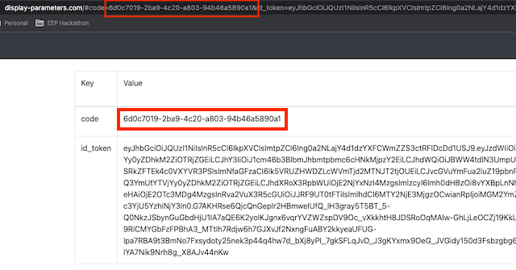
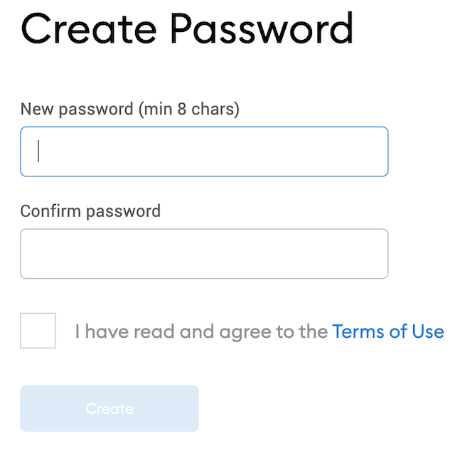

Ensuring that stablecoins are fully backed in a transparent way is crucial for trust. This article 
presents an automated approach based on OpenBanking. 

# Stablecoins and why we need them

Stablecoins are central to the crypto ecosystem as a high velocity medium of exchange and unit of account. 

Let's take a deep dive on **What** stablecoins are and then examine **Why** we need them.

## Types of stablecoins - The What

As their name suggests, stablecoins offer *stability* of exchange value against another asset or currency. E.g. 1 
coin X = 1 USD.  
This stability can be achieved in a number of ways, which give us 4 different categories (original analysis 
can be found [here][1]).

* **"True" Stablecoins**    
These are non-interest bearing coins. Stability is achieved by the issuer through 2 pillars. Namely, the issuer   
  * Mints and buys back coins at par, and 
  * Holds assets to back their redeem obligation. To avoid currency risk, the assets need to be denominated in the 
    reference currency, be highly liquid, and considered "safe". A classic example is government bonds, like US Treasuries.  
    These assets must be held separately to protect coin holders in case of bankruptcy.  
* **Deposit Stablecoins**    
These tokens are claims against deposits held in commercial banks. Holders are protected by the legal framework governing 
bank deposits (e.g. capital requirements, deposit insurance,...). In other words, deposit coins are a new layer on top 
of the current system of banking and payments. Without a clear legal framework, coins issued by one bank, might not be 
recognised by others. 
* **Decentralised Stablecoins Backed By Crypto**    
These tokens do not have a central operator; they are governed by a consensus of the users who take part in the network.
Coins in circulation are backed by crypto-assets in a mechanism of overcollateralisation and forced liquidations (e.g 
[DAI][2] is backed by a crypto-basket). 
* **Decentralised Algorithmic Stablecoins**  
These coins do not have any external collateral backing their system; they rely on algorithms and market incentives to  
remain stable against a fiat currency. Though elegant in theory, it is questionable how their underlying primitives 
and assumptions will work in extreme conditions. This was highlighted in a spectacular way by the [Terra UST collapse][3].  

## Use of stablecoins - The Why

If you have not yet read my 3-part series on how global payments work ([part 1][4], [part 2][5], [part 3][6]), you are 
really missing out! Go ahead and read them, I'll wait... 😎   

If you have, then you already know that the world of international fiat payments is underpinned by a network of 
nostro-vostro accounts with slow, multi-day settlement cycles. In the 24/7/365 world of real-time blockchain settlement, 
this will just not cut it. 

Stablecoins are a blockchain-native unit of account and medium of exchange. It massively accelerates the velocity of fiat 
money to match the velocity of other blockchain digital assets.  

# Intro to OpenBanking

Put in very simple terms, OpenBanking is a financial and technical standard.   
It allows a bank customer to  
1. securely authorise third parties, 
2. through an API 
3. to perform all activities said customer would have to logon to the bank's portal to perform.

I have covered the internals of OpenBanking in great detail in my 2-part series ([part 1][7], [part 2][8]).  
Take some time to go through them, as we will be using some key concepts in our solution.

# Marrying OpenBanking & web3


> Photo by Foto Pettine on Unsplash

Like any system and product, we need to start with a...

## Problem 

The current stablecoin market is dominated by a few big players, namely USDT, USDC and BUSD. 
All three of them belong to the true stablecoin category above<sup>[1](#footnote_1)</sup>. Namely    
* On-ramp only for large investors (e.g. $100k deposit minimum for USDT)
* Off-ramp for accredited people (sometimes [discretionary][9]) 

Most importantly and to this day, the lack of transparency in the whole minting and redemption process is a constant 
[source of FUD][10]. 

An ideal solution would  
* automate away the need for manual processing of fiat payments, minting and redemption of tokens, and 
* be making all interactions visible and provable on-chain. This would make the process of externally validating the 
  protocol's volumes trivial.

## Challenges

OpenBanking is built on top of [OAuth2][11], inheriting a fundamental assumption: an end-to-end secure channel, namely HTTPS.  
This is crucial as the OpenBanking messages carry sensitive information<sup>[2](#footnote_2)</sup>.

This comes at a stark contrast with blockchains, where transparency of information underpins trust.  
We will need to consider how to use available cryptographic primitives to address this challenge.

## <a name="solution"></a>Solution 

The following diagram gives an overview of our protocol's functionality.


> The minting flow of our OpenBanking dApp

The smart contract has one or more "owners", which are OpenBanking regulated [TPPs][13]. The TPP(s) publish their 
encryption key in the contract. See a detailed [encryption discussion](#encr_discussion) in the next section.

1. The Payer launches the minting dApp and makes a `mintRequest` method call to the smart contact.  
  The requested fiat `amount` is visible on-chain, while the following payload is encrypted with the TPP's public key.   
```json
{
  "institutionId": "Payer's bank",
  "sortCode": "UK branch identifier",
  "accountNumber": "Self explanatory",
  "name": "Account holder name",
  "publicKey": "Payer's public encryption key"
}
```
2. The contract emits a `MintRequest` event.   
  The TPP use their private key to decrypt the payload, and...
3. Create an initial payment consent calling the payer's bank OpenBanking API.  
  The bank responds with an authorisation URL, for the Payer to approve.
4. The TPP makes an `authRequest` method call to the contract.  
  The payload is encrypted with the Payer's public key (from the previous message) and looks like this  
```json
{
  "url": "Auth'n URL for the Payer",
  "consentId": "Bank-generated identifier for this consent"
}
```
5. The smart contract emits an `AuthRequest` event and the Payer's dApp decrypts it with its private key.
6. The dApp redirects the Payer to the consent authorisation screen using the URL, and...
7. The Payer authorises the payment, getting back a unique authorisation code.
8. The dApp encrypts the code with the TPP's public key and makes an `authGranted` smart contract call. The payload looks like this  
```json
{
  "consentCode": "Authorisation code",
  "requestId": "Original mint request id, to associate this call"
}
```
9. The TPP receives the `AuthGranted` event, decrypts the payload and...
10. Uses it to contact the bank and execute the payment. Once the payment is confirmed settled by the bank (by polling 
   or callback), then...
11. Call the smart contract's `paymentComplete` method, doing the token mint and crediting the Payer's address with the 
   right amount of new tokens (minus fees).

### <a name="encr_discussion"></a>Encryption discussion

Client-side wallets are all about isolating and protecting user private keys. These are not exposed in any way but rather 
hidden behind abstraction methods.  
The Metamask wallet supports [asymmetric encryption/decryption][14], by exposing [`eth_decrypt`][15] and 
[`eth_getEncryptionPublicKey`][16]<sup>[3](#footnote_3)</sup>.  
Digging a bit deeper in [the code][73], we see that Metamask is using the [eth-sig-util library][17] for all its cryptographic actions. 
We can also see that the Metamask team has not re-invented the wheel, but rather chose to [implement][18] the [NaCl secret 
key][19] algorithm.  
That is great, as we can find good, compatible NaCl implementations in all the major languages. More on this below. 

The last thing to consider are the details of the interaction.  
The Payer has no way of knowing the TPP's public encryption key upfront<sup>[4](#footnote_4)</sup>, so the TPP needs to 
publish it somewhere. In this instance, we will choose a read-only field of the smart contract.  
In an industry-grade setup, the TPP would regularly rotate their encryption key and keep the private part in an [HSM][22].

We also need a way to inform the TPP of the Payer's encryption key.  
To avoid leaking information on-chain, we choose to encrypt it as part of the payload. In a more robust setup, the Payer's dApp
could choose to generate session-level encryption keypairs. The downside would be that old TPP messages cannot be retroactively 
decrypted once the session key is discarded.

# Let's get coding


> Photo by James Harrison on Unsplash

> The code for this blog post is in repository [hello-stablecoin][23].  
> Each section below has a corresponding code branch ([`v1`][74], [`v2`][75] etc) containing the progress of the project 
> until that point. You can switch to that branch and follow along at your pace.

## v1 - Setup and smart contract minting

We are going to have all our code in a single repo.  
Everything related to the smart contract will be in sub-folder `/chain`.  

We start by installing the correct Node version and an initial Typescript [Hardhat project skeleton][24] by scavenging 
from our [previous Hardhat project][25].  
You can install all dependencies by running  
```
cd chain
nvm install 18.7.0
nvm use 18.7.0
npm install
```

We created the outline of our smart contract using [OpenZeppelin's wizard][26].  
Namely, our contract is  
* a fungible token (ERC-20) 
* mintable & burnable (the whole point of this exercise!) 
* pausable (in case of an emergency), and 
* ownable (as only the TPP should be able to call certain lifecycle methods)

Our additions to the contract are  
* Disable the public [`mint` method][27]; we want this to happen via the lifecycle, not explicitly.
* Expose the TPP's [public key][28] for clients to use for encryption. 
* Create a [map of mint commitments][29]. This will help the contract keep track and reduce spam as much as possible.
* Define the payload of the different [events][30] that the contract will emit. Notice that we have made some fields 
  `indexed` to aid with event retrieval on the client side.
* Define the logic and controls of the 4 smart contract methods: [`mintRequest`][31], [`authRequest`][32],
  [`authGranted`][33], [`paymentComplete`][34].

We can now compile out contract to check for errors: `make compile-contract`

## v2 - Contract unit tests 

It's time to do some unit testing of our contract.  
Our tests at this stage provide some basic coverage and are split in 3 groups
* [basic functionality][35], like contract name and pausing 
* end-to-end [logical flow][36] (testing method and events payload) 
* [encryption/decryption][37], simulating the behaviour of the user's wallet and TPP's process 

We can run the test suite with `make test-contract`.

These unit tests serve as an initial example of using ether.js and Hardhat's embedded chain runner to test smart contracts.  
However they are far from providing a complete coverage of functionality.  
The reader can easily extend them as an exercise to cover additional use cases and edge cases. 

## v3 - Manual testing 


> Photo by Stijn Swinnen on Unsplash

Now that we have tested the smart contract with unit tests in embedded mode, the next step is to test against a separate
chain. For this we will use [Ganache][68], running a single-node chain locally.

### Hardhat tasks 

To facilitate our smoke testing, we will utilize Hardhat's [task plugin][38] mechanism.

In the [`v3`][76] branch, under folder `tasks`, we have created a number of tasks to allow us to emulate the different steps 
of the interactions (plus a few more generic ones). For convenience, the mint-related tasks have a numeric prefix to 
their name. This way they will appear first in the Hardhat tool list as well as indicate the correct order of invocation.  
```bash
$ npx hardhat
Hardhat version 2.12.2
...
AVAILABLE TASKS:

  1-mint-request    	Triggers a mintRequest for PGBP
  2-get-mint-request	Receive the latest MintRequest message for PGBP
  3-auth-request    	Triggers an authRequest for PGBP, in response to a mintRequest
  4-get-auth-request	Receive the latest AuthRequest message for PGBP
...
```

You can get help for any task with: `npx hardhat help 1-mint-request`

The tasks correspond to the interactions back to the original diagram and are created in pairs: one to call the smart 
contract method (e.g. `mintRequest`) and one to receive the event on the other side and decrypt its payload (e.g. 
`getMintRequest`)

Last thing to note is the contract deployment script, under folder `deploy`. 

### Ganache deployment 

Switching to Ganache, we create a new workspace (i.e. chain instance), making sure the settings match our Harhdat config 
file.  


We pick 2 of the workspace auto-created accounts and take note of their private keys and account address. We will use one 
as the smart contract owner (TPP) and one as the Payer (bank account holder).  


Take a copy of the account private keys; we will use them below prefixed with `0x`. I.e. if the Ganache private key is 
`123abc`, we will be using `0x123abc`.

With Ganache running, we deploy the smart contract. The tag auto-selects our contract deployment script.      
```bash
PRIVATE_KEY=0x<TPP_PRIVATE_KEY> \
npx hardhat deploy --network ganache --tags gbp
```

We can verify the contract deployment in Ganache.  


Take note of the contract address, as we will need it for our...

### Local testing

We can now use the tasks we have created to emulate the flow between the 2 accounts: Payer and TPP. We do not have to 
use any real values at this point, it is all about testing the flow of the deployed contract.

Start by having the user make a `mintRequest`    
```bash
PRIVATE_KEY=0x<PAYER_PRIVATE_KEY> \
npx hardhat 1-mint-request \
    --contract <CONTRACT_ADDRESS> \
    --network ganache \
    --amount 100 \
    --institution-id test-bank \
    --sort-code 405060 \
    --account-number 1234567 \
    --name "John Doe"
```

The TPP's Ethereum client process needs to receive the message. Since we have not developed it yet, we need to do it 
manually.  
The `getMintRequest` action decrypts the event with the `PRIVATE_KEY` and prints the payload.  
```bash
PRIVATE_KEY=0x<TPP_PRIVATE_KEY> \
npx hardhat 2-get-mint-request \
    --contract <CONTRACT_ADDRESS> \
    --network ganache \
    --account <PAYER_CHAIN_ACCOUNT>

Listening for MintRequest for PGBP (contract 0x... ) on network ganache
MintRequest received
        RequestId 0xbff95a362c6b6c2577c5a0dd76ac3f645b2fdda2bcacd5c3fc351916a4d44954
...
        Encr. data {"version":"x25519-xsalsa20-poly1305","nonce":"...","ephemPublicKey":"...","ciphertext":"..."}
--------------------------------------------------
MintRequest encr. payload
...
        Public key CgTZFRFIToxlhoxMkexzbhNiTgSkIkqeI2egzp0kHVA=
```

It is important to note the Payer's encryption public key. The TPP must use this for all subsequent Payer-bound interactions.
We can continue the flow with the other 2 implemented tasks.

Sending the authorisation request from the TPP to the user.   
```bash
PRIVATE_KEY=0x<TPP_PRIVATE_KEY> \
npx hardhat 3-auth-request \
    --contract <CONTRACT_ADDRESS> \
    --network ganache \
    --request-id <ORIGINAL_REQUEST_ID> \
    --public-key <PAYER_PUBLIC_KEY_FROM_MINT_REQUEST> \
    --consent-id <SOME_CONSENT_ID> \
    --url "https://bank.com/some-url/to/authorise/consent/"
```

...and receiving it on the other side.  
```bash
PRIVATE_KEY=0x<PAYER_PRIVATE_KEY> \
npx hardhat 4-get-auth-request \
    --contract <CONTRACT_ADDRESS> \
    --network ganache \
    --account <PAYER_CHAIN_ACCOUNT>
```

Then notify the TPP of the consent authorisation code.  
```bash
PRIVATE_KEY=0x<PAYER_PRIVATE_KEY> \
npx hardhat 5-auth-granted \
    --consent-code <SOME_STRING> \
    --contract <CONTRACT_ADDRESS> \
    --request-id <ORIGINAL_REQUEST_ID>
```

It will be an excellent exercise for the reader to continue implementing the remaining missing tasks: `6-get-auth-granted`,
`7-payment-complete`. Upon succesfully completing a mint request cycle, the total supply will increase (i.e. tokens being 
minted). This will be verified with `npx hardhat total-supply`.

## Brief pause - Sandbox bank accounts


> Photo by Claudio Schwarz on Unsplash

Since our solution is based on OpenBanking, we need to use a test banking platform. We will go for the [Natwest sandbox][39].  
It gives us a realistic client e-banking view, to better visualise the money flows.   
> A detailed overview of the sandbox and its basic concepts can be found in my [hands-on OpenBanking blog post][8]. If you 
> are not familiar, it would be very helpful to take some time to read the basic concepts.

To keep things simple, we will use basic security (username & password) in our configured sandbox application.   


Scroll down to find the `Payment Initiation 3.1.7` API and configure it to have *reduced security* and *programmatic 
approval*. Both of these will make testing easier (but, obviously, are not available in a production environment).  


You can use the sandbox's auto-provisioned data, or you can wipe it out and upload the [test data file][40] 
accompanying this article. The test data contains only 2 users with accounts: *John Doe* (payer) and *Provable GBP 
Limited* (TPP receiver).

At this point you can manually verify the end-to-end setup of the sandbox account or skip to the next section.  
The following expanding box contains the cURL commands to manually test the sandbox test application setup by 
performing a payment.

<details markdown="1">
  <summary><b>Click to expand!</b></summary>

Replace `CLIENT_ID` & `CLIENT_SECRET` in the commands below from the newly created sandbox application.  
If you have **not** used the test data of the blog post, you will also need to replace the account numbers and account 
holder names.

**Client access token**  
```bash
curl -k \
-X POST \
https://ob.sandbox.natwest.com/token \
-H 'Content-Type: application/x-www-form-urlencoded' \
-d 'grant_type=client_credentials&client_id=CLIENT_ID&client_secret=CLIENT_SECRET&scope=payments' \
| jq '.access_token'
```

**Create a consent**  
Replace the `CLIENT_ACCESS_TOKEN` below with the value you just got.  
```bash
curl -k \
  -X POST \
  https://ob.sandbox.natwest.com/open-banking/v3.1/pisp/domestic-payment-consents \
  -H 'Authorization: Bearer CLIENT_ACCESS_TOKEN' \
  -H 'Content-Type: application/json' \
  -H 'x-jws-signature: IGNORED_DUE_TO_REDUCED_SECURITY' \
  -H 'x-idempotency-key: SOME_UNIQUE_IDEMPOTENCY_KEY' \
  -d '{
      "Data": {
        "Initiation": {
          "InstructionIdentification": "instr-identification",
          "EndToEndIdentification": "e2e-identification",
          "DebtorAccount": {
            "SchemeName": "SortCodeAccountNumber",
            "Identification": "50000012345601",
            "Name": "John Doe"
          },
          "InstructedAmount": {
            "Amount": "1000",
            "Currency": "GBP"
          },
          "CreditorAccount": {
            "SchemeName": "SortCodeAccountNumber",
            "Identification": "50000087654301",
            "Name": "ProvableGBP Limited"
          },
          "RemittanceInformation": {
            "Unstructured": "Provable GBP mint",
            "Reference": "Provable GBP mint"
          }
        }
      },
      "Risk": {
        "PaymentContextCode": "Services",
        "MerchantCategoryCode": null,
        "MerchantCustomerIdentification": null,
        "DeliveryAddress": null
      }
    }' \
    | jq '.Data.ConsentId'
```

**Generate authorisation URL**  
Paste the value in the `CONSENT_ID` below.  
`REDIRECT_URI` is as you have defined it in the sandbox application definition.  
```bash
curl -v -G -k \
  "https://api.sandbox.natwest.com/authorize" \
   --data-urlencode "client_id=CLIENT_ID" \
   --data-urlencode "response_type=code id_token" \
   --data-urlencode "scope=openid payments" \
   --data-urlencode "redirect_uri=REDIRECT_URI" \
   --data-urlencode "request=CONSENT_ID"
```

**Complete authorisation**  
Copy the `location` from the response and paste it in a browser.  
Complete the consent authorisation, using the login information of *John Doe* (`customerNumber` etc)


Once complete, copy the `code` URL parameter.  



**Exchange code for access token**  
Replace `CLIENT_ID`, `REDIRECT_URI` and `AUTH_CODE_FROM_URL` as necessary.  
```bash
curl -G -k \
  -X POST \
  https://ob.sandbox.natwest.com/token \
  -H 'Content-Type: application/x-www-form-urlencoded' \
  -d 'client_id=CLIENT_ID&client_id=CLIENT_SECRET&redirect_uri=REDIRECT_URI&grant_type=authorization_code&code=AUTH_CODE_FROM_URL' \
  | jq '.access_token'
```

**Make the payment**  
Replace the `ACCESS_TOKEN` and `CONSENT_ID` from above.  
```bash
curl -k \
  -X POST \
  https://api.sandbox.natwest.com/open-banking/v3.1/pisp/domestic-payments \
  -H 'Authorization: Bearer ACCESS_TOKEN' \
  -H 'Content-Type: application/json' \
  -H 'x-jws-signature: IGNORED_DUE_TO_REDUCED_SECURITY' \
  -H 'x-idempotency-key: SOME_UNIQUE_IDEMPOTENCY_KEY' \
  -d '{
      "Data": {
        "ConsentId": "CONSENT_ID",
        "Initiation": {
          "InstructionIdentification": "instr-identification",
          "EndToEndIdentification": "e2e-identification",
          "DebtorAccount": {
            "SchemeName": "SortCodeAccountNumber",
            "Identification": "50000012345601",
            "Name": "John Doe"
          },
          "InstructedAmount": {
            "Amount": "1000",
            "Currency": "GBP"
          },
          "CreditorAccount": {
            "SchemeName": "SortCodeAccountNumber",
            "Identification": "50000087654301",
            "Name": "ProvableGBP Limited"
          },
          "RemittanceInformation": {
            "Unstructured": "Provable GBP mint",
            "Reference": "Provable GBP mint"
          }
        }
      },
      "Risk": {
        "PaymentContextCode": "Services",
        "MerchantCategoryCode": null,
        "MerchantCustomerIdentification": null,
        "DeliveryAddress": null
      }
    }' \
    | jq '.Data.DomesticPaymentId'
```

**Verify payment settlement (optional)**  
Replace the `PAYMENT_ID` and `ACCESS_TOKEN` from above.  
```bash
curl -G -k \
"https://api.sandbox.natwest.com/open-banking/v3.1/pisp/domestic-payments/PAYMENT_ID" \
-H 'Authorization: Bearer ACCESS_TOKEN' \
| jq '.Data.Status'
```

You can also log in to the sandbox E-Banking as "ProvableGBP Limited" (Bankline customer id `1234567890`) and verify that 
the transaction took place and the business account balance has increased (i.e. we can mint new tokens).


</details>
<br/>
## v4 - TPP bank client

With the smart contract fairly well covered, it is time to turn our attention to the TPP's automated process.  
We will implement it in Go.  
Create a new sub-folder `tpp-client`, next to `chain` to hold our Go code.  
```bash
mkdir tpp-client && cd tpp-client
go mod init github.com/sgerogia/hello-stablecoin/tpp-client
```

For the interactions with the bank's OpenBanking APIs, we will use the [go-resty][41] library.   
`go get github.com/go-resty/resty/v2`  

Based on that we create an abstract [TPP client interface][42] and a concrete [Natwest sandbox][43] implementation.

The end-to-end [integration test][44] verifies the correct functionality of the banking client, for the 
entire lifecycle.  
Note that this version of the test has hard-coded account numbers from our [test data set][40]. A better implementation would 
be using a test data file.  
Also note that we are taking advantage of the [programmatic consent approval][45] offered by the Natwest sandbox in lieu 
of a real customer approval.

We can run the tests with `make test-client`.

With the banking interaction done, it is time to move on to...

## v5 - Server-side cryptography

What we want to achieve here is identical encryption/decryption behaviour as what the Metamask wallet does internally. 
See section [*Encryption discussion*](#encr_discussion) further up.

At the core of our code is the [Go implementation][46] of the NaCl library. `go get golang.org/x/crypto/nacl/box`  
The internals of it follow the [original research][47]. 

We will highlight 2 aspects of our code:  
1. The [`KeyPair`][48] abstraction  
NaCl is using elliptic curve asymmetric encryption. Ethereum (and most/all chains for that matter) use elliptic curve 
asymmetric signatures. Ethereum and Nacl utilise *different [elliptic curves][48]*.  
So we need to build a mechanism where we can generate 2 public keys from the same private, one for each curve. 

2. The encrypted message's [(un)marshalling][49]  
The encrypted message is a JSON, with base64 encoded fields and known binary lengths. We tap into Go's [JSON mashalling][50]
support to encapsulate this.

The unit tests (`make test-client`) verify the correctness of our encryption, as well as compatibility with an encrypted 
message generated manually using Metamask's implementation.

It is time to move to the "meaty" part of our Go coding.

## v6 - Ethereum smart contract client 

We are making heavy use of the [Ethereum Go][51] implementation. `go get github.com/ethereum/go-ethereum`  

In order to implement the TPP logic we outlined in section [Solution](#solution), we split the code in 4 packages.

* Contract and wrapper ([`contract`][52])  
The file [`provable_gbp`][56] is an auto-generated binding from the contract's [ABI][57]. It contains all the available
contract methods and corresponding Go data structures. See Makefile [`generate-abi`][77] target.  
We created a wrapper around this binding ([`contract_client`][58]), which allows us to interact with the contract on our 
own terms. The key thing to note here is the [`GetSingleUseSession`][59] method. This makes sure that each contract call
uses the next [nonce][60] and the correct gas price.  
More on this in the [Discussion](#discussion) section below.

* Ethereum event handling ([`event`][53])  
The contract [event handler][62] and [subscriber][61] are naive implementations of the logic.  
The subscriber connects to an event stream from the contract (i.e. requiring a websocket), but has very little in terms 
of error recovery (e.g. in case of network errors). The handler is more straight-forward in its logic, processing events
as the come in. It makes no effort to determine duplicate/repeated events.

* Payment settlement check ([`schedule`][54])  
The scheduler and its associated task is another simple in-memory component. It is intended to be triggered by an external 
periodic job and check submitted payments until they are confirmed (i.e. irrevocably executed and not stopped by, e.g. 
internal fraud checks).   

* Binary launch and config ([`cmd`][55])  
Finally this package provides the [`main`][63] method which brings our system together and launches the binary process. 
It is configured by an external [TOML file][78].

After updating the Makefile [env. variables][64], we can execute all our tests (`make test-client`), including the 
complete end-to-end [integration test][65].

We are finally ready for an...

## End-to-end test


> Photo by Jeswin Thomas on Unsplash

As before, for our end-to-end test we will be using a different pair of keys: one for the Payer and one for the TPP.  

Get an [Infura account key][67] and follow the [instructions in Annex 1](#annex1) to have a correctly set up Metamask wallet, 
pointing to the Sepolia testnet.

We will first deploy our contract.       
```bash
PRIVATE_KEY=0x<TPP_PRIVATE_KEY> \
INFURA_TOKEN=<INFURA_TOKEN> \
npx hardhat deploy --network sepolia --tags gbp
```
Note down the new contract address you will see printed; we will need it soon!

Let's build the Go binary.   
```bash
make build-client
```

Edit the correct values in `tpp-client.toml`, like `ContractAddress`, `ProviderUrl`,... Pay attention that we will 
be using Infura's websocket API (not HTTP), as we need streaming event notifications.

Run the local server using the private key. Note how we omit the `0x` key prefix here.
```bash
PRIVATE_KEY=<TPP_PRIVATE_KEY> \
  ./tpp --config ./tpp-client.toml 
...
{"level":"info","ts":1668771551.527633,"caller":"cmd/main.go:53","msg":"Listening for on-chain events..."}  
```

You can view the entire mint interaction between Payer and TPP in the captioned video below (video has no sound).

<iframe 
    width="560" height="315" 
    src="https://www.youtube.com/embed/zk_08b8WnnU" 
    title="OpenBanking + ERC-20" 
    frameborder="0" 
    allow="accelerometer; autoplay; clipboard-write; encrypted-media; gyroscope; picture-in-picture" allowfullscreen></iframe>

The commands issued in the interaction are in the expanding section below, if you are interested. 

<details markdown="1">
  <summary><b>Click to expand!</b></summary>

Throughout the following, we can track the contract interactions on Sepolia Etherscan; transactions, events and event fields.  


Let's make a mint request as a payer from the command line. You may need to change the bank account details if you are 
using a different Natwest sandbox dataset.   
```bash
INFURA_TOKEN=<INFURA_TOKEN> \
PRIVATE_KEY=0x<PAYER_PRIVATE_KEY> \
npx hardhat 1-mint-request \
--contract <CONTRACT_ADDRESS> \
--network goerli \
--amount 123 \
--institution-id natwest-sandbox \
--sort-code 500000 \
--account-number 12345601 \
--name "John Doe"

Initiating mintRequest for 123 PGBP ...
```

After a few seconds, we can see the TPP process coming to life, after receiving the event.  
  
The TPP process contacts the bank to create a draft consent and calls the `authRequest` method of the contract.

While this is happening, we need to have the client command line listening for the emitted `AuthRequest` event.  
```bash
INFURA_TOKEN=<INFURA_TOKEN> \
PRIVATE_KEY=0x<PAYER_PRIVATE_KEY> \
npx hardhat 4-get-auth-request \
--contract <CONTRACT_ADDRESS> \
--network sepolia \
--account <PAYERS_ACCOUNT_ON_SEPOLIA_USED_FOR_EVENT_FILTERING> \
--poll true
```  
This command will start polling the contract for new `AuthRequest` events. Once a new one is detected, it will print 
its details. 

Note the `RequestId` and use the URL to open the bank's consent authorisation page.  


On approval, we need the authorisation `code`. We put it in the payload of the `authGranted` call, along with the `RequestId`.  
```bash
INFURA_TOKEN=<INFURA_TOKEN> \
PRIVATE_KEY=0x<PAYER_PRIVATE_KEY> \
npx hardhat 5-auth-granted \
--contract <CONTRACT_ADDRESS> \
--network sepolia \
--request-id <REQUEST_ID>
--consent-code <CONSENT_AUTHORISATION_CODE>
```

The TPP process receives the `AuthGranted` event, executes the payment. Upon successful settlement of the fiat payment, 
it calls the `paymentComplete` method to mint the tokens in the Payer's Ethereum account.

</details>
<br/>

And that was it!  
We just had an automated ERC-20 mint, in response to a transfer of fiat, all visible on-chain. 🎉🥳🍾

## <a name="discussion"></a>Discussion & Next steps


> Photo by charlesdeluvio on Unsplash

This implementation and approach is by no means perfect. It has a number of issues, which would need correction or 
mitigation before considered anywhere near mature. Here is a non-exhaustive list. 

**Product-related**
* The Payer needs to have the native token (e.g. ETH) to interact with the contract.  
  This could be a barrier-to-entry, especially if this was considered a mass-market [on-ramp][69]. A possible future 
  solution could be a [gas relay][70], where some other party picks up the cost of the transaction.
* Metamask will deprecate the [encryption methods][79]  
  Removal of these methods without a direct replacement would make it close to impossible to implement our system over 
  [EVM-compatible chains][80]. A derisking strategy could be to choose a privacy-first chain, like [Secret][81]. 
* The contract is subject to spam.  
  A bad actor could start spamming the contract with pointless `mintRequest` calls from burner addresses, especially if 
  calls were "free" due to gas relay. A possible mitigation to that could be to require some additional verifiable form of identity in 
  the payload (e.g. Google identity JWT) and move some filtering/decoding logic in the smart contract (increasing the 
  gas cost). 
* A malicious TPP could fake mint interactions.  
  Either by faking the transactions or by using "money mule" bank accounts with recycled funds. This would be the harder 
  one to crack, while maintaining a balance between transparency (of interactions) and privacy (of user details). Some 
  avenues to explore would be 
   * [TLS notarised][71] bank responses
   * publishing automated [OpenBanking Balances][72] for TPP's account on-chain (e.g. via Oracles) and cross-referencing 
     with completed mint transactions.

**Technical**   
* The `authGranted` method is redundant.  
  We could have reduced the number of interactions by redirecting from the bank back to the TPP process and picking up
  the authorisation `code` from there. This would also reduce the surface are for network errors.
* The current implementation has very little fault tolerance.  
  Everything is kept in memory and error correction is an afterthought. As one would expect with a PoC.
* The current implementation has very poor parallelization.  
  Sending Ethereum tranactions is inherently sequential, due to the account's [nonce][60]. The current code to mitigate 
  this ([`GetSingleUseSession`][59]) is not well thought-out. The parallelization problem would be best addressed with 
  a combination of 
  * a persistent message bus, deduplicating incoming messages on the TPP side, and 
  * multiple outgoing TPP wallet addresses, akin to outboxes.

Last but not least, the curent PoC lacks a UI; a single-page application to integrate with Metasmask and provide a 
semi-realistic user experience.  

The motivated reader could take this PoC one step further by adding a web-based UI, using the existing Hardhat code as 
an example. 

# Parting thought


> Photo by Ian Schneider on Unsplash

Web3 applications and systems pose their own opportunities as well as challenges.  
Striking the right balance between usage requirements and what is available by the underlying platforms is key. 
When done right, it can result in applications that can scale globally instantly. 

I hope this blog post gave you an initial direction of  
* how to approach similar problems, and 
* which tools to reach for.

Keep building! 

# Footnotes

1. <a name="footnote_1"></a>In true narrow bank form, part of USDT/C's revenue stream is arbitraging between offering zero 
yield (for depositors) and receiving interest from converting USD balances into interest-bearing instruments (e.g. bonds)
2. <a name="footnote_2"></a>One example is bank account details which is PII and could be used in banking fraud. Another 
   example is customer [consent authorisation links][12] and consent authorisation tokens.   
   Though not explicitly documented, in most banks' case these are single use. If unencrypted, a malicious actor could
   intercept them, make a failed attempt just to "consume" them and invalidate an otherwise valid customer flow.
3. <a name="footnote_3"></a>Even though there are no vulnerabilities, these methods are marked as deprecated. That is 
   something to keep in mind in this approach. 
4. <a name="footnote_4"></a>All blockchains make account public keys visible/retrievable for signature verification. 
   However, even though originating from the same private key, the public encryption key will be different as it is 
   derived from a [different elliptic curve][20] (e.g. [ECDSA][21] for Ethereum).     


# <a name="annex1"></a>Annex 1: Installing Metamask, connecting to Sepolia, using faucets, etc 

> HERE BE DRAGONS!! 🐉🐉  
> Be extremely careful, which network you are connected to AT ALL TIMES when in test/development. Sending mainnet ETH to
> a testnet address will result in loss of funds.

*This short guide assumes you are starting from scratch.*    
*If you already have Metamask installed, then you can just skip to the relevant parts.*

Let's start by installing the Metamask browser extension from the [official website][7].
* It launches a setup wizard. Create a new wallet.    
  

* Your local wallet will be password-protected. Select a password.  
  

* Metamask is now installed in your browser's extensions panel.  
  

* Select the Sepolia network from the drop-down.  
  If you cannot see Sepolia, you may need to toggle showing more networks.   
  

* Next up is funding our Metamask with testnet ETH.  
  Select one of the [Sepolia faucets][66] and use your Metamask account address to receive.  
  

* We will use 2 accounts from the same wallet, pretending we are different actors.  
  Go to the `Account Details` of the default Metamask account. Click the pencil and rename to `TPP` so we know what
  is what.  
  

* Finally, create a 2nd account. We will use it as the owner of the Oracle consumer contract.  
  Name the account as `Payer` or similar.
    
  You can transfer some GoerliETH between the 2 accounts, or fund directly from a faucet.  

* To view an account's private key (used for interacting with the contracts), we go to their details.  
    
  Then we choose to `Export`.  
    
  Export the keys for both `TPP` and `Payer`.

* Check your balance on both accounts; we are all set for testing.    
  

* Once the `ProvableGBP` contract is deployed to Sepolia, we will need to make Metamask aware of the new token to 
  track its balance. Click on the `Payer` account and add the address of your contract (link `Import token`).  
  


  
   [1]: https://www.globalstablecoins.co.uk/
   [2]: https://marketrealist.com/p/dai-stablecoin-explained/
   [3]: https://www.calebandbrown.com/blog/a-week-of-terra-ust-and-luna-collapse-explained/
   [4]: https://sgerogia.github.io/Payments-Intro-Part1/
   [5]: https://sgerogia.github.io/Payments-Intro-Part2/
   [6]: https://sgerogia.github.io/Payments-Intro-Part3/
   [7]: https://sgerogia.github.io/OpenBanking-Part1/
   [8]: https://sgerogia.github.io/OpenBanking-Part2/
   [9]: https://cryptoslate.com/you-can-redeem-tether-usdt-11-on-tether-to-but-theres-a-catch/
   [10]: https://www.investing.com/news/cryptocurrency-news/is-there-any-truth-about-the-fud-panic-call-on-usdt-2940382
   [11]: https://oauth.net/2/
   [12]: https://ob.docs.wso2.com/en/latest/learn/consent-authorization-intro/#!
   [13]: https://my.cfte.education/courses/what-is-a-TPP
   [14]: https://www.sciencedirect.com/topics/computer-science/asymmetric-cryptography
   [15]: https://docs.metamask.io/guide/rpc-api.html#eth-decrypt-deprecated
   [16]: https://docs.metamask.io/guide/rpc-api.html#eth-getencryptionpublickey-deprecated
   [17]: https://metamask.github.io/eth-sig-util/latest/index.html
   [18]: https://github.com/MetaMask/eth-sig-util/blob/v5.0.0/src/encryption.ts#L39
   [19]: https://en.wikipedia.org/wiki/NaCl_%28software%29#Secret-key_cryptography
   [20]: https://en.wikipedia.org/wiki/Elliptic-curve_cryptography
   [21]: https://en.wikipedia.org/wiki/Elliptic_Curve_Digital_Signature_Algorithm
   [22]: https://en.wikipedia.org/wiki/Hardware_security_module
   [23]: https://github.com/sgerogia/hello-stablecoin
   [24]: https://github.com/sgerogia/hello-stablecoin/blob/v1/chain/hardhat.config.ts
   [25]: https://sgerogia.github.io/Chainlink-Oracle/
   [26]: https://docs.openzeppelin.com/contracts/4.x/wizard
   [27]: https://github.com/sgerogia/hello-stablecoin/blob/v1/chain/contracts/ProvableGBP.sol#L77
   [28]: https://github.com/sgerogia/hello-stablecoin/blob/v1/chain/contracts/ProvableGBP.sol#L25
   [29]: https://github.com/sgerogia/hello-stablecoin/blob/v1/chain/contracts/ProvableGBP.sol#L35
   [30]: https://github.com/sgerogia/hello-stablecoin/blob/v1/chain/contracts/ProvableGBP.sol#L42-L60
   [31]: https://github.com/sgerogia/hello-stablecoin/blob/v1/chain/contracts/ProvableGBP.sol#L95
   [32]: https://github.com/sgerogia/hello-stablecoin/blob/v1/chain/contracts/ProvableGBP.sol#L113
   [33]: https://github.com/sgerogia/hello-stablecoin/blob/v1/chain/contracts/ProvableGBP.sol#L132
   [34]: https://github.com/sgerogia/hello-stablecoin/blob/v1/chain/contracts/ProvableGBP.sol#L147
   [35]: https://github.com/sgerogia/hello-stablecoin/blob/v2/chain/test/ProvableGBP_base_test.ts
   [36]: https://github.com/sgerogia/hello-stablecoin/blob/v2/chain/test/ProvableGBP_e2e_flow_test.ts
   [37]: https://github.com/sgerogia/hello-stablecoin/blob/v2/chain/test/ProvableGBP_mintRequest_test.ts
   [38]: https://hardhat.org/hardhat-runner/docs/advanced/create-task
   [39]: https://www.bankofapis.com/products
   [40]: ../assets/resources/openbanking-stablecoin/sandbox_data.yaml
   [41]: https://github.com/go-resty/resty
   [42]: https://github.com/sgerogia/hello-stablecoin/blob/v4/tpp-client/bank/client.go
   [43]: https://github.com/sgerogia/hello-stablecoin/blob/v4/tpp-client/bank/impl/natwest_client.go
   [44]: https://github.com/sgerogia/hello-stablecoin/blob/v4/tpp-client/bank/impl/natwest_client_e2e_test.go
   [45]: https://github.com/sgerogia/hello-stablecoin/blob/v4/tpp-client/bank/impl/natwest_client_e2e_test.go#L63
   [46]: https://pkg.go.dev/golang.org/x/crypto/nacl/box
   [47]: https://nacl.cr.yp.to/
   [48]: https://en.wikipedia.org/wiki/Elliptic_curve
   [49]: https://github.com/sgerogia/hello-stablecoin/blob/v5/tpp-client/encrypt/crypto.go#L145-L189
   [50]: https://pkg.go.dev/encoding/json
   [51]: https://github.com/ethereum/go-ethereum
   [52]: https://github.com/sgerogia/hello-stablecoin/tree/v6/tpp-client/contract
   [53]: https://github.com/sgerogia/hello-stablecoin/tree/v6/tpp-client/event
   [54]: https://github.com/sgerogia/hello-stablecoin/tree/v6/tpp-client/schedule
   [55]: https://github.com/sgerogia/hello-stablecoin/tree/v6/tpp-client/cmd
   [56]: https://github.com/sgerogia/hello-stablecoin/blob/v6/tpp-client/contract/provable_gbp.go
   [57]: https://www.mycryptopedia.com/ethereum-abi-explained/
   [58]: https://github.com/sgerogia/hello-stablecoin/blob/v6/tpp-client/contract/contract_client.go
   [59]: https://github.com/sgerogia/hello-stablecoin/blob/v6/tpp-client/contract/contract_client.go#L93
   [60]: https://medium.com/swlh/ethereum-series-understanding-nonce-3858194b39bf
   [61]: https://github.com/sgerogia/hello-stablecoin/blob/v6/tpp-client/event/impl/event_subscriber_impl.go
   [62]: https://github.com/sgerogia/hello-stablecoin/blob/v6/tpp-client/event/impl/event_handler_impl.go
   [63]: https://github.com/sgerogia/hello-stablecoin/blob/v6/tpp-client/cmd/main.go#L24
   [64]: https://github.com/sgerogia/hello-stablecoin/blob/v6/Makefile#L4
   [65]: https://github.com/sgerogia/hello-stablecoin/blob/v6/tpp-client/event/impl/event_e2e_test.go
   [66]: https://ethereum.org/en/developers/docs/networks/#sepolia
   [67]: https://app.infura.io/login
   [68]: https://trufflesuite.com/ganache/
   [69]: https://www.ledger.com/academy/crypto-on-and-off-ramps-say-what
   [70]: https://eips.ethereum.org/EIPS/eip-1077
   [71]: https://tlsnotary.org/
   [72]: https://openbankinguk.github.io/read-write-api-site3/v3.1.10/resources-and-data-models/aisp/Balances.html
   [73]: https://github.com/MetaMask/metamask-extension/issues/8152
   [74]: https://github.com/sgerogia/hello-stablecoin/tree/v1
   [75]: https://github.com/sgerogia/hello-stablecoin/tree/v2
   [76]: https://github.com/sgerogia/hello-stablecoin/tree/v3
   [77]: https://github.com/sgerogia/hello-stablecoin/blob/v6/Makefile#L12
   [78]: https://github.com/sgerogia/hello-stablecoin/blob/v6/tpp-client.toml
   [79]: https://medium.com/metamask/metamask-api-method-deprecation-2b0564a84686
   [80]: https://coinguides.org/evm-blockchains-add-evm-network/
   [81]: https://scrt.network/
   