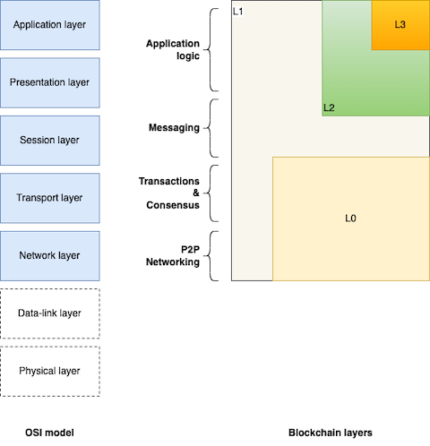
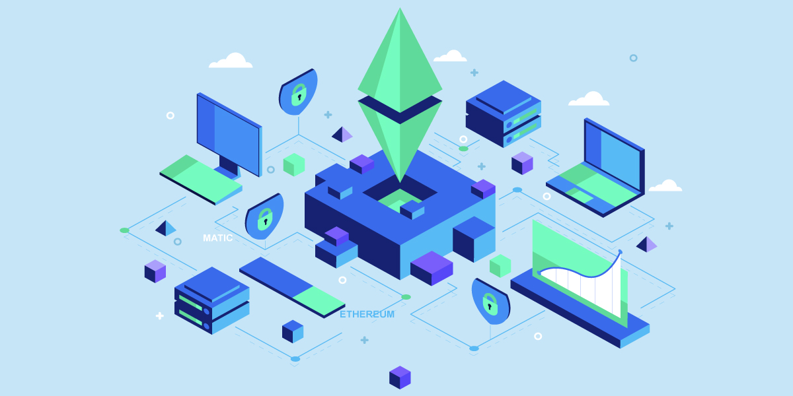
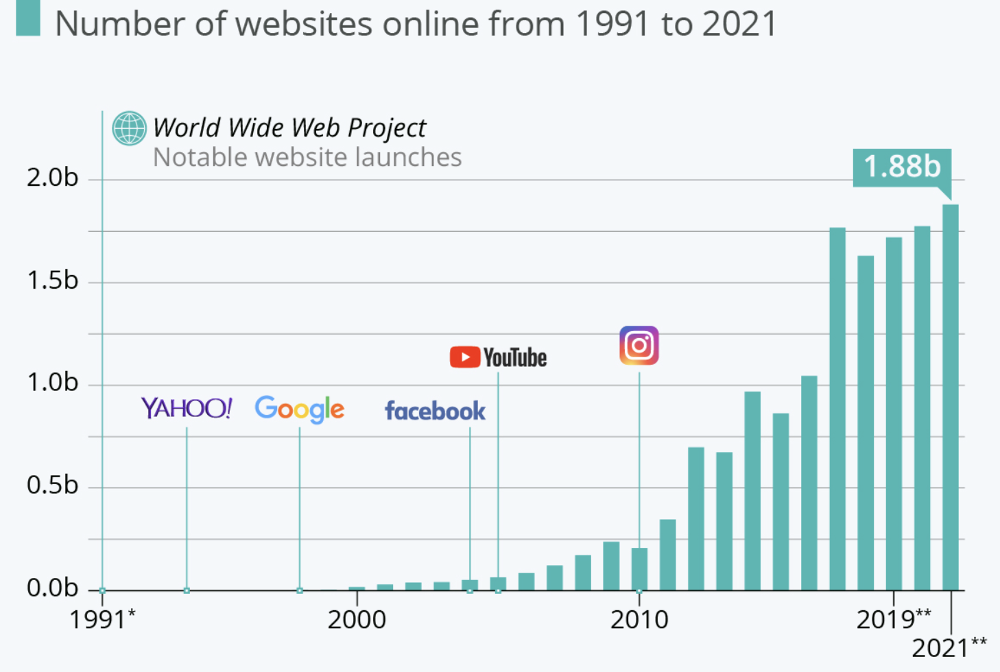
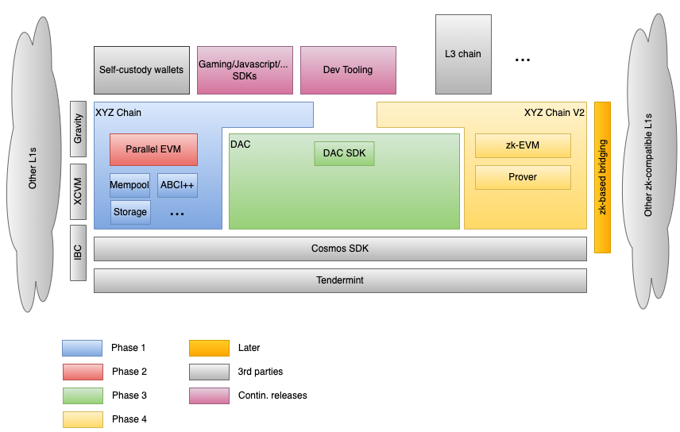

Scalability is THE differentiator for L1 chain success. In this post, I explore how Cosmos' 
modularity can scale a L1 to the next level.

# Introduction 

Let's start with a truism: there is no right-wrong approach to scaling up a blockchain and increasing its 
transactions per second (TPS).  
Just as with any software system, there is a series of trade-offs to be made, based on restrictions and available tools
and technologies. 
Wearing an architect / senior engineer hat on requires ??? 

In this post, I will 
* lay out some "realistic" requirements of a fictional chain, 
* examine the current technological landscape, and
* present an example approach on scaling the chain, while discussing the thought process. 

> For the readers without a deep understanding of the blockchain space, I will start by quickly introducing some basic 
> concepts: L1 & L2s, rollups, side-chains, the importance of EVM,etc  
> If you feel you are well-versed in blockchain concepts, you can just skip to section [*Setting the stage*](#setting_the_stage).

## L3, L2, L1, L0... Lift-off!

> Photo by Charlie Wollborg on Unsplash

There are different ways we could categorise blockchains. 
The most common way is by assessing at which point of the "stack" they operate, i.e. at which layer. For this, we will 
use the [Open Systems Interconnection (OSI) model][1] as a reference.

> Mapping between the OSI model and the blockchain layers

### L1
It all started with the 1st (Bitcoin et al) and 2nd generations (Ethereum et al) of blockchains. Whether a single purpose 
chain (e.g. Bitcoin, allowing transfer of value) or a multi-purpose chain (e.g. Ethereum, allowing arbitrary computations), 
they are all considered L1 chains. Their remit covers the whole stack, from peer-to-peer networking to the top-most 
user-facing application layer. This category also includes 3rd generation chains (e.g. Solana, Binanche Smart Chain, 
Evmos, Aptos,...); despite their differences, they all have the same top-to-bottom "footprint".

### L2
Ethereum's rising popularity clashed with its fixed transaction-per-second (TPS) limit leading to [gas price surges][2] 
and a dash to find scaling alternatives.  
One of the options was to move the expensive computation off-chain. This led to the creation of L2 chains, which  
* perform user-facing computation outside of the L1 chain, 
* use the L1 chain as a "source of truth" (e.g. for storing batches of transactions), and
* are interoperable with the L1 chain.
 
Different L2 solutions (e.g. Optimism, Polygon, Starkware) have different technical choices which lead to different 
trade-offs in terms of security or decentralization. The end result is one: increase the overall TPS of the underlying 
L1 chain by moving the expensive computation away from it.  

### L0
L2s were a solution to the scalability problem, taking the existing L1 chains "for granted"; it is there, it works, let's 
make it better.   

L0s are a first-principles approach to the scalability question. They offer the infrastructure and building blocks that 
comprise a blockchain (p2p networking, transaction finality and consensus, storage,...) to allow them to scale. A L0 
is effectively a chain-of-chains; not meant to be used for implementation of user-facing applications, but instead as 
the foundation for other blockchains.

Through different technology, architecture choices and trade-offs in this category we have Polkadot, Cosmos, LayerZero,
Celestia,...

### L3
Now that we have described the other layers, it becomes a bit clearer what an L3 is.  
L3 is a user-facing application (smart contract dApp) with its own token that is built on top of an L2. There are plenty of examples 
here, like Uniswap deployed on Optimism, Decentraland on Polygon, etc.   

We have yet to see a L3 blockchain built on top of an L2. This is because there are no use cases yet which would   
* benefit from the increased TPS of the L2, and
* require features that are not available in a smart contract environment (like network and DB access).

However, with the increasing adoption of web3, it is only a matter of time that we see an L3 chain built on top of an L2's
SDK. 

## Rollups and Side-chains: What's the difference?

> Photo by Thought Catalog on Unsplash

Rollups and side-chains are 2 different types of solutions to scale up existing L1s, i.e. increase their TPS capacity. In
that regard, they are both L2s.

A rollup utilizes off-L1-chain computation to process transactions. It does this by "rolling up" (read: compressing) 
multiple transactions into a single on-L1-chain transaction. This reduces the amount of data that needs to be stored and 
processed on the main blockchain, thereby increasing its scalability. Examples of rollups are Optimistic Rollup, ZK Rollup 
and Value transfer rollup.

A side-chain is a separate blockchain that is connected to the main L1 blockchain, typically through a two-way peg. This 
allows for assets to be transferred between the main blockchain and the side-chain, enabling off-L1-chain transactions 
to occur. These off-chain transactions can be processed at a faster rate and with lower fees, while still retaining the 
security guarantees of the main blockchain. Unlike the underlying L1 which can be general-urpose, side-chains are 
"specialised"; they are designed to be used for specific purposes, e.g. payments, trading,...    
Examples of sidechain framework are [RootStock][4] and [Liquid][3].

Both rollups and side-chains are designed to improve scalability by moving transactions off the underlying L1 blockchain.  
They achieve this in different ways.  
Rollups bundle multiple transactions together, using the underlying L1 as a storage for the bundle as proof. Side-chains 
are [separate blockchains][5], with their own security and consensus mechanism, connected to the main L1. All transactions on 
the side-chain are processed and stored off the main L1. What ends up on the L1 is a periodic "summary" of the activity 
on the side-chain (e.g. netted off transactions). 

### Optimistic vs ZK Rollups

Optimistic Rollups are quite simple in their approach. They assume that all proposed transactions are valid and honest; 
they just include them in the rollup (hence the adjective "optimistic"). To counter bad actors they employ an incentivised 
[fraud proof][6] mechanism: all transactions in the rollup are practically unsettled for a "challenge period" of a few 
days. If noone submits a fraud-proof, then they are considered final for all intentns and purposes. This simple mechanism 
allows for fast and cheap computations, at the expense of increased friction when trying to move assets off the optimistic 
L2[1](#footnote_1). 

ZK Rollups on the other hand use [zero-knowledge proofs][8] to keep the data private, which allows for private transactions 
(in the L2) on a public L1 blockchain. The ZK Rollup protocol takes the user’s transaction (or "inputs") and verifies them 
with a smart contract. Unlike optimistic rollups which impose a challenge period, ZK rollup transactions are final; the 
state updates are verified on execution. In addition, through complex zero-knowledge computations (a.k.a. [circuits][9]) 
the proof posted on the L1 chain is orders of magnitude smaller than the optimistic transaction batch[2](#footnote_2), 
while remaining private and trustless.

## dApps and app-chains

> Image from igexsolutions.com

Decentralized applications (dApps) are user-facing applications running on a blockchain.  
They almost always have a UI (browser-based or mobile), they use smart contracts to execute tasks and store data, and 
they allow for trustless, tamper-proof operations. There are plenty examples of dApps like decentralized exchanges, 
prediction markets, DeFi applications,...

Application-specific blockchains (app-chains) can be considered as a variation of dApps. As the name implies, they are 
sovereign blockchains[3](#footnote_3) catering to a specific use case or application. 

A dApp is generally easier to build and deploy than an app-chain.  
dApps only require front-end and smart-contract development knowledge. The logic is then deployed on existing L1 and runs 
on the existing infrastructure. The downside is that the dApp is limited by the capabilities of the underlying L1 and 
competes for L1 compute resources with other dApps.

On the other hand, app-chains require more involved systems-level programming to implement the code for validators and 
nodes. They also require the non-trivial task of bringing together a community of validators which will provide the 
necessary infrastructure to run the chain. The upside is that an app-chain leads to more efficient and scalable solutions 
for certain types of applications, allowing the core team to tweak with any aspect of operations (consensus, tech stack, 
tokenomics,...).  
A good example of the trade-offs in the decision-making is the case of [dYdX][10]. They started out as a dApp on Ethereum,
but eventually decided to build their own app-chain to improve their scalability and performance.

## Developers, developers, developers

> Image from tenor.co

Key to success for every general purpose chain (L1 or L2) is the developer community and the developer experience.  

How easy is it to build on the platform?  
How easy is it to deploy and maintain the application?  
What tools are there to support in the development lifecycle?  
Can the team find skilled engineers or would they need to upskill in a new technology stack?  

These (and more!) are concerns which are crucial to the uptake of a blockchain platform by engineers.
As the saying goes "Builders will BUIDL"; it is these new applications and systems that will attract new users and volume
to the platform and increase its token's utilisation.

Ethereum's [Solidity][11] smart contract programming language and the underlying [Ethereum Virtual Machine][12] (EVM) 
have been around the longest and they (arguably!) provide a superior developer experience compared to other smart 
contract platforms.

Solidity is a high-level programming language, i.e. closer to human-readable code. It has historically been easier for 
non-crypto developers to pick up, understand and work with. This, along with Ethereum's head start compared to all other 
smart contract platfroms, has resulted in a much larger and more active developer community.  
This translates into a large number of tools, libraries, and resources for Solidity developers, which hugely accelerates 
the development effort.

The result is that there is a huge number of dApps built on EVM on its blockchain compared to any other platform.  
According to [DappRadar][13] there are almost 4,000 EVM dApps built on Ethereum. Combined with other EVM-compatible 
chains like [BSC][14], [chain][15] etc the number climbs closer to 10,000. 
For contrast, competing non-EVM-based platforms like [EOS][16] and [Tron][17] have 1-to-2 order of magnitude less 
deployed dApps.

That is a huge hurdle for any new development platform with its own language to overcome, in terms of tolling quality, 
community support and available talent pool.
As an anecdote, AI coding assistants ([Github Copilot][16], [ChatGPT][17]) offer incomaparably better support with 
Solidity than any other smart contract language.[4](#footnote_4)

So in conclusion, easier developer adoption and a better upfront developer experience mean that EVM compatibility should 
be top-of-mind.

# Setting the stage

> Photo by Annie Spratt on Unsplash

With our basics out of the way, let's set the stage for where we are and what we want to achieve.  
We will first discuss an ideal end state (a Vision) as a direction of travel. Then we will set out some requirements or
constraints (a Mission) to guide us through this journey. 

Let's time-travel to the future and start with the...

## Vision

Here is a bold statement.  
> In a few years there will be millions of tokens and L3 chains, tokenizing and representing any asset imaginable.  

Let's work backwards from this statement.  
The Internet gives us a good prior example of exponential technology adoption. The number of websites has been on an 
exponential trajectory for the last 20 years. From 0 at the beginning of the '90s to almost 2 billion today.  

> Chart from Statista

Websites are a great parallel to web3 dApps and chains. They are both collections of data and logic, with progressively higher 
orders of user engagement and utility.

The crypto space is clearly following the Internet adoption curve, no matter [which metric][19] we pick. This has 2 
important consequences for aspiring general-purpose L1s.

* **Volumes**  
That is an obvious one: L1s must be able to support exponentially growing volumes of transactions.

* **Flexibility**  
Just like websites range from simple Wordpress sites to gigantic banking and e-commerce systems, future dApps and L3s will come 
with a continuum of needs  
- from maximum-trust-with-little-on-chain (Wordpress-like) to minimum-trust-with-everything-on-chain (banking-like), and
- from few large Bitcoin-like “transactions” to millions of gaming-like “interactions”

L1s that aspire to take market share should have the performance, building blocks and tooling to enable this future for 
their users and developers.

## The journey  

Now that we have the destination, let's define our starting point and set some requirements for the "journey". 

### Starting point 

> Throughout this article I will call both our imaginary chain and its token XYZ. 

The XYZ chain is a well-established player in the wider blockchain ecosystem.  

It already has a few million users (active addresses) on it. Almost the entirety of this user base comes from a very 
successful single app, to which they are very loyal.[6](#footnote_6) This gives it a good moat compared to 
the competition and a ready user community with which to entice 3rd party developers.  

XYZ is implemented using the Cosmos SDK and allows EVM-compatible smart contract  development. It  already has a 
number of dApps deployed on it. It has a reputation for stability, but it ranks lower than other L1s in number of dApps
deployed.  
It has a high market cap, say top 50 or top 20; in other words it is not insignificant. However it's DeFi ecosystem is 
not as developed as other chains: the Total Value Locked (TVL) is low compared to other chains.

In summary, XYZ's team have "something" in their hands; they do not start from zero. There is an existing user base, which should 
not be jeopardised. Any decision has to consider not only the upside opportunity, but also the downside risk.

### Requirements

Based on the discussion so far, we have some realistic requirements. Let's discuss them briefly, in semi-random order.

* **Tech stack**
Our chain is built using the Cosmos SDK, so there is existing know-how in the team and the ecosystem.  
Any decision on changing the tech stack should not be taken lightly. 

* **North star metric**  
We need a quantifiable target to act as a "North star" measure of scalability progress. This is how both internal teams 
as well as the community will unambiguously assess the success of the effort.  

The most obvious and widely understood metric is transaction throughput. The target figure must be maintained under 
various network loads and conditions. Therefore instead of aiming for *transactions per second* (which could fluctuate 
wildly), it is better to aim and measure *transactions per day* (where noise can be smoothed out). 

A corollary of aiming for a specific throughput, is that the team would need to have a **dedicated stress-test harness 
system**. This will allow them to test candidate technical solutions and to gauge early if they would bring the system
closer to the goal.

* **Stability >> bleeding edge**  
This is a general *guiding principle*, a value.  
As discussed in [Starting point](#starting_point) the chain’s moat is the existing user base. In that regard, the 
technical team has to seriously consider the potential downside of any risky or untested technical solution. Any 
technological improvements will not be done for technology's sake; instead technology is the tool to maintain and expand 
the existing user base.  

* **Based on “serious” open source**  
This is a restriction, which comes as a natural corollary of the above principle. If a chain's (or any product/service for 
that matter), [USP][20] is not cutting-edge technology, then the chain is an *integrator rather than an inventor*.[7](#footnote_7)
Any technical enhancements and new building blocks should map to well-maintained open-source repositories.

* **EVM compatibility**  
This is a [1-way door decision][22]. In the Cosmos ecosystem there is the optionality of integrating different 
smart contract VMs (EVM, CosmWasm, Gno.land). In practice this is a decision which has far-reaching consequences in the 
execution and future adoption by developers.  
As discussed in the [Introduction](#developers), the EVM/Solidity ecosystem has the **best developer experience** by far,
through sheer community size and tooling availability.  
Therefore, XYZ chain will find it hard to economically compete for developer attention[8](#footnote_8) if it 
does not offer EVM compatibility. 

* **Bridges to other chains**  
This is another thing to keep in mind: interoperability across chains increases the reach and utility of an L1. On the 
other hand [cross-chain bridges][25] remain one of the biggest sources of vulnerabilities in the blockchain world. This 
further restricts the technology choices in the current landscape. The Cosmos SDK offers secure, native bridging via 
[IBC][24] out-of-the-box. Reaching to other blockchain ecosystems requires either technology-enabled native bridging, or 
maintaining compatibility with existing, battle-tested bridges.

* **Compound XYZ token utility**  
This is another guiding principle. Almost all L1s (XYZ included) start their existence with a [genesis token distribution][23],
part of the tokens going to the team's treasury. This works towards aligning incentives for long-term success.  
In an existing and developed ecosystem, like XYZ, there is a strategic intent to not "cannibalize" the existing token, e.g. 
by introducing a dependency to a new or 3rd party token. Instead the goal must always be to *compound value accrual*. 
This works in favour of everyone involved: tokens in treasury, RoI for partners’ validation infrastructure, ecosystem 
participants.  
In brief, any solution must avoid any dependency on external tokens or dilution of utility of the existing XYZ token.

* **Single, composable chain**  
Last but not least, XYZ chain should remain a composable chain. This is another 1-way door decision. A chain can increase 
its throughput via side-chains or channels (e.g. [Lightning][26] for Bitcoin). These channels are extremely effective 
when the chain is single-purpose (like value transfer for Bitcoin). In general purpoise chains introducing use-case-specific 
side channels can quickly lead to confusion and poor choices.  
Should there be a side-chain per market vertical (e.g. gaming, DeFi)? Or per transaction type? How do ecosystem 
participants decide correctly which one to join? 

# State of the world

> Photo by NASA on Unsplash

## Overall

The blog post splits the upgrade of chain in Phases 1 & 2. This makes sense as a **safe path to scalability**, allowing for **milestones of delivered ecosystem value** along the way.

- Phase 1 groups together all the “vertical” improvements. 
These **incremental changes** are relatively well-bound, mostly orthogonal to each other (i.e. parallel implementation) and will be tested / deployed on an existing ecosystem.
Risks:
    - Improvements to Cosmos SDK are not merged to main.
    This would result in the chain team having to maintain forks, draining resources in the long run.
    - Improvements are not entirely orthogonal.
    Say, “mempool prioritization” and “storage optimization” end up interacting in a negative way.
    Though they can potentially be developed in parallel, changes must be stress-tested for perf. improvements individually.
- Phase 2 talks about the “horizontal” improvements.
These are much wider in scope, with a heavy dependence on R&D and availability of reliable external technology. 
The blog post seems to imply a delivery order as 1) rollups, and 2.1) smart contract parallelization, 2.2) storage modularization.

The following sections follow this breakdown but changing the delivery order, laying out the arguments and nuances in each section.

## Parallelization of execution

**General chains**

- Generally parallelized chains are based on the insight that **most transactions in the same block affect different parts of the global state graph**. Either via explicit transaction classification (Zilliqa[[1]](https://www.notion.so/Stelios-Gerogiannakis-Lead-Architect-assignment-4b239887d71147b7a7335e316284275c)) or by optimistic locking of the global state and hard-coding inter-contract dependencies (Aptos, Sui[[2]](https://www.notion.so/Stelios-Gerogiannakis-Lead-Architect-assignment-4b239887d71147b7a7335e316284275c)).
- In the case of chain, becoming a generally parallel chain would mean a complete re-write. Even with the presence of ABCI++, all transactions have to be decoded. Therefore a number of SDK modules would need to be updated/rewritten (bank for account-to-account, evm for smart contracts,…).
  All this is against [Prio. 6](https://www.notion.so/Stelios-Gerogiannakis-Lead-Architect-assignment-4b239887d71147b7a7335e316284275c).

**EVM parallelization**

- Parallelization of EVM execution seems like a more contained piece of work, considering the modular nature of Cosmos. A breakthrough here would benefit chain v1 immediately.
- EVM state graph understanding can range from explicit (EIP-2930) to implicit (e.g. bytecode heuristics [[3]](https://www.notion.so/Stelios-Gerogiannakis-Lead-Architect-assignment-4b239887d71147b7a7335e316284275c))
- Ethereum adoption of EIP-2930 will “force” the corresponding work on the Cosmos EVM side to maintain compatibility. This would provide the needed open-source support, but it is still unknown when it would happen. In any case, it forces a major re-write work on updating the EVM execution model.
- BSC and [NodeReal Parallel EVM](https://www.bnbchain.org/en/blog/new-milestone-the-implementation-of-parallel-evm-2-0/) is a working open-source parallel EVM.
  Unfortunately, BSC is not Ethermint-compatible, so their approach is not directly usable. This would require a thorough PoC.
- Risks
    - This requires investigation/PoC by chain team; the eventual result would  require sec. audits. In an extreme case, the chain team might need to maintain a Cosmos EVM fork (against [Prio 6](https://www.notion.so/Stelios-Gerogiannakis-Lead-Architect-assignment-4b239887d71147b7a7335e316284275c)).
    - On low chain loads overall performance may decrease after the parallelisation upgrades (see Aptos whitepaper findings).
    - As stated above, a breakthrough would immediately uplift chain v1 performance.

## Data availability (storage modularization)

- Increasing blockchain speed by offloading block storage to an external component is a subject studied in length, especially by the [Ethereum community](https://ethereum.org/en/developers/docs/data-availability/).
- Though mostly referenced in the context of a zk-rollup, a data availability layer can accelerate any chain connected to it. This is true for chain v1 and v2. chain v1 is already a general purpose chain, appealing to high-throughput apps, like gaming.
- dApp storage needs are **not one-size-fits all; they fall along a ladder of increasing security**[[4]](https://www.notion.so/Stelios-Gerogiannakis-Lead-Architect-assignment-4b239887d71147b7a7335e316284275c). In the ideal end state
    - different dApps would have access to different storage options, depending on their needs, and
    - access to the data availability layer is abstracted behind an SDK/API.
- For these reasons it makes sense to **investigate storage availability as a separate building block**, not exclusively tied to the chain v2 chain’s roadmap.
- From a code PoV a Cosmos-compatible reference implementation already exists ([Celestia](https://celestia.org/)) and is following a modular architecture approach. Celestia is built as a L0 and will eventually have its own token (against [Prio 5](https://www.notion.so/Stelios-Gerogiannakis-Lead-Architect-assignment-4b239887d71147b7a7335e316284275c)).
  The chain team can **use a Celestia fork as a PoC starting point** and investigate
    - the extent of out-of-the-box reusability vs custom development (i.e. SDK module re-use).
    - the best **tokenomics model** for the staked DAC option (new DAC token vs re-use of XYZ vs PoA)
- Risks
    - The implementation approach of a DAC does not align with the interests of chain’ partner validators (e.g. incentives, infrastructure choices,…).
      This can be mitigated by involving partners in the early stages of the high-level design and tokenomics.
    - The interface and functional choices of the data availability module/SDK is not fit-for-purpose for the needs of the community. This can be mitigated by
        - circulating the design ahead of time for comments, and
        - the chain team creates some realistic dApps to verify the usability of the data layer.

## Rollups

**ZK vs Optimistic**

- Picking between the 2 rollup technologies is a major 1-way door, **which the blog post does not cross** (possibly intentionally).
- Optimistic rollups are simpler to implement, have lower computation costs and, hence, have the **potential for higher TPS throughput.** Due to their nature, they impose a multi-day “exit settlement” time window (when moving out of the rollup, to allow for externally submitted fraud proof).
- zk-Rollups are much harder to implement, requiring much more computation and an upfront trust structure (provers). They offer immediate settlement.
- [Prio 7](https://www.notion.so/Stelios-Gerogiannakis-Lead-Architect-assignment-4b239887d71147b7a7335e316284275c) implies a seamless user experience w.r.t. bridging. In addition, one of the main benefits of the Cosmos ecosystem is instant finality. Introducing optimistic rollups would “break” these promises.
  Therefore, **zk-Rollups appears as the best option to pursue**.

**EVM compatibility**

- [Prio 3](https://www.notion.so/Stelios-Gerogiannakis-Lead-Architect-assignment-4b239887d71147b7a7335e316284275c) and [Prio 4](https://www.notion.so/Stelios-Gerogiannakis-Lead-Architect-assignment-4b239887d71147b7a7335e316284275c) make it clear that chain v2 must offer a general computation engine. So offering a VM is almost without question.
- zk-EVM approaches are split in 2 categories
  - 1st generation bespoke VMs (e.g. [Cairo](https://starkware.co/cairo/))
  - An emerging cluster of 2nd generation zk-EVMs ([zkSync](https://docs.zksync.io/zkevm/#general), [Polygon](https://github.com/0xpolygonhermez), [Scroll](https://scroll.io/))
- From the chain point-of-view, [Prio 4](https://www.notion.so/Stelios-Gerogiannakis-Lead-Architect-assignment-4b239887d71147b7a7335e316284275c) points not only to EVM compatibility, but **cross-stack developer tooling compatibility and re-use**. I.e. giving dApps the ability to port from chain v1 to v2 with minimal-to-no changes.
  This makes a **2nd generation zk-EVM a better choice**, with 3 different option to explore.
- From the information available at the time of writing
  - zkSync: Gated mainnet. Effectively closed source. Critical parts of the code (Prover) are not available, while others do not build intentionally.
  - Scroll: Pre-alpha testnet. Open source with zero documentation. Seems to be at least 1y behind zkSync in terms of maturity.
  - Polygon: Testnet. The best documented of the 3, at 97% EVM opcode coverage. Seems the most promising option.
- A future strategic opportunity with zk-Rollups is through **standardization of circuit/prover logic across ecosystems**. This would lead to (almost) native bridging of assets between compatible zk-Rollups ([Prio 7](https://www.notion.so/Stelios-Gerogiannakis-Lead-Architect-assignment-4b239887d71147b7a7335e316284275c)). This is something worth exploring by chain through partnerships.
- Risks
  - Maybe none of the 3 options are ready for use within chain’ timeframe. E.g. zkSync remains closed source for an unknown period of time, Polygon has bugs, etc.
    This could be a real threat. A possible mitigation would be by joining forces with one of the above teams to assist.
  - The chosen prover circuit may not be performant, requiring specialized hardware and leading to validator centralisation[[5]](https://www.notion.so/Stelios-Gerogiannakis-Lead-Architect-assignment-4b239887d71147b7a7335e316284275c). This is an area that requires active R&D and leveraging partnerships.
 
# A path forward

> Building blocks of our imaginary chain

**Phase 1.1**

This phase includes all the vertical improvements described in Phase 1 of the blog post.

- Node RPC layer
- Internal optimizations (ABCI++, mempool, decoupling of storage,…)

*It is mentioned for completeness and will not be analysed further as out-of-scope.*

**Phase 1.2**

Parallelized EVM
This is decoupled from chain v2, as an explicit improvement to the v1 chain.

**Phase 2.1**

This phase delivers the Data Availability layer (DAC) as a separate building block.

It offers an SDK for its various modes (centralised validium, fully staked DAC), allowing dApps on v1 to start developing straight away (e.g. gaming with semi-centralised storage).
Depending on the uptake, this will help take load off the v1 chain, nearing towards the North Star transaction goal.

**Phase 2.2**

This delivers chain v2 as a zk-EVM chain, after evaluating all alternatives.

The chain utilizes the existing DAC SDK & layer for storage.

**Other items**

*Out of scope, mentioned for completeness.*

- Interfaces (wallet, SDKs, dev tooling)
  Their delivery cycle and feature set is aligned to the delivery phases of chain.
- ZK cross-chain bridge
  Further out in the future. Once zk-EVMs proliferate, this will be the next area to get R&D focus.

# Parting thought

> Photo by Mar Bocatcat on Unsplash

# Footnotes

1. Normally assets cannot be moved out for the duration of the challenge period. However a 
  number of [bridges][7] allow for fast-exits-for-a-fee, with the liquidity providers taking on the risk of the challenge 
  period.  
2. An extremely simplistic parallel of a ZK proof's size is to a hash. A hash is much smaller than 
  the original data, but still uniquely identifying it.
3. Sovereign meaning having their own set of validators, consensus mechanism, token and governance.
4. As an experiment, try asking ChatGPT to create a simple smart contract in [any other][18] smart 
   contract language. Chances are on its first attempt it will return a Solidity example.
5. It would have been easy to start from a "blank sheet of paper" with a new chain. But this 
   would have presented no trade-offs. The whole point of this thought exercise is to see how we can reach a technical 
   "destination" in the face of trade-offs and restrictions.
6. There are plenty of examples of single "killer" apps acting as on-ramp for users on a chain:
  Stepn for Solana, Sweatcoin on ???, chain for chain (to an extent), etc
7. It is worth re-stating here the difference between invention and innovation. Something I 
   have covered in my [investment-related blog posts][21]. 
8. It is important stress the word "economically" in this context. Chains introducing new smart
   contract languages will need to invest a lot of time and effort to educate developers on the new language. This 
   inevitably translates into a lot of community marketing and development effort (articles, hackathons, grants). This is
   a game for deep-pocketed chain teams. 

  [1]: https://en.wikipedia.org/wiki/OSI_model
  [2]: https://ethereum.org/en/developers/docs/scaling/
  [3]: https://liquid.net/
  [4]: https://rootstock.io/
  [5]: https://komodoplatform.com/en/academy/blockchain-sidechain/
  [6]: https://ethereum.org/en/developers/docs/scaling/optimistic-rollups/
  [7]: https://www.optimism.io/apps/bridges
  [8]: https://en.wikipedia.org/wiki/Zero-knowledge_proof
  [9]: https://trapdoortech.medium.com/zero-knowledge-proof-deep-into-zkevm-source-code-evm-circuit-21d0a47f63aa
  [10]: https://revelointel.substack.com/p/why-did-dydx-move-to-cosmos
  [11]: https://soliditylang.org/
  [12]: https://ethereum.org/en/developers/docs/evm/
  [13]: https://dappradar.com/rankings/protocol/ethereum/
  [14]: https://dappradar.com/rankings/protocol/binance-smart-chain/
  [15]: https://dappradar.com/rankings/protocol/chain
  [16]: https://github.com/features/copilot
  [17]: https://chat.openai.com/
  [18]: https://pontem.network/posts/comparison-of-the-top-10-smart-contract-programming-languages-in-2021
  [19]: https://studio.glassnode.com/metrics?a=BTC&m=addresses.ActiveCount
  [20]: https://snov.io/glossary/unique-selling-point/
  [21]: https://sgerogia.github.io/Angel-investing-Part-3/#:~:text=And%20a%20word%20on%20invention
  [22]: https://www.linkedin.com/pulse/making-decisions-one-way-two-way-doors-alfons-staerk/
  [23]: https://smithandcrown.com/research/introduction-to-token-distribution-mechanisms/ 
  [24]: https://medium.com/@datachain/how-cosmoss-ibc-works-to-achieve-interoperability-between-blockchains-d3ee052fc8c3
  [25]: https://blog.chainalysis.com/reports/cross-chain-bridge-hacks-2022/
  [26]: https://www.bitcoin.com/get-started/what-is-lightning-network/