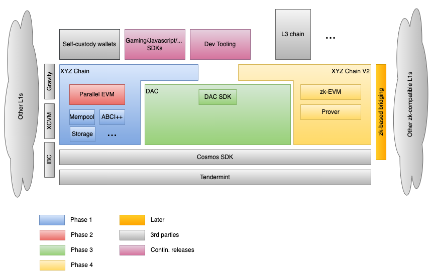

Scalability is THE differentiator for L1 chain success. In this post, I explore how Cosmos' 
modularity can scale a L1 to the next level.

# Introduction 

Let's start with a truism.  
There is no black-and-white approach to scaling up a blockchain and increasing its throughput (TPS).  
Just as with any software system, there is a series of trade-offs to be made, based on restrictions and available tools
and technologies. Wearing an architect / senior engineer's hat on requires us to be aware of both the restrictions as well the technical 
landscape around us. This will allow us to make informed decisions in the face of uncertainty.  

In this post, I will 
* lay out some "realistic" requirements of a fictional chain, 
* examine the current technological landscape, and
* present an example approach of scaling the chain, while discussing the thought process. 

> For the readers without a deep understanding of the blockchain space, I will start by quickly introducing some basic 
> concepts: L1 & L2s, rollups, side-chains, the importance of EVM, etc  
> If you feel you are well-versed in blockchain concepts, you can just skip to section [*Setting the stage*](#setting_the_stage).

## L3, L2, L1, L0... Lift-off!

> Photo by Charlie Wollborg on Unsplash

There are different ways we could categorise blockchains. 
The most common way is by assessing at which point of the "stack" they operate, i.e. at which layer. For this, we will 
use the [Open Systems Interconnection (OSI) model][1] as a reference.

> An attempt to map between the OSI model and the blockchain layers

**L1**  
It all started with the 1st (Bitcoin et al) and 2nd generations (Ethereum et al) of blockchains. Whether a single purpose 
chain (e.g. Bitcoin, allowing transfer of value) or a general computation chain (e.g. Ethereum, allowing arbitrary computations), 
they are all considered L1 chains. Their remit covers the whole stack, from peer-to-peer networking to the top-most 
user-facing application layer. This category also includes 3rd generation chains (e.g. Solana, Binanche Smart Chain, 
Evmos, Aptos,...); despite their differences, they all have the same top-to-bottom "footprint".

**L2**  
Ethereum's rising popularity clashed with its fixed transaction-per-second (TPS) limit leading to [gas price surges][2] 
and a dash to find scaling alternatives.  
One of the options was to move the expensive computation off-chain. This led to the creation of L2 chains, which  
* perform user-facing computation outside of the L1 chain, 
* use the L1 chain as a "source of truth" (e.g. for storing batches of transactions), and
* are interoperable with the L1 chain.
 
Different L2 solutions (e.g. [Optimism][48], [Polygon][49], [Starkware][50]) have different technical choices which lead to different 
trade-offs in terms of security or decentralization. The end result is one: increase the overall TPS of the underlying 
L1 chain by moving the expensive computation away from it.  

**L0**  
L2s were a solution to the scalability problem, taking the existing L1 chains "for granted"; it is there, it works, let's 
"make it great again".   

L0s are a first-principles approach to the scalability question. They offer the infrastructure and building blocks that 
comprise a blockchain (p2p networking, transaction finality and consensus, storage,...) to allow them to scale. A L0 
is effectively a chain-of-chains; not meant to be used for implementation of user-facing applications, but instead as 
the foundation for other blockchains.

Through different technology, architecture choices and trade-offs in this category we have [Polkadot][51], [Cosmos][52], 
[LayerZero][53], [Celestia][46],...

**L3**  
Now that we have described the other layers, it becomes a bit clearer what an L3 is.  
L3 is a user-facing application (smart contract dApp) with its own token that is built on top of an L2. There are plenty 
of examples here, like Uniswap [deployed on Optimism][54], Decentraland [on Polygon][55], etc.   

To the best of my knowledge, we have yet to see a L3 blockchain built on top of an L2. This is because there are no use 
cases yet which would   
* benefit from the increased TPS of the L2, and
* require features that are not available in a sandboxed smart contract environment (like network and DB access).

However, with the increasing adoption of web3, it is only a matter of time that we see an L3 chain built on top of an L2's
SDK. 

## Rollups and Side-chains: What's the difference?

> Photo by Thought Catalog on Unsplash

Rollups and side-chains are 2 different types of solutions to scale up existing L1s, i.e. increase their TPS capacity. In
that regard, they are both L2s.

A rollup utilizes off-L1-chain computation to process transactions. It does this by "rolling up" (read: compressing) 
multiple transactions into a single on-L1-chain transaction. This reduces the amount of data that needs to be stored and 
processed on the main blockchain, thereby increasing its scalability. Examples of rollups are Optimistic Rollup, ZK Rollup 
and Value transfer rollup.

A side-chain is a separate blockchain that is connected to the main L1 blockchain, typically through a two-way peg. This 
allows for assets to be transferred between the main blockchain and the side-chain, enabling off-L1-chain transactions 
to occur. These off-chain transactions can be processed at a faster rate and with lower fees, while still retaining the 
security guarantees of the main blockchain. Unlike the underlying L1 which can be general-urpose, side-chains are 
"specialised"; they are designed to be used for specific purposes, e.g. payments, trading,...    
Examples of sidechain framework are [RootStock][4] and [Liquid][3].

Both rollups and side-chains are designed to improve scalability by moving transactions off the underlying L1 blockchain.  
They achieve this in different ways.  
Rollups bundle multiple transactions together, using the underlying L1 as a storage for the bundle as proof. Side-chains 
are [separate blockchains][5], with their own security and consensus mechanism, connected to the main L1. All transactions on 
the side-chain are processed and stored off the main L1. What ends up on the L1 is a periodic "summary" of the activity 
on the side-chain (e.g. netted off transactions). 

### Optimistic vs ZK Rollups

Optimistic Rollups are quite simple in their approach. They assume that all proposed transactions are valid and honest; 
they just include them in the rollup (hence the adjective "optimistic"). To counter bad actors they employ an incentivised 
[fraud proof][6] mechanism: all transactions in the rollup are practically unsettled for a "challenge period" of a few 
days. If noone submits a fraud-proof, then they are considered final for all intentns and purposes. This simple mechanism 
allows for fast and cheap computations, at the expense of increased friction when trying to move assets off the optimistic 
L2[1](#footnote_1). 

ZK Rollups on the other hand use [zero-knowledge proofs][8] to keep the data private, which allows for private transactions 
(in the L2) on a public L1 blockchain. The ZK Rollup protocol takes the user’s transaction (or "inputs") and verifies them 
with a smart contract. Unlike optimistic rollups which impose a challenge period, ZK rollup transactions are final; the 
state updates are verified on execution. In addition, through complex zero-knowledge computations (a.k.a. [circuits][9]) 
the proof posted on the L1 chain is orders of magnitude smaller than the optimistic transaction batch[2](#footnote_2), 
while remaining private and trustless.

## dApps and app-chains

> Image from igexsolutions.com

Decentralized applications (dApps) are user-facing applications running on a blockchain.  
They almost always have a UI (browser-based or mobile), they use smart contracts to execute tasks and store data, and 
they allow for trustless, tamper-proof operations. There are plenty examples of dApps like decentralized exchanges, 
prediction markets, DeFi applications,...

Application-specific blockchains (app-chains) can be considered as a variation of dApps. As the name implies, they are 
sovereign blockchains[3](#footnote_3) catering to a specific use case or application. 

A dApp is generally easier to build and deploy than an app-chain.  
dApps only require front-end and smart-contract development knowledge. The logic is then deployed on existing L1 and runs 
on the existing infrastructure. The downside is that the dApp is limited by the capabilities of the underlying L1 and 
competes for L1 compute resources with other dApps.

On the other hand, app-chains require more involved systems-level programming to implement the code for validators and 
nodes. They also require the non-trivial task of bringing together a community of validators which will provide the 
necessary infrastructure to run the chain. The upside is that an app-chain leads to more efficient and scalable solutions 
for certain types of applications, allowing the core team to tweak with any aspect of operations (consensus, tech stack, 
tokenomics,...).  
A good example of the trade-offs in the decision-making is the case of [dYdX][10]. They started out as a dApp on Ethereum,
but eventually decided to build their own app-chain to improve their scalability and performance.

## Developers, developers, developers

> Image from tenor.co

Key to success for every general purpose chain (L1 or L2) is the developer community and the developer experience.  

How easy is it to build on the platform?  
How easy is it to deploy and maintain the application?  
What tools are there to support in the development lifecycle?  
Can the team find skilled engineers or would they need to upskill in a new technology stack?  

These (and more!) are concerns which are crucial to the uptake of a blockchain platform by engineers.
As the saying goes "Builders will BUIDL"; it is these new applications and systems that will attract new users and volume
to the platform and increase its token's utilisation.

Ethereum's [Solidity][11] smart contract programming language and the underlying [Ethereum Virtual Machine][12] (EVM) 
have been around the longest and they (arguably!) provide a superior developer experience compared to other smart 
contract platforms.

Solidity is a high-level programming language, i.e. closer to human-readable code. It has historically been easier for 
non-crypto developers to pick up, understand and work with. This, along with Ethereum's head start compared to all other 
smart contract platfroms, has resulted in a much larger and more active developer community.  
This translates into a large number of tools, libraries, and resources for Solidity developers, which hugely accelerates 
the development effort.

The result is that there is a huge number of dApps built on EVM on its blockchain compared to any other platform.  
According to [DappRadar][13] there are almost 4,000 EVM dApps built on Ethereum. Combined with other EVM-compatible 
chains like [BSC][14], [Cronos][15] etc the number climbs closer to 10,000. 
For contrast, competing non-EVM-based platforms like [EOS][16] and [Tron][17] have 1-to-2 orders of magnitude less 
deployed dApps.

That is a huge hurdle for any new development platform with its own language to overcome, in terms of tooling quality, 
community support and available talent pool.
As an anecdote, AI coding assistants ([Github Copilot][16], [ChatGPT][17]) offer incomaparably better support with 
Solidity than any other smart contract language.[4](#footnote_4)

So, in conclusion, easier developer adoption and a better upfront developer experience mean that EVM compatibility should 
be top-of-mind.

# Setting the stage

> Photo by Annie Spratt on Unsplash

With our basics out of the way, let's set the stage for where we are and what we want to achieve.  
We will first discuss an ideal end state (a Vision) as a direction of travel. Then we will set out some requirements or
constraints (a Mission) to guide us through this journey. 

Let's time-travel to the future and start with the...

## Vision

Here is a very bold assertion.  
> In a few years there will be millions of dApps, tokens and L3 chains, tokenizing and representing any asset imaginable.  

Let's work backwards from this statement.  
The Internet gives us a good prior example of exponential technology adoption. The number of websites has been on an 
exponential trajectory for the last 20 years. From 0 at the beginning of the '90s to almost 2 billion today.  

> Chart from Statista

Web2 websites (and online systems in general) are a great parallel to web3 dApps and chains. They are both collections of 
data and logic, with progressively higher orders of user engagement and utility.

The crypto space is clearly following the Internet adoption curve, no matter [which metric][19] we pick. This has two 
important consequences for aspiring general-purpose L1s.

* **Volumes**  
That is an obvious one: L1s must be able to support exponentially growing volumes of transactions.

* **Flexibility**  
Just like websites range from simple Wordpress sites to gigantic banking and e-commerce systems, future dApps and L3s 
will come with a continuum of needs  
  * from maximum-3rd-party-trust-with-little-on-chain (Wordpress-like) to minimum-trust-with-everything-on-chain (banking-like), and
  * from few large Bitcoin-like “transactions” to millions of gaming-like “micro-interactions”

L1s that aspire to take market share should have the performance, building blocks and tooling to enable this future for 
their users and developers.

## Preparing for the journey  

Now that we have the destination, let's define our starting point and set some requirements for the "journey". 

### Starting point 

> I will call both our imaginary chain and its token XYZ. 

The XYZ chain is a well-established player in the wider blockchain ecosystem.  

It already has a few million users (active addresses) on it. Almost the entirety of this user base comes from a very 
successful single app, to which they are very loyal.[6](#footnote_6) This gives it a good moat compared to 
the competition and a ready user community with which to entice 3rd party developers.  

XYZ is implemented using the Cosmos SDK and allows EVM-compatible smart contract  development. It already has a 
number of dApps deployed on it and has a reputation for stability. However, it ranks lower than other L1s in number of dApps
deployed.  
It has a high market cap, say top 50 or top 20; in other words it is not insignificant. On the other hand, its DeFi ecosystem is 
not as developed as other chains: the Total Value Locked (TVL) is low compared to other chains.

In summary, XYZ's team have "something" in their hands; they do not start from zero. There is an existing user base, which should 
not be jeopardised. Any decision has to consider not only the upside opportunity, but also the downside risk.

### Requirements & Priorities

Based on the discussion so far, we have some realistic requirements. Let's list them briefly, in semi-random order.

1. **Tech stack**
Our chain is built using the Cosmos SDK, so there is existing know-how in the team and the ecosystem.  
Any decision on changing the tech stack should not be taken lightly. 

2. **North star metric**  
We need a quantifiable target to act as a "North star" measure of scalability progress. This is how both internal teams 
as well as the community will unambiguously assess the success of the effort.  

The most obvious and widely understood metric is *transaction throughput*. The target figure must be maintained under 
various network loads and conditions. Therefore instead of aiming for *transactions per second* (which could fluctuate 
wildly), it is better to aim and measure *transactions per day* (where noise can be smoothed out). 

A corollary of aiming for a specific throughput, is that the team would need to have a **dedicated stress-test harness 
system**. This will allow them to test candidate technical solutions and to gage early if they would bring the system
closer to the goal.

3. **Stability >> bleeding edge**  
This is a general *guiding principle*, a value.  
As discussed in [Starting point](#starting_point) the chain’s moat is the existing user base. In that regard, the 
technical team has to seriously consider the potential downside of any risky or untested technical solution. Any 
technological improvements will not be done for technology's sake; instead technology is the tool to maintain and expand 
the existing user base.  

4. **Based on “serious” open source**  
This is a restriction, which comes as a natural corollary of the above principle. If a chain's (or any product/service for 
that matter), [USP][20] is not cutting-edge technology, then the chain is an *integrator rather than an inventor*.[7](#footnote_7)
Any technical enhancements and new building blocks should map to well-maintained open-source repositories.

5. **EVM compatibility**  
This is a [1-way door decision][22]. In the Cosmos ecosystem there is the optionality of integrating different 
smart contract VMs (EVM, CosmWasm, Gno.land). In practice this is a decision which has far-reaching consequences in the 
execution and future adoption by developers.  
As discussed in the [Introduction](#developers), the EVM/Solidity ecosystem has the **best developer experience** by far,
through sheer community size and tooling availability.  
Therefore, XYZ chain will find it hard to economically compete for developer attention[8](#footnote_8) if it 
does not continue to offer EVM compatibility. 

6. **Bridges to other chains**  
This is another thing to keep in mind: interoperability across chains increases the reach and utility of an L1. On the 
other hand [cross-chain bridges][25] remain one of the biggest [sources of vulnerabilities][27] in the blockchain world. This 
further restricts the technology choices in the current landscape. The Cosmos SDK offers secure, native bridging via 
[IBC][24] out-of-the-box. Reaching to other blockchain ecosystems requires either technology-enabled native bridging, or 
maintaining compatibility with existing, battle-tested bridges. 

  
> IBC-enabled chain interactions, by [mapofzones.com][29]

7. **Compound XYZ token utility**  
This is another guiding principle. Almost all L1s (XYZ included) start their existence with a [genesis token distribution][23],
part of which goes to the team's treasury. This works towards aligning incentives for long-term success.  
In an existing and developed ecosystem, like XYZ, there is a strategic intent to not "cannibalize" the existing token, e.g. 
by introducing a dependency to a new or 3rd party token. The goal must instead be to *compound value accrual*. 
This works in favour of everyone involved: tokens in treasury, RoI for partners’ validation infrastructure, ecosystem 
participants.  
In brief, any solution must avoid any dependency on external tokens or dilution of utility of the existing XYZ token.

8. **Single, composable chain**  
Last but not least, XYZ chain should remain a composable chain. This is another 1-way door decision. A chain can increase 
its throughput via side-chains or channels (e.g. [Lightning][26] for Bitcoin). These channels are extremely effective 
when the chain is single-purpose (like value transfer for Bitcoin). In general purpoise chains introducing use-case-specific 
side channels can quickly lead to confusion and poor choices.  
Should there be a side-chain per market vertical (e.g. gaming, DeFi)? Or per transaction type? How do ecosystem 
participants decide correctly which one to join? 

# Moving forward

> Photo by NASA on Unsplash

Now that we have established some guiding principles and requirements, we can start to look at the options available 
to us. 
Let's start with some... 

## Low-hanging fruit

### Cosmos SDK & Tendermint improvements

Upstream improvements is part-and-parcel of a vibrant ecosystem (e.g. for [Tendermint Core][30]).  
These range from peer-to-peer networking improvements, to upgrades to the [ABCI interface][31] and [mempool prioritisation 
refactoring][32]. 
Keeping up with these is a must, bringing some performance improvements to the chain.

### Block adjustments

This is another place to look.  
* Increasing the [block size][28] ("how many transactions can we fit") 
* How frequently blocks are minted at the consensus layer, and 
* Tweaking the block creation logic

are all pulls and levers which can potentially increase throughput. 

There are two things to note with all of these:  
* They are all incremental performance optimisations, not step changes. Performance will probably increase as a 
percentage, not by a factor of 2-3-10x.
* There are diminishing returns to each of these. They all directly affect the requirements on the validator nodes 
capacity and connectivity. There is a cut-off point where it might become unfeasible to run a validator node, if 
the block adjustment are out of whack.

### Storage logic optimization 

A large part of validator node resources is consumed by managing and storing the chain's state in the local database.  
In the Cosmos SDK, all building blocks of logic (a.k.a modules) store their data in the [internal key-value store][33]. 
Some modules will have a disproportionate load on the node and will become critical (e.g. the EVM module, an order book 
module in a DEX chain, etc).  
Focusing on optimising the storage of these modules (e.g. optimising data structures, decoupling from the default 
storage) can potentially bring performance improvements.   

With quick wins out of the way, we need to think of potentials for step change; orders of magnitude improvements.  
Let's look at some more ambitious options.

## Option 1 - Parallelisation of execution

### At transaction settlement

The latest generation of general-purpose chains like [Zilliqa][34], [Aptos][35] and [Sui][36] have a unique selling 
proposition (USP): they offer a higher throughput via parallelisation of transaction settlement.  
This parallelisation is based on the insight that **most transactions in the same block affect different parts of the 
global state graph**[9](#footnote_9). This parallelisation is made possible either via explicit transaction 
classification (Zilliqa[10](#footnote_10)) or by optimistic locking of the global state and hard-coding 
inter-contract dependencies (Aptos, Sui[11](#footnote_11)).

Transaction settlement parallelisation definitely sounds appealing. Let's take a step back and assess it in the context 
of our imaginary chain.  
Being a Cosmos chain means using the [Tendermint BFT consensus][38] algorithm, which has sequential execution. Moving 
to parallel settlement would entail a complete re-write of the underlying consensus layer. Even with the availability of 
ABCI++, all transactions would have to be decoded in order to be introspected and categorised. The changes in transaction 
settlement (from instant finality to eventual settlement) would affect the logic of a large number of SDK modules (Bank 
module for account balances, EVM for smart contracts,…).  
Though not impossible, this is a major undertaking. And it would contravene our guiding principles of [stability](#req_3) 
and [utilising existing technologies](#req_4).   

### At EVM execution

In general computation chains, the vast majority of transactions are smart contract operations. And EVM execution is by 
far the most expensive part of the transaction settlement. Therefore it makes sense to focus on that.

From an architecture PoV parallelization of EVM execution seems like a more contained piece of work. EVM is implemented 
as a Cosmos SDK module, so all changes should remain transparent to the rest of the codebase.  
From an implementation perspective, a core piece of work would
be to understand the impact of transactions on the state graph of the EVM and identify which ones can be safely executed.
Transaction classification can range from explicit and standards-based (e.g. see [EIP-2930][39]) to implicit and esoteric 
(e.g. bytecode heuristics[12](#footnote_12)).  

In terms of options there are a couple.  
Ethereum adoption of EIP-2930 will "force" the corresponding work on the Cosmos EVM side to maintain compatibility. This 
would provide the needed open-source support, but it is still unknown when it would actually happen. 
Another real-world option is [NodeReal's Parallel EVM][41] adopted by Binance Smart Chain. On the downside NodeReal's EVM 
would need some work before becoming usable by another chain.

Though not immediately going against any of the principles laid above, there are a couple of risks to consider.  
* There is no drop-in Cosmos module for parallelised EVM execution just yet. The XYZ team will need to do some 
extensive investigation and PoCs to proceed with confidence. The eventual result would require 3rd-party security audits
before going on mainnet. In the extreme case that the upstream Cosmos modules would not accept the pull requests, the 
chain's team would need to maintain an EVM fork on their own. That would be against [priority 4](#req_4)).
* On low chain loads, overall performance may actually decrease after the parallelisation upgrades. This might be 
perceived wrongly by the community. See the [Aptos whitepaper][42] findings.

In general the parallelisation of EVM execution is a promising path to explore. It should be part of the chain's 
optimisation journey.

## Option 2 - Data availability (storage modularization)

As we touched briefly in [Low-hanging fruit](#low_hanging_fruit), the storage element is a major contributor to resource 
comsumption. In other words, a performance drag.  
Increasing blockchain speed by offloading block storage to an external component or service is a subject studied at length, 
especially by the [Ethereum community][43]. Though mostly referenced in the context of a ZK rollup (to be discussed 
later on), a data availability layer can accelerate any chain connected to it. Our XYZ chain is already a general 
computation chain, appealing to high-throughput and possibly high data volume apps, like gaming. 

It is worth pausing to think that dApp storage needs are **not one-size-fits-all**. They fall along a "ladder" of 
increasing complexity and security[13](#footnote_13). In the ideal end state, in our XYZ chain  
* different dApps will have access to different storage options, depending on their needs, and
* access to the data availability layer is abstracted behind an SDK.

For these reasons it makes sense to investigate storage availability as a **separate building block**, rather than 
making it a "blocking" requirement in the chain’s roadmap. Let's dig in a little deeper.  
From a code PoV there is an actively maintained Cosmos-compatible reference implementation of a base storage layer: 
[Celestia][46]. Celestia is built from the ground up as a L0 and will eventually have its own token; using it outright 
would be against [Priority 7](#req_7). On the other hand, Celestia's code itself is built in a modular way, courtesy 
of Cosmos SDK and Go.  
This means that the XYZ chain team can **use a Celestia fork as a PoC starting point** and investigate  
* the extent of out-of-the-box reusability vs custom development with regards to Cosmos SDK modules,
* the impact of the data availability layer on the chain's performance,
* the feasibility and best way to introduce various data availability models (Validium, DAC,...) via a common interface, and  
* (in the case of the DAC option) the best **tokenomics model**, if applicable. I.e. should DAC be secured via 
  simple [proof-of-authority][47], re-use the existing XYZ token or introduce a separate DAC.

The XYZ team would not be considering this option from a blank sheet of paper; there is plenty of research and a working 
Cosmos implementation to begin with. However, there are a couple of risks to consider in this option, too.   
* The existing Celestia codebase is hard-to-impossible to incorporate. This would mean starting the development from 
  scratch, which is against Priorities [3](#req_3) and [4](#req_4). 
* The chosen implementation approach of a DAC does not align with the interests of XYZ’s partner validators (e.g. 
  incentives, infrastructure choices,…). In other words, they would not want to support it. This can be mitigated by 
  involving the community from the early stages of the high-level DAC design and any tokenomics decision.
* The interface and functional choices of the data availability module/SDK is not fit-for-purpose for the needs of the 
  community. Like with any product, there will be a fair amount of assumptions baked in (e.g. will there be a lot of 
  gaming apps? If yes, what will their on-chain usage profile be?) The long lead time of infrastructure products may not 
  agree with the fast-shifting pace of the blockchain space. This uncertainty can be mitigated by
   * circulating the design ahead of time for comments from the community, and
   * the XYZ chain team creating some realistic dApps (themselves or via a commissioned 3rd party) to verify the 
     usability of the data layer.

## Option 3 - Rollups

The third option is to use a rollup technology.  

But first there are a couple of important decisions.

### ZK vs Optimistic

This is a major one-way door decision.  
The two technologies offer similar benefits, but are not interchangeable. We discussed their characteristics in the 
Introduction section [ZK vs Optimistic](#optimistic_zk).

From the XYZ chain's PoV both appear to offer benefits.  
* Optimistic rollups offer simple implementation, aligning with [Priority 3](#req_3) of prioritising stability.
* On the other hand, optimistic rollups's securirty is effectively a product of social consensus and participant 
  incentives. If, for some reason, fraud proofs are not submitted, the whole security model falls apart.   
* ZK rollups' security is firmly grounded in mathematics. This makes it a more reliable long-term option. The security 
  is harder to implement, but not open to disputes. This aligns well with [Priority 3](#req_3)in the long term.
* Speaking of longer term, one additional point to consider is the future opportunity of **standardization of 
  circuit/prover logic across ecosystems**. This would lead to (almost) native bridging of assets between compatible 
  ZK Rollups ([Priority 6](#req_6)). Though not a Day 1 opportunity, this is something worth exploring by the XYZ team 
  through technology partnerships.

Weighing the choices and their trade-offs, it would make sense for XYZ chain to **pursue ZK Rollups**.

### EVM compatibility

The second decision is whether to use an EVM-compatible rollup or not.  
[Requirement 5](#req_5) is unambiguous on this: yes.  

Which, given the discussion on ZK rollups we just had, brings us to the next question: can we have an EVM-compatible ZK
rollup? The answer is also yes.

zk-VM implementations are split in 2 categories:  
* 1st generation VMs. These ones employ a bespoke language to support the underlying ZK execution semantics (e.g. 
  Starkware's [Cairo][57])
* An emerging cluster of 2nd generation VMs. These offer full EVM compatibility out-of-the-box.  
  Examples here are [zkSync][58], [Polygon Hermez][59] and [Scroll][60]. 
 
From the XYZ chain's PoV, [Priority 5](#req_5) points not only to EVM compatibility, but **cross-stack developer tooling 
compatibility and re-use**. I.e. giving dApps the ability to port across chains with minimal-to-no changes.  
This makes a **2nd generation zk-EVM a better choice**, with 3 different option to explore.

At the time of writing this article, the state of the 3 options is as follows.
* zkSync  
  Currently at mainnet. Critical parts of the code (e.g. Prover) are not available, while others do not build intentionally. The project Effectively closed source. Critical parts of the code (Prover) are not available, while others do not build intentionally.
  This makes the project effectively closed source, based on its strategy[14](#footnote_14).
* Scroll  
  At pre-alpha testnet. Fully open source, but with zero documentation at the time of writing. From a quick glance it 
  appears to be at least 1 year behind zkSync in terms of code maturity.
* Polygon Hermez  
  Currently at testnet. This EVM is the best documented of the 3, with almost 100% EVM opcode coverage and all code 
  open-source.  
  It seems like the most promising option at of the 3.

### Rollups and the XYZ chain

The way forward for the implementation of rollups in XYZ chain becomes a bit clearer.  
The team would need to deploy a separate L2, secured by the existing XYZ chain. Let's call this XYZ v2.  
XYZ v2 would offer ZK rollups along with full EVM compatibility. This would allow existing XYZ chain dApps to be ported 
over with minimal changes. 

It is also important to highlight a future strategic opportunity with ZK Rollups.  
A **standardization of circuit/prover logic across ecosystems** would lead to (almost) native bridging of assets between 
compatible zk-Rollups, regardless which chain ecosystem they are implemented in. This would fit nicely with [Priority 6](#req_6). 
This is something worth exploring by thge XYZ chain through cross-chain technology partnerships.

Like all choices, this does come with its own risks.  
* Maybe none of the 3 ZK EVM options are ready for use within XYZ chain’s timeframe.  
  E.g. zkSync remains closed source for an unknown period of time, Polygon has bugs, etc. This could be a real threat to
  the delivery of this milestone. A possible mitigation would be to join forces with one of the above teams to assist.
* Not all ZK circuits are created the same; the chosen prover circuit may not be performant enough.  
  For example, it may require specialized hardware to run (see [footnote 14](#footnote_14). This could lead to validator 
  centralisation. This is an area that requires active R&D and leveraging partnerships in order to derisk.

# A path forward

With all the pieces in place, the last thing to do is to put them together in a coherent plan.  
In a key piece of infrastructure like a chain, having a clear plan with milestones and a target end state is key to 
building up trust in the stakeholder community.

> Expansion phases and building blocks of the XYZ chain

This diagram attempts to do 3 things:  
* depict the new building blocks of the XYZ chain that we just discussed and how they correlate to each other, 
* group them together in a rough plan with delivery milestones, and
* highlight how they would interact with external pieces of infrastructure.

In terms of sequencing and timing, the differnt phases can be sequential or have any amount of timing overlap. This 
depends entirely on the capacity of the XYZ team and the availability/maturity of external components. 

**Phase 1**  
Here we have grouped together all the improvements described in the section [Low-hanging fruit](#low_hanging_fruit).  
These are the internal optimisations to the existing codebase of XYZ.  
The chain will continue maintaining support with other L1s via IBC, [Gravity Bridge][62] and, for Polkadot chains, 
[XCVM][63]. 

**Phase 2**  
Here the XYZ team can tackle the Parallelized EVM work. Once completed, this would deliver an additional performance 
boost to the chain's throughput. 

**Phase 3**  
This phase delivers the Data Availability layer (DAC) as a separate building block.  
It offers an SDK for its various modes (centralised validium, fully staked DAC). The SDK, delivering the simplest forms
of storage first, would allow dApps on XYZ to start developing straight away (for example, gaming requiring 
semi-centralised rather than independently attested storage).  
Depending on the uptake, this will also help improve the XYZ chain throughput, nearing towards the North Star 
performance goal.

**Phase 4**  
This will deliver the zk-EVM functionality as a separate L2 on top of XYZ (after evaluating all alternatives).  
Depending on delivery timing and community interest, the new L2 chain may also utilize the DAC SDK & layer for storage.

**Other items**  
* Tooling  
  The delivery of the above phases is not in isolation. Instead, it is accompanied by updates to a number of tools and 
  interfaces: wallets, SDKs, dev tooling and documentation. Their delivery cycle and feature set is aligned to the 
  delivery phases of the XYZ chain.
* ZK cross-chain bridge  
  This is a "later" thing, to be delivered sometime in the future. Once zk-EVMs and ZK chains in general proliferate, 
  this will be the next area to get R&D focus. Compatibility at the prover & circuit level will lead to native bridging 
  of assets. 

# Parting thought

> Photo by Mar Bocatcat on Unsplash

And that was it! 🎉🎉

We covered a LOT of ground in this article.  
For someone new to the space, it may have been a bit overwhelming or even complete alien language.  
The point was not to understand every little detail. Instead it was to get a sense of the different options available 
in the little corner called Cosmos ecosystem.  

But if you are going to walk away with a single take-away it should be this: blockchain not only has non-stop innovation.
It also has its own tradeoffs and optimisations based on external factors.  
Just as with any discipline of engineering.

Until next time, keep building!

# Footnotes

1. Normally assets cannot be moved out for the duration of the challenge period. However a 
  number of [bridges][7] allow for fast-exits-for-a-fee, with the liquidity providers taking on the risk of the challenge 
  period.  
2. An extremely simplistic parallel of a ZK proof's size is to a hash. A hash is much smaller than 
  the original data, but still uniquely identifying it.
3. Sovereign meaning having their own set of validators, consensus mechanism, token and governance.
4. As an experiment, try asking ChatGPT to create a simple smart contract in [any other][18] smart 
   contract language. Chances are on its first attempt it will return a Solidity example.
5. It would have been easy to start from a "blank sheet of paper" with a new chain. But it is 
   rarely realistic to be discussing technology in a vacuum. There is always some context which informs our decisions 
   and trade-offs. The whole point of this thought exercise is to see how we can reach a technical "destination" in the 
   face of different restrictions as well as options.
6. There are plenty of examples of single "killer" apps acting as on-ramp for users on a chain:
  Stepn for Solana, Sweatcoin on ???, chain for chain (to an extent), etc
7. It is worth re-stating here the difference between invention and innovation. Something I 
   have covered in my [investment-related blog posts][21]. 
8. It is important stress the word "economically" in this context. Chains introducing new smart
   contract languages will need to invest a lot of time and effort to educate developers on the new language. This 
   inevitably translates into a lot of community marketing and development effort (articles, hackathons, grants). This is
   a game for deep-pocketed chain teams.
9. 2 simple examples of transactions happening in the same block:  
   * Alice sends tokens to Max. Alice sends tokens to Bob. Alice's balance is affected by both these transactions, so 
     they have to be executed sequentially.
   * Alice sends to Max. Bob sends to Dave. The transactions affect separate balance, so they can be executed in parallel.
10. Zilliqa classifies transactions as:  
   * account-to-account
   * account-to-contract
   * complex (account-to-contract-to-contract-to…)  
   
   This allows the chain to understand the “impact” of each type of transaction and batch/shard accordingly.
     
   > Image from [Zilliqa][34]
11. Both chains are [Diem][37] spinoffs and follow similar design approaches.  
    Their internal data model is using optimistic state locking to support parallel transaction execution (versioned 
    data items). This results in “eventually settled” transactions.
12. Performing bytecode analysis to discover state graph dependencies (e.g. [F1][40], F2,… opcodes)
13. Data storage is a continuum of choices.  
    At one end we can have a centralised off-chain DB, either fully trusted or providing [Validium-like][44] ZK proofs for 
    maximum speed, to [Data Availability Committees][45] (stakes & unstaked) to full on-chain ZK rollups.
    
    > Image from [Celestia][46]
14. According to [zkSync’s CPO][61], achieving performance on generalized hardware is their “technical 
    moat” and the most closely guarded part of their codebase for the foreseeable future.

  [1]: https://en.wikipedia.org/wiki/OSI_model
  [2]: https://ethereum.org/en/developers/docs/scaling/
  [3]: https://liquid.net/
  [4]: https://rootstock.io/
  [5]: https://komodoplatform.com/en/academy/blockchain-sidechain/
  [6]: https://ethereum.org/en/developers/docs/scaling/optimistic-rollups/
  [7]: https://www.optimism.io/apps/bridges
  [8]: https://en.wikipedia.org/wiki/Zero-knowledge_proof
  [9]: https://trapdoortech.medium.com/zero-knowledge-proof-deep-into-zkevm-source-code-evm-circuit-21d0a47f63aa
  [10]: https://revelointel.substack.com/p/why-did-dydx-move-to-cosmos
  [11]: https://soliditylang.org/
  [12]: https://ethereum.org/en/developers/docs/evm/
  [13]: https://dappradar.com/rankings/protocol/ethereum/
  [14]: https://dappradar.com/rankings/protocol/binance-smart-chain/
  [15]: https://dappradar.com/rankings/protocol/cronos
  [16]: https://github.com/features/copilot
  [17]: https://chat.openai.com/
  [18]: https://pontem.network/posts/comparison-of-the-top-10-smart-contract-programming-languages-in-2021
  [19]: https://studio.glassnode.com/metrics?a=BTC&m=addresses.ActiveCount
  [20]: https://snov.io/glossary/unique-selling-point/
  [21]: https://sgerogia.github.io/Angel-investing-Part-3/#:~:text=And%20a%20word%20on%20invention
  [22]: https://www.linkedin.com/pulse/making-decisions-one-way-two-way-doors-alfons-staerk/
  [23]: https://smithandcrown.com/research/introduction-to-token-distribution-mechanisms/ 
  [24]: https://medium.com/@datachain/how-cosmoss-ibc-works-to-achieve-interoperability-between-blockchains-d3ee052fc8c3
  [25]: https://blog.chainalysis.com/reports/cross-chain-bridge-hacks-2022/
  [26]: https://www.bitcoin.com/get-started/what-is-lightning-network/
  [27]: https://blog.chainalysis.com/reports/cross-chain-bridge-hacks-2022/
  [28]: https://docs.tendermint.com/main/tendermint-core/block-structure.html
  [29]: https://mapofzones.com/home?columnKey=ibcVolume&period=24h&mapType=2d
  [30]: https://github.com/tendermint/tendermint/issues?q=is%3Aissue+is%3Aopen+%22improvement%22
  [31]: https://github.com/tendermint/tendermint/blob/master/docs/rfc/rfc-013-abci++.md
  [32]: https://github.com/tendermint/tendermint/blob/master/docs/architecture/adr-067-mempool-refactor.md
  [33]: https://docs.cosmos.network/main/core/store
  [34]: https://www.zilliqa.com/
  [35]: https://aptos.dev/
  [36]: https://sui.io/
  [37]: https://en.wikipedia.org/wiki/Diem_(digital_currency)
  [38]: https://tendermint.com/static/docs/tendermint.pdf
  [39]: https://eips.ethereum.org/EIPS/eip-2930
  [40]: https://www.ethervm.io/#F1
  [41]: https://www.bnbchain.org/en/blog/new-milestone-the-implementation-of-parallel-evm-2-0/
  [42]: https://aptos.dev/assets/files/Aptos-Whitepaper-47099b4b907b432f81fc0effd34f3b6a.pdf
  [43]: https://ethereum.org/en/developers/docs/data-availability/
  [44]: https://ethereum.org/en/developers/docs/scaling/validium/
  [45]: https://ethereum.org/en/developers/docs/scaling/validium/
  [46]: https://celestia.org/
  [47]: https://www.geeksforgeeks.org/proof-of-authority-consensus/
  [48]: https://www.optimism.io/
  [49]: https://polygon.technology/
  [50]: https://starkware.co/starknet/
  [51]: https://polkadot.network/
  [52]: https://github.com/cosmos/gaia
  [53]: https://layerzero.network/
  [54]: https://uniswap.org/blog/uniswap-optimism-alpha
  [55]: https://decentraland.org/blog/announcements/polygon-mana/
  [56]: https://ethereum.org/en/developers/docs/scaling/optimistic-rollups/#what-is-an-optimistic-rollup
  [57]: https://starkware.co/cairo/
  [58]: https://docs.zksync.io/zkevm/#general
  [59]: https://github.com/0xpolygonhermez
  [60]: https://scroll.io/
  [61]: https://podcasts.apple.com/us/podcast/the-zkevm-is-here-zksyncs-steve-newcomb/id1499409058?i=1000580884859
  [62]: https://www.gravitybridge.net/
  [63]: https://www.composable.finance/about