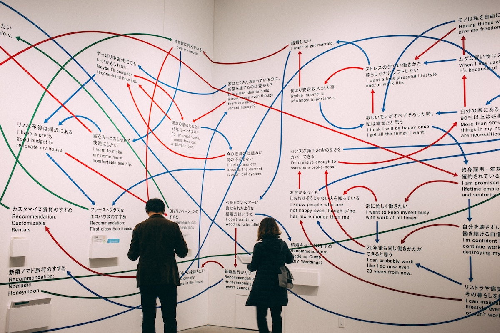
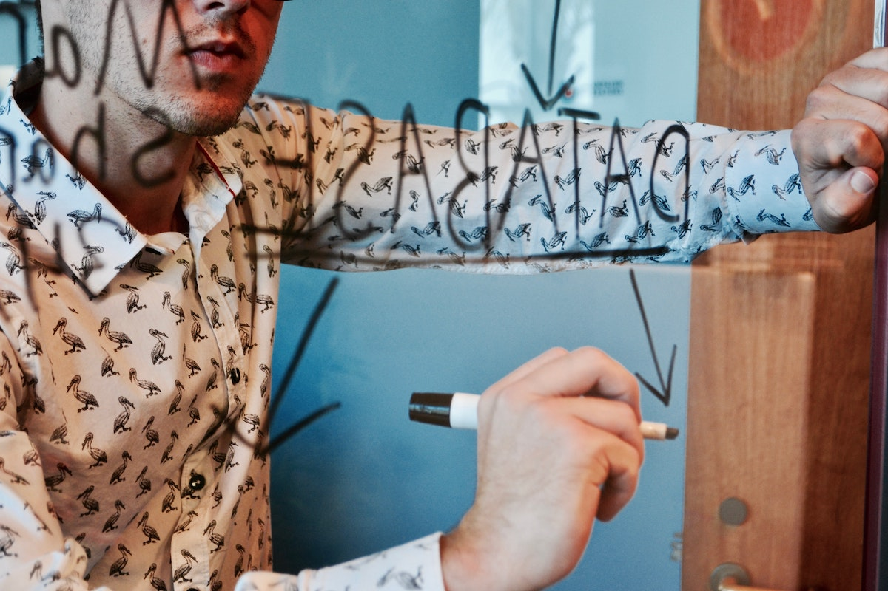

A new endeavour comes with uncertainty. In this post I will share an approach to help you lift "the fog of war".

# First few days 

# Your mission, should you decide to accept it...  

> Photo by Nathan Dumlao on Unsplash

Describe our idea

# Some context

> Photo by Scott Graham on Unsplash

# Our approach 

## 1. The problem space

> Photo by charlesdeluvio on Unsplash

Number of product questions & decisions

* Do we need to build a mobile app or multi-channel?

* Is there a target date we 

## 2. The system

> Photo by Campaign Creators on Unsplash

Questions
* Can we use SaaS like Airtable?
* Can we use a PaaS like Heroku or do we need heavier cloud resources?
* What would the infrastructure footprint look like on Day 1?

## 3. The plan 

> Photo by Volodymyr Hryshchenko on Unsplash

## 4. The team & the budget
 

> Photo by Randy Fath on Unsplash

# Discussion & Parting thought

> Photo by Marc Wieland on Unsplash

Until next time, excelsior!

# Footnotes

1. 

  [1]: 