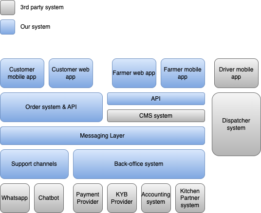
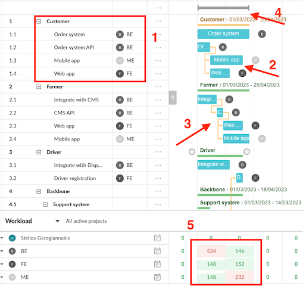
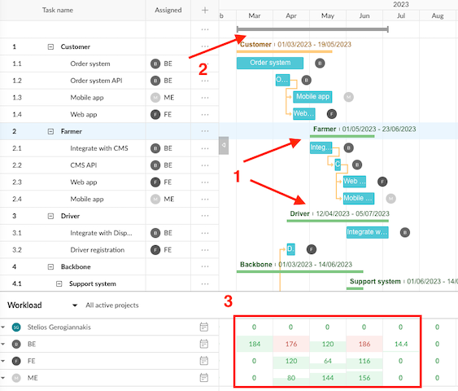

A new technical endeavour comes with uncertainty. I will share an approach to help you (the founding technical person) 
lift "the fog of war".

# First few days 

Uncertainty takes many forms: joining a new team, a new business domain, a startup looking to go from idea to reality.  

A "technical leader" also comes in many forms: the technical co-founder in a startup, a department director in an 
enterprise, a team lead.  
Leadership is not in the title; it boils down to whom eyes turn to for direction.

Let's assume you are the technical co-founder in a startup.  
We will use this as a fictional scenario to help us focus on the thought process.

# Your mission, should you decide to accept it...  

> Photo by Nathan Dumlao on Unsplash

> Note: The business idea serves only as a [McGuffin][5] to help us focus on the thought process

You are the technical co-founder in an order startup for same-day farm-to-plate-to-door meals.  
Or in VC-speak: "Uber for farm fresh-cooked food".  
Your co-founder (CEO) has been working on the business model for the past few months. The market opportunity is just 
amazing, customers cannot wait to log on and start ordering, investors are forming a disorderly queue to invest, this 
is the next unicorn etc. 

Here is the outline of the functionality.  
* Urban farmers register with our platform and list their micro-produce on it.
* Customers browse the website and select their desired produce. 
* They also select their preferred recipe to cook the produce in (e.g. salad, soup, etc.) in a central kitchen location
* ...and finally their desired time to deliver the ready meal to their door.
* On the backend the platform allows freelance drivers to sign up, and 
* ...pick up the produce from the farmers to deliver to the central kitchen, and
* ...pick up the cooked orders from the central kitchen and deliver them to the customers.
* The whole system is available as a mobile app and a website.

The founder CEO has added some additional requirements for the platform.  
* You have secured a kitchen partner to cook the meals.  
  The partner not only provides the cooking facilities (shadow kitchen), but they also have their own order management 
  and logistics system (check-in ingredients, check-out cooked orders). Your platform should integrate with this system.
* To save on capex, you should initially be ready to utilise an external [Delivery Management System][4] to manage drivers, 
  routing, etc (e.g. [OnFleet][1], [Shipox][2], [Tookan][3],...).
* The system should be in public beta within 6 months of seed funding.   
  There are really-really good business & investor reasons. No point arguing about it, this is a hard requirement.

## ...and some more context

> Photo by Scott Graham on Unsplash

The above might be enough to get started: it is our **What**.  

But we need to get some additional context on the **Why** you, as a technical co-founder, are about to embark on the 
exercise we describe in this post. 

The business is currently in pre-seed stage, bootstrapped by the CEO.  
Having validated the idea and business model with potential customers and partners, the business is now looking to raise 
a seed round to get things off the ground.

But how much seed funding do you need?  
The CEO has a firm grasp of the costs of marketing, sales, and operations; these are already in the financial projection. 
What about product development?   
Will it cost $100k or $1M? Can the team build the MVP in-house? Will the MVP be ready on time for public beta as needed? 

The answer to these questions (and more) can have a dramatic impact on a number of fronts:  
* the "ask" for money to the prospective investors 
* the product roadmap (is the go-live date really non-negotiable? is the MVP scope non-negotiable?)
* the viability of the business model, given the additional development costs (What is the company's burn-rate? When 
  will it break even? When will it be profitable?)
* the hiring plan (Do you need a team of 10 or 100? Do you need to go looking for outsourcing agencies for the first few 
  months?)

Now that we have some context, let's get to work!

# Our approach 

If you come from an engineering background, your muscle-memory reaction most likely is to jump in, pick the first 
problem and [just write code][6].      
Not to worry! There will be plenty of time for that in the days and months to come!

But first, it is really worth taking a step back and spending a couple of days to flesh out your approach.  
This will help you get a better understanding of the task at hand, and the direction you need to take.

Going from the abstract to the concrete, let's start by defining...

## 1. The problem space

> Photo by charlesdeluvio on Unsplash

In our imaginary system we have a number of product- and system-related questions & decisions.  
Just like with any system.    

Here is a (definitely non-exhaustive!) list to consider:   
* Will we be multi-channel? Which distribution channels will we support?
* Is there a target date we aim for?
* What is the MVP scope?
* Do we have external systems to integrate with?
* What are our projected volumes and load?
* Do we handle sensitive data? Are there applicable regulations?

and many more.

Some of these questions have already been answered by the CEO, some are to be decided by you, and some... well, who knows!
The answers give us a high level understanding of all the different "problems" we will need to tackle.  

The best way to represent a fuzzy problem is to break it down into a mind map.  

> Mind map of our imaginary system

If there is a team, this exercise should be done collaboratively, allowing everyone to  
* brain-dump all possible aspects and components of the system...
* from a logical (or [jobs-to-be-done][7]) PoV, and
* continue drilling down in each tree branch to extract more fine-grained building blocks. 

This exercise and the back-and-forth of ideas and what-ifs helps uncover a lot of the unknowns and assumptions.  
This is also an opportunity to map out dependencies as well as opportunities for re-use ("why don't we use X, instead 
of building it ourselves?").

With the problem space laid out, it is time to consider... 

## 2. The system

> Photo by Campaign Creators on Unsplash

The breakdown of the problem space is the first step towards top-down [componentization][8]; thinking about our system in
building blocks which [do one thing well][9].  
After a couple of iterations over the mindmap, the branches and sub-branches of the mindmap start emerging as our future 
systems and components. 

With the jobs-to-be-done defined we can have a 2nd-order set of questions. The ones below are specific to our imaginary 
system.  
* Can we use SaaS like Airtable or a CMS for dynamic content, rather than build it ourselves?
* Can we use a PaaS like Heroku or do we need heavier cloud resources?
* What would the infrastructure footprint look like on Day 1?  
  etc

This process will eventually lead us to a logical system design like the following.

> System design for our platform

A logical design like this has a number of useful features:
* Shows the overall footprint of the system. 
* Shows what will be built vs used.  
* Abstract enough to be understood by both technical and non-technical stakeholders.

Of course this is not the only way to represent things at a high level.  
The [C4 model][10] is another excellent way to represent a system at increasing levels of detail. I have covered this 
in detail in a [previous post][11].

One thing to consider is the audience for this design.  
Especially in an early-stage company, everyone does everything and so everyone needs to be able to understand everything.
More so fund-raising is almost always a full-time job, with 10s of investors doing all kinds of dilligence. The system 
should be understandable by everyone, not just the technical team.

With the system design in place, it is time to consider...

## 3. The plan 

> Photo by Volodymyr Hryshchenko on Unsplash

[AGI][12]-for-development is not here yet, so we cannot have our system built at the snap of a finger.  
We need to plan for its delivery and try to answer the burning questions: *How much?" and "By when?".

This is where we dust off our project manager hat and start looking at [Gantt charts][13] and tools.  

We start off by putting our mindmap branches and leaves[1](#footnote_1) onto a chart as tasks and subtasks.   
Then we try to make some effort estimations.  

> Before you jump out of your chair and start screaming "[Planning fallacy][14]!"; yes, you are [correct][15]! This 
> exercise is fraught and loaded with biases and assumptions.    
> However, unless you are 
> * working on a bootstrapped project, and
> * everyone in the team is technical and experienced, then
>
> one or more stakeholders (co-founders, investors, colleagues, etc) will need some directionally correct guidance.[2](#footnote_2)   
> So the best you can do is be very mindful and transparent of the assumptions & biases you or the team "baked into the 
> cake".

The result looks something like this.

> Our Gantt chart v1

1. The tasks and subtasks form a tree. We assign roles (e.g. Frontend Engineer) to each task.
2. We then assign effort estimates for each task. Unless working on something trivial, it is best if our unit of 
   measurement is weeks or months at this stage. We are going for direction, not accuracy.
3. We draw the dependencies between tasks ("X needs to finish before Y can start"). Our Gantt tool will then take care 
   of arranging the dependent tasks in the correct time order.
4. The tool keeps track of the total effort for each independent system. At this stage we do not worry about overall 
   capacity, i.e. how many things our team can deliver in parallel. We are only interested in hard, dependency-driven 
   timing contraints.
5. The tool keeps track of the cumulative effort each role has to spend in each unit of time. In this example here, our 
   Backend Engineer (BE) is forecasted for >530 work-hours in the first month (a month being ~160 work-hours). This starts
   highlighting the "hotspot periods" of effort if we could hire an unlimited number of people.   

In most cases our pockets tend to be very shallow. Therefore we need to revisit the plan to optimise for the available 
budget.  
Without touching the estimations and task dependencies, can we move the work items around to smoothen the overall effort?  
Can we move some tasks to a later date? Can we have a release cadence of features? 
If the above is not possible, should we consider reducing the scope?  

All of the above questions are part of grapling with the [Triple Constraint Theory][16].   

In our imaginary scenario, we have the fixed constraints of "up to 6 months" and "scope is non-negotiable".  
Therefore we only need to optimise cost by smoothing down the spikes of effort.

> Our Gantt chart v2

## 4. The team & the budget
 

> Photo by Randy Fath on Unsplash

# Discussion & Parting thought

> Photo by Marc Wieland on Unsplash

Until next time, excelsior!

# Footnotes

1. This includes the tasks that are "part of the product", i.e. we can implement them. If our 
   mindmap contains branches like "Hiring", "Training", "Open Questions" etc. it is obvious that they do not belong here.
2. An overall effort estimation of, say, 1 month can easily turn into 2 & 3 months in practice, 
   no matter how well thought-through the estimation. It happens all the time.  
   But it is in a different league to an initial overall effort of, say, 1 year. 

  [1]: https://onfleet.com/
  [2]: https://shipox.com/
  [3]: https://jungleworks.com/tookan/
  [4]: https://www.fleetequipmentmag.com/delivery-management-system/
  [5]: https://en.wikipedia.org/wiki/MacGuffin
  [6]: http://programming-motherfucker.com/
  [7]: https://strategyn.com/jobs-to-be-done/
  [8]: https://docs.aws.amazon.com/whitepapers/latest/running-containerized-microservices/componentization-via-services.html
  [9]: https://en.wikipedia.org/wiki/Unix_philosophy
  [10]: https://en.wikipedia.org/wiki/C4_model
  [11]: https://sgerogia.github.io/System-Documentation/
  [12]: https://en.wikipedia.org/wiki/Artificial_general_intelligence
  [13]: https://www.atlassian.com/agile/project-management/gantt-chart
  [14]: https://en.wikipedia.org/wiki/Planning_fallacy
  [15]: https://zapier.com/blog/how-to-estimate-time/
  [16]: https://www.smartsheet.com/triple-constraint-triangle-theory