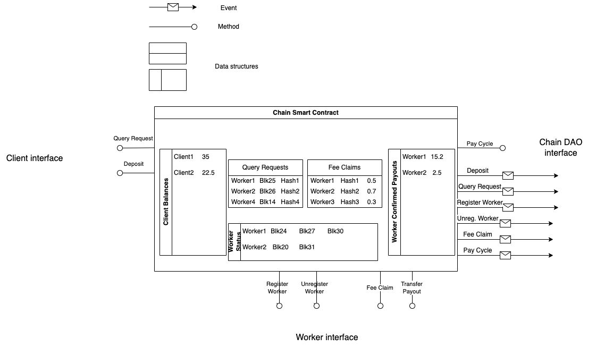
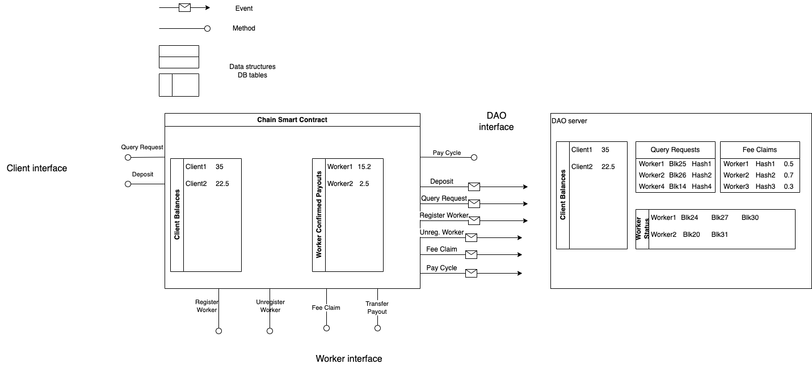
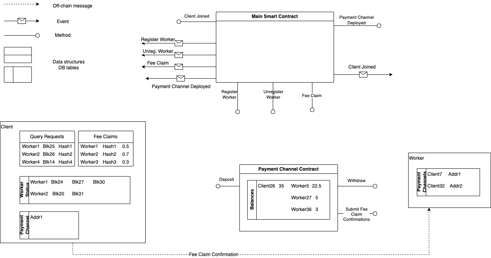
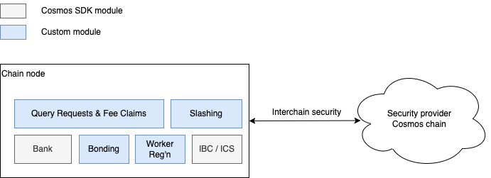
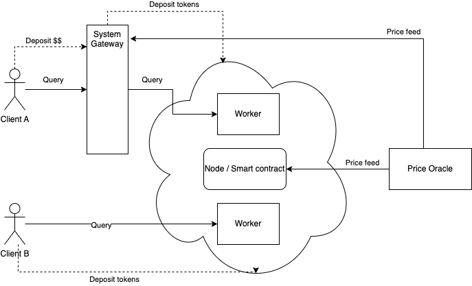

As crypto moves from financialisation to platform creation, on-chain micropayments lead to a new way of exchanging value.

# Introduction 

Blockchains are trust machines, capable of eliminating the need for trusted middlemen.  
As such, they naturally lend themselves to the creation of platforms. They enable the organic matching of supply and 
demand through pricing mechanisms, interaction transparency, and incentives.  
While platform creation is not new, the ability to do so in a trustless manner is revolutionary. Without relying on a 
trusted 3rd party, the value accrual is more equitably distributed among participants.  
This is encapsulated in the catchphrase "*your take is my opportunity*."

In the current financial system, high transaction costs and long payment settlement times often result in deferred 
payment for services. For instance, work may be completed over several days, but cleared and settled payment is received 
at the end of the month as a batch transaction.  
In the blockchain world, the ability for low fees and near-instant settlement, paves the way for a new 
paradigm: micropayments. Micropayments allow the payment of services as they are rendered, in small increments.

This blog post is an in-depth examination of different options for implementing micropayments on a blockchain 
platform.  

We will use a hypothetical example of a platform   
* matching **Clients**, in need of a service 
* with **Workers** providing that service. 
* The service in question is historical weather data[1](#footnote_1).

Let's see the outline of our system:  
* Clients make queries to the system. 
* They are matched with Workers, which provide the requested data. 
* The Workers are paid for their work by the Clients, upon successful completion of the query.
* Communication for query servicing is peer-to-peer, with workers identified by their unique system id (e.g. [libp2p 
  ID][3]).
* Workers can come and go, (un)registering themselves as (un)available for service. 

  
To make things a bit more interesting (and probably unrealistic), let's assume that    
* Clients will be making a query at least every second, 
* the returned data will be in the order of megabytes, and
* our ecosystem will be composed of 1000s of Clients and 1000s of Workers. 

Our imaginary project has already surpassed the minimum viable product (MVP) stage, with a working product and initial 
traction.  
Now, the team aims to achieve full decentralization and expansion, using their own native token.

# Core requirements

> Image generated by Bing Image Creator

This section outlines the core requirements and principles of (and around) our micropayment system. 
Some of these may appear obvious, but they are worth stating explicitly. They will be our guide in evaluating the 
different architecture options later on.

## Jobs to be done

These requirements come from putting ourselves in the [shoes of the system users][2].

1) **Timely responses**  
   From a Client’s PoV the main problem to solve using our imaginary system is that of retrieving data fast; payments 
   are just a means to an end. The payment solution should not add unnecessary overheads in the data querying lifecycle.
   In other words, a late payment should not cause a late query.  

2) **Trust & Skin in the game**  
   From the system’s / network’s PoV the primary concern is to establish trust between participants. Both Clients and 
   Workers should be equally incentivised to be good actors. This means that all participants should be forced to have 
   a comparable amount of “skin in the game”.  

3) **Focus on the job**  
   This is a corollary of the above.  
   The network must help both Clients and Workers to focus on developing code to meet their business goals, rather than 
   mitigate shortcomings of the payment mechanism.

## Other concerns

There are some additional concerns which are not directly related to the jobs to be done, but are still important to
consider.

4) **Value accrual for own token**  
   This is a common and key concern across web3 projects.  
   Decentralisation cannot be achieved through equity; it requires the issuance of a native token.[2](#footnote_2) 
   Following the web2 model of equity grants, web3 teams retain a reserve of tokens in their treasury to fund future 
   development. Therefore, the payment solution should be increasing the utility and value of the token by utilising it 
   as a medium of exchange. The flip side of this is that the payments solution should avoid any dependence on external 
   tokens, unless there is no other way. Such a dependency would dilute the overall utility of the native token and 
   leave it vulnerable to arbitrageurs.

5) **Price stability at low cost**    
   It is a well-known maxim that the price of digitised services trends towards zero. Therefore, the payment mechanism 
   should be able to function when prices for each interaction are utility-like (i.e. tiny amounts).

6) **Easy on-ramp**  
   Not all dApps and clients are equal in their abilities to transact. For various reasons, some may not be able or 
   willing to transact in the native token (e.g. they are a pure web2 business). The solution should provide a way for 
   them to easily get onboarded.  
   This creates a tension with [Requirement #4](#req_4).

7) **Minimize complexity**  
   A corollary of the above, this applies in 2 axes, technical and operational.  
   * **Technical**: A complex solution will probably require a complex client integration. This is an upfront cost to be 
   shouldered by someone, increasing barrier to entry & time-to-market.
   * **Operational**: At its core the payment rail is meant to facilitate a business proposition. It should not increase 
   the effort spent by the participants to participate in the network.[3](#footnote_3)
   
8) **Scalability**  
   Different system design approaches and options have their pros & cons. There is no one-size fits all with system 
   design. It should be clear what the downsides of the proposed solution(s) are and what is the roadmap to mitigate 
   them as network adoption grows.

# First thoughts

> Image generated by Bing Image Creator 

## Query requests  
The network (and by extension the payment mechanism) needs to secure both Clients and Workers from malicious behaviour 
on the other side of this Supply - Demand equation (Workers - Client). This means that the actions of both should be 
somehow recorded on-chain. In our case that means queries by Clients (demand) and responses by Workers (supply).
This would work towards [Req. #2](#req_2).

Client query requests could be submitted   
* before the fact, i.e. call the network to get something like a “query ticket”, or
* after the fact, i.e. submit the submitted query(ies), to automatically match with worker responses, reducing the 
possibility of need for arbitration or a trusted 3rd party.

## Web2 time vs Web3 time  
Web3 transactions are recorded and settled in blocks. Almost all existing blockchains have a block time of at least a 
few seconds (with notable claimed exceptions Aptos, Sui, Solana).  
On the other hand, our network’s clients will be making queries at least every second. [Req. #1](#req_1) demands that responses 
are fast; focus is on low latency as well as high throughput (i.e. “Web2 time”). This effectively rules out client 
query requests going via the blockchain/smart contract first ("query ticket" option).  
The block confirmation delay would be too much (i.e. "Web3 time").

The implication of executing queries out of band is a window of "free-loading" for clients, between the "wall clock" 
time they may have nominally exhausted their wallet and the time the queries are confirmed on-chain. This is something 
we will need to consider in the design of the payment mechanism.

## Payments and Payouts  
At a large scale, full on-chain micropayments become problematic. I.e. requiring the continuous real-time settlement of 
multiple payments per second, when blockchains offer transaction finality (block time) every few seconds.
We also have the additional concern of gas fees on some chains: fully settled account-to-account transactions cost gas 
(e.g. ~21,000 gas in the case of Ethereum). Since we are talking about micropayments, chances are it becomes uneconomical 
to finalise the transfer of individual payments to the Worker’s wallet in real-time. This naturally leads towards some 
form of payment batching.

One real-world analogy that we could consider here is that of a Payout or Invoice, already mentioned in the introduction 
section. Other than operational convenience, existing Web2 payment processors utilise gated Payouts to effect skin in 
the game for their counter-parties (e.g. longer payout periods for new or risky partners).

# System concepts

> Image generated by Bing Image Creator

This section discusses the different logical concepts and entities our system needs to keep track of.

## In scope

- **Clients**   
  They run queries on the network and pay a fee for each query.
- **Workers**  
  Workers join and leave the network in order to service queries. Each worker is identified by a libp2p peer ID and can 
  accept client queries.  
  To avoid being punished unecessarily (e.g. for scheduled downtime), Workers should be able to signal their availability 
  to Clients (e.g. on-chain, through a smart contract).
- **Client Balance**  
  Since blockchains are decentralised, there is no practical uncollateralised debt collection mechanism. Therefore 
  Clients need to deposit an amount in advance in order to use the services of the network. This balance is reduced with 
  every successful Fee Claim (see below).  
  A problem to solve here is how to handle the edge case when the balance gets "overdrawn" (i.e. Clients have consumed 
  more than their balance) and if being overdrawn should be allowed or not.
- **Worker Bonded Balance**  
  This is a concept ancillary to the payment system, but still worth mentioning.  
  To enforce a similar incentive for good behaviour (a.k.a. skin in the game) for Workers, they should be required to 
  have an amount bonded on-chain as guarantee.  
  If they behave maliciously, this amount can be slashed.
- **Fee claims**  
  Submitted by Workers upon the completion of a query.  
  Since we are aiming for maximum speed in query execution, the queries should be executed out of band. This means that
  a Worker needs to submit a Fee Claim to the network after the fact.  
  Viewed a bit more abstract, this is a recorded Client liability to be settled against the Client’s balance.
  For this mechanism to be effective we would need to  verify that  
   - the price charged corresponds to the actual amount of data processed, and
   - the Worker is not trying to claim a fee for a query they did not actually serve.
- **Worker registrations**  
  As mentioned above, the Workers join and leave the network through an on-chain mechanism. This creates the implicit 
  concept of scheduled uptime / downtime. This means that Workers  
   - should not be able to submit Fee claims for periods they were not online, and
   - the system needs a mechanism for Clients to legitimately prove their query went unanswered.  
     This proof is not an easy problem to solve.
- **Query requests**  
  Submitted by Clients as proof of the actual query. Matched against Fee Claims for automatic settlement.  
  Discussed in the [previous section](#query_req).
- **Payout**  
  A final transfer of a Worker’s confirmed and collected fees from the system's escrow account to the Worker’s wallet.

## To-do list

The items in this section are for reference only, not directly affecting the design of the payment solution. However, 
they should probably stay on the radar to ensure future extensibility.

- **Unit of account**  
  Clients and Workers have real-world operations (e.g. data centers) which are funded in fiat. Operating in the 
  platform's native token exposes them to currency risk and volatility (against [Reqs #3](#req_3) and [#7](#req_7)). 
  The system should allow for its internal operations to use a different denominator (e.g. prices denominated in USD, 
  but settled in the native token).
- **Pricing policy**  
  The pricing mechanism could introduce complexity to the overall design.  
  Do queries have a flat price across the network or they follow floating market rates? The price-per-unit (e.g. if 
  changing every few seconds) would need to be taken into account when considering Fee Claims.
- **Arbitration**  
  Whether with matching of Query Requests to Fee Claims or when using self-attested Fee Claims, the network would need 
  a mechanism for withholding payments while arbitration happens.  
  This could be triggered automatically (in the case of mismatched Query Request and Fee Claims) or manually, via a 
  dispute mechanism (in the case of "self-attested" Fee Claims).
- **Insurance fund**  
  This would be an additional network mechanism to establish trust and back-stop Worker financial loss.  
  It would be needed if there is no purely cryptography-based way to totally prevent Client bad behaviour.
- **Client credit line**  
  On a big enough scale, some parts of the network could be financialised. Creating the equivalent of a credit line 
  would allow Clients to continue operating even if they are late to top up their balance. There are a number of ways 
  this could be implemented (e.g. based on tenure on the platform, reputation,...)
- **Pooled Client & Worker ids**  
  Client and Worker identities are tied 1-to-1 to their private key (public address for Clients, derived libp2p id for 
  Workers). This means that the collateral mechanism (Client Deposits, Worker Bonds) also works on a 1-to-1 basis with 
  their wallets. Large-scale operators may need nominal identities in order to pool collateral across addresses for 
  operational efficiency.

With the above in mind, let’s look at some possible...

# System design alternatives

> Image generated by Bing Image Creator

## 1. All-in-one smart contract

In this setup, the micropayment solution is composed of a single smart contract. The contract contains all the 
entities described in the previous sections as data structures.  
The diagram above presents it as a single unit. In practice, it would probably be deployed as a collection of contracts, 
e.g. following the [Diamond Pattern][4].

The data structures contained in the contract are:  
- **Client Balances**: a map (`address → uint` in Solidity) containing the token amounts deposited by Clients, out of 
  which the fees are taken.    
  Updated by the `Deposit` function.
- **Worker Payouts**: similar map (`address → uint`) containing the sum of confirmed and withdrawable Worker fees in 
  the native token.  
  A Worker can withdraw their confirmed balance to their wallet with method `TransferPayout`.  
- **Fee Claims**: a map (`address → FeeClaimStruct[]`) of all the individual Worker Fee Claims for this payment cycle.  
  New items are added by Workers with method `Fee Claim`.
- **Query Requests**: a map (`address → QueryRequestStruct[]`) of confirmed queries submitted by Clients. It is matched 
  against Fee Claims.  
  New items are added by Clients with method `Query Request`. 
- **Worker Status**: a map (`address → uint[]`) of block heights in which the Worker went on-/off-line. Though there are 
  a number of ways to implement this, in this case the sequence is interpreted as `[on, off, on,…]`.  
  The array is modified by methods `(Un)RegisterWorker`.

The contract's methods have been visually grouped as interfaces exposed for different system actors. All smart contract 
methods emit an event at the end of their successful execution. 

The calculation cycle is kicked off at regular intervals (method `PayCycle`) by a wallet controlled by the maintenance 
team (e.g. by a DAO).

The `PayCycle` method's logic is roughly as follows:  
- Discard Query Requests and Fee Claims which do not agree with the Worker Status at that block height (i.e. impossible 
  to have interactions when a Worker was provably down).
- Match Query Requests and Fee Claims.  
  The matched Fee Claims are used to update the corresponding balances for Clients and Workers.
- Remove matched Query Requests and Fee Claims.

### Discussion

- The smart contract of this approach contains all the logic, making it transparent to (and auditable by) all network 
  participants. Execution would be fully decentralised, save for the need to trigger the `PayCycle` method.
- On the negative side, this design would not scale to more than a few participants.  
  At 1000s of Workers and Clients the required compute operations on the contract’s state would quickly exceed the block 
  gas limit[4](#footnote_4). This is contrary to [Req #8](#req_8).
- One way to go around the gas limit restriction would be to deploy the contract to a chain with high gas limits, like 
  Avalanche or Polygon. However, this would not address the overall high cost per operation.
- In addition, all participants would need to have the token of the underlying smart contract chain for fees, in 
  addition to the native token (e.g. BNB if deployed on Binance Chain). This would go against [Req #4](#req_4).

For these reasons, **this approach is not considered as viable** for anything other than a PoC.

## 2. Smart contract with off-chain calculations

This design tries to improve the shortcomings of the previous one.

- Client and Worker balances are kept on-chain in the smart contract.
- All smart contract methods are extremely simple and just emit a corresponding event (except `Deposit` and 
  `TransferPayout` which affect the balances by initiating token transfers).
- The events are consumed by an off-chain process controlled by the project team and/or the DAO.  
  From the point-of-view of the participants, this is the trusted 3rd party which maintains the state of the system in 
  a more efficient way.
- On regular intervals the off-chain process performs the payment calculations and calls the `PayCycle` method.  
  The difference is that it passes the results of the calculations to the smart contract, i.e. the balance adjustments.

### Discussion

- This solution trades off efficiency for centralisation, compared to the previous one.  
  The network participants will need to place trust on the code correctness (i.e. no bugs) and operational efficiency 
  (i.e. no missed smart contract events) of the DAO operator.  
  To an extent, this is going against [Req #2](#req_2).
- One way to mitigate the above is to make the code of the server process open source. Interested community members can 
  run it on their own and verify the results.  
  This option could be seen as going against [Req #3](#req_3).
- On the plus side, this solution allows the network to grow at a much faster pace ([Req #8](#req_8)). The core 
  team can iterate and optimise much faster when coding and deploying off-chain.
- Another thing to highlight is the `PayCycle` method.  
  Since all calculations take place off-chain, its payload is only the results, i.e. the value transfers. There are 2 
  ways this could be expressed:  
    1. Individual flows, i.e. an array of micro-amount transfers, each one like `{clientAddress, workerAddress, amount}`.
       Assuming 100s-to-1000s Workers and Clients, this payload would have in the order of 105 entries.
    2. Balance adjustments, i.e. an array of additions / subtractions to the participant balances, each one like this 
       `{clientAddress, -100}`. All of them would sum up to zero, as Workers would receive what is subtracted from Clients.  
       Worst case size for this would be 1000s of Workers + 1000s of Clients = 103 of entries.  
       This 2nd option, even though harder to verify, is the least worst option from a gas consumption and scalability 
       perspective.

This design solution, even though more centralised, is **a viable first step to get a payment system off the ground** and 
iterate/optimise on it quickly.

## 3. Payment channel contracts

This design alternative is a purer expression of the side-channels pattern (a.k.a. [state channels][6]).

In this approach things operate as follows:

1. A new Client joins the network (method and event `ClientJoined`).  
   On the back of the event, the DAO deploys a new `Payment Channel` contract to keep track of the liabilities of that 
   client. Once done, `PaymentChannelDeployed` method is called which emits the same-named event. This event is consumed 
   by the Client and all Workers, which store the address of the contract.
2. The Client deposits funds to the Payment Channel.
3. The Client listens for events `(Un)RegisterWorker` and `FeeClaim`.  Using those, along with its recorded 
   QueryRequests, the Client decides which FeeClaims are valid.
4. For each one of the `FeeClaims`, it sends a signed `FeeClaimConfirmation` out-of-band to the Workers (e.g. via HTTP, e-mail,...). 
   This is a signed message proving that the Client recognises a Worker Fee Claim as valid.[5](#footnote_5) 
5. The Workers submit these individually or in batches at their convenience to the corresponding Payment Channel contract(s). 
   This adjusts the balances and makes the funds available for the Workers to `Withdraw`. This could be further optimised
   by making withdrawal automatic on `FeeClaimConfirmation` submission.

### Discussion

This solution, even though more decentralised in nature, adds a lot of complexity and puts a lot more operational 
pressure on all participants.

- The DAO needs to deploy and maintain 100s - 1000s Payment Channels, one per Client. Depending on the Worker-to-Client 
  ratio, this could potentially be reduced by deploying one Channel per, say, Worker if their number is less. However, this 
  would have marginal effect to the rest of the system’s complexity.
- Clients need to maintain state internally (i.e. listening to events and not missing any of them) in order to 
  confidently sign off Workers’ Fee Caims. In addition, a fundamental assumption is that Clients are honest and will 
  immediately honor incoming Fee Claims.
- Workers have their balances (i.e. their ["accounts receivable"][7]) scattered across multiple contracts. In the case 
  of having one Channel per Worker, then we would have the opposite: Clients would have their ["accounts payable"][8] 
  scattered across multiple contracts.
- The overall arbitration and Client black-listing logic (i.e. stop clients when balance is zero), would need to keep 
  track of all deployed contracts.

On balance, this approach brings in a lot of complexity (against Req's [#3](#req_3) and [#7](#req_7)) for debatable 
decentralisation benefits. So **it is not considered as viable**.

## 4. Separate chain

> Note: This section is descriptive rather than prescriptive.    
> It uses Cosmos SDK as an example, not as a strict recommendation. Same results can be achieved with other technologies 
> (e.g. Polkadot, Avalanche,...)

This approach is the logical next step in the evolution of the network. With the lessons learnt from the deployment as 
a smart contract, the team can build a more robust network.

The logic and concepts discussed in previous sections are implemented as components of the node’s logic. In this 
example, they are depicted as custom Cosmos modules, working alongside the standard ones.

### Discussion

As state is stored inside the node (e.g. in Cosmos’ [key-value store][9]) and processed in native code, execution can be 
optimised as with the "Off-chain calculations" option discussed previously.

In addition, the network can optimise and fine-tune gas fees and block size to accommodate volume and (dis)incentivise 
participant behaviour. For example, `FeeClaim` methods can be made expensive in terms of gas (to prevent spam) but 
`Withdraw` methods can be free (to enable withdrawals of ["dust payments"][10]). This is in contrast with a smart 
contract platform, where all interactions and computations are treated equally and cost (proportionally) the same.

Considering the overhead of deploying a new chain vs deploying a smart contract:  
There is a plethora of options to deploy a sovereign L1 or L2, without the hassle of assembling validators. Cosmos 
[Interchain Security][11], Polkadot [parachains][12], Avalanche [Subnets][13],... (and the list goes on) are all frameworks 
which dramatically lower the threshold for launching a separate chain.  
It is still a considerable upfront development investment though, compared to a smart contract solution.

For these reasons, this **is a viable solution past a certain network size** and as part of a wider strategic roadmap.
``
## Extra: Trusted facilitator & Oracles

> Note: The solution / components in this section are orthogonal to the previous ones.  
> I.e. they can be combined with any of them in order to augment them.

### Gateway

- The Gateway is a centralised system maintained by the project team / DAO.  
  It offers API access to the network, accepting payments and subscriptions in fiat and/or other crypto. It then 
  abstracts and hides away all the mechanics of interacting with the network (depositing the native token, submitting 
  Fee Claims,...)
- This helps facilitate onboarding of smaller Clients (Req's [#3](#req_3) and [#6](#req_6)).  
  It is a widely adopted approach, used by e.g. [Covalent][14], [Cheqd][15] and other service marketplace networks to 
  ease customer onboarding.

### Price Oracle

Introducing an external price oracle helps address the "Unit of Account" concern mentioned previously.

There are 4 possible configurations of a unit of account for the network. Let's explore them and see in which case we 
would need a Price Oracle.  
- **Prices in fiat, transactions in stablecoin**  
  Workers advertise their prices in fiat (e.g. USD) and get paid in stablecoin. This would be easy to adopt for 
  participants, but against [Req #4](req_4).  
  In this case, we do not need an external Price Oracle.
- **Pegged native token, nominal prices in fiat**  
  In this case, the network would be operating a ["closed capital account"][16] policy.
  To prevent arbitrage, the native token would only be convertible and redeemable inside the network, rather than at 
  external exchanges.  
  No Price Oracle needed in this case.
- **Free-floating native token, nominal prices in token**  
  This would be the least complex option from an implementation PoV, but arguably the worst option from a participant 
  convenience PoV.  
  Clients and Workers are "paying their bills" in fiat. Introducing a new currency (with probably high volatility) would 
  make it hard for participants to perform accounting in periods of high volatility.  
  No Price Oracle needed.
- **Free-floating native token, nominal prices in fiat**  
  In this case the native token is listed on exchanges with a free-floating price. For network participant convenience,
  prices are denominated in fiat.  
  In this case, we need an external Price Oracle to perform conversions at the point of transaction.

# Roadmap

> Image generated by Bing Image Creator

Given the above options and discussion of viable options, the next step  think of a high level roadmap to evolve the 
network and the micropayments component.

1. **Gateway**  
   This component is the most straightforward to implement. It is a centralised system (API server + database + payment 
   integration), so it does not require any blockchain expertise. Evolving this offering in the early days would be no 
   different to any existing SaaS product. It will allow the core team to experiment with pricing and go-to-market 
   strategies, while their engineering team works on...
2. **Smart contract with off-chain calculations**  
   There are different moving parts in decentralising the solution, from tokenomics to fine-tuning incentives to 
   reacting to unexpected actor behaviour. Deploying a central smart contract while keeping the bulk of the logic 
   off-chain, gives maximum flexibility to try things and pivot quickly. Also, as discussed, it can also scale quickly 
   if/when the network becomes an early runaway success.  
   With the lessons learnt from this stage, the team can then focus on building their...
3. **Independent chain**  
   Since this is further out in the future, there are a number of options on the table: from choosing based on the 
   team’s technical strength (e.g. Golang vs. Rust vs. C++) to top-down strategic direction (e.g. partnerships with 
   an L1 like Polygon, Polkadot, etc)

# Parting thought

> Photo by Quino Al on Unsplash

With the digitisation of everything, the need for crypto micro-payments is only going to increase.   
Hopefully this blog post has given you some food for thought on how to approach this problem.

Until next time, excelsior!

# Footnotes

1. The discussion in this blog post can be generalised to any type of electronic service (e.g 
   queries for data, provision of compute, provision of storage, etc). Things become harder once we get into the realm 
   of physical goods and services (e.g. Uber, [Fiverr][1]). In this case we need more moving parts, the most important 
   of which are digital identity and real-world verification of delivery.
2. Equity is issued under an existing legal framework (e.g. US securities law). This not only 
   imposes legal overhead, but is also a barrier to entry for people the government does not welcome. E.g. consider 
   the US' wholesale sanctioning of other countries' citizens. 
3. An example of uneeded operational complexity: The payment rail forces participants to hedge 
   currency risk in their asset book.
4. For example Ethereum has a [maximum block gas limit of 30 million][5], with a target of 15 
   million. An SSTORE operation to add a new entry to a data structure is 20,000 gas. For 1000 active Clients, simply 
   populating the QueryRequests structure would consume 20 million gas. If we include the other logic tasks required, we 
   would easily exceed the block’s gas limit. This would prove a hard runtime limit, without even considering the costs 
   that would be incurred during execution.
5. This can be considered the same as an IRL self-signed check or promissory note. 

  [1]: https://www.fiverr.com/
  [2]: https://www.coursera.org/articles/jobs-to-be-done
  [3]: https://libp2p.io/
  [4]: https://eip2535diamonds.substack.com/p/introduction-to-the-diamond-standard
  [5]: https://ethereum.org/en/developers/docs/gas/#block-size
  [6]: https://ethereum.org/en/developers/docs/scaling/state-channels/
  [7]: https://www.investopedia.com/terms/a/accountsreceivable.asp
  [8]: https://www.freshbooks.com/hub/accounting/accounts-payable
  [9]: https://docs.cosmos.network/v0.46/core/store.html
  [10]: https://www.gemini.com/cryptopedia/basics-of-crypto-dusting
  [11]: https://cosmos.github.io/interchain-security/introduction/technical-specification
  [12]: https://wiki.polkadot.network/docs/learn-parachains
  [13]: https://docs.avax.network/learn/avalanche/subnets-overview
  [14]: https://www.covalenthq.com/
  [15]: https://cheqd.io/
  [16]: https://www.investopedia.com/terms/c/capitalaccount.asp
