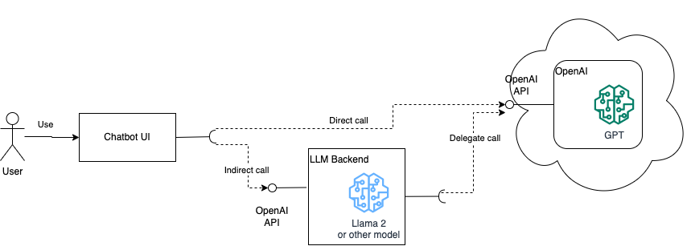

Large Language Models can be a force multiplier for a multitude of use cases. This post focuses on how to 
integrate LLMs in the backend.   

# Introduction 

Large Language Models (LLMs) are the newest and coolest kid on the block. Their core 
function is to understand and produce text in a manner that closely resembles human cognition.  
While the concept of machines processing and producing language isn't new, the scale and accuracy achieved by recent 
LLMs have transformed the discourse around their potential applications.

LLMs trace their origins back a few years.  
As computational power and research methodologies advanced, these models expanded in complexity, evolving from simple 
text predictors to sophisticated language processors capable of tasks ranging from content creation to code assistance.

One notable advancement in the LLM domain was the release of ChatGPT by OpenAI.  
Its widespread availability marked a significant shift in the AI landscape, providing both researchers and the broader 
public unprecedented access to top-tier language processing capabilities. This model and its subsequent iterations 
underscored the significance of LLMs and set the stage for their broader adoption in various industries.

In this article, I will provide a brief introduction to the inner workings of LLMs, before getting our hands dirty 
coding with them.

## Inside an LLM

> Image generated by Bing Image

At their core, Large Language Models (LLMs) are a form of deep learning, leveraging neural networks to understand and 
generate text.    
Let's look at some basic concepts to get a better understanding.

### The Analogy of Training a model

Training an LLM (or any neural network, for that matter) is akin to teaching a child to recognize patterns.  
Over time, with exposure to various examples, the child begins to understand and predict those patterns.  
LLMs function in a similar way.  
They're exposed to vast amounts of text data and learn to recognize patterns in language. Through this 
process, they develop an understanding of grammar, context, language use, and even nuances like sarcasm and humor.

### Tokens, Model Size, and Context Windows

In LLMs, language is broken down into units called "tokens". A token can be as short as one character or as long as one 
word. For example, the phrase "LLMs are amazing" might be divided into tokens like `["L", "L", "M", "s", " are", 
" amazing"]`. Tokens are then mapped to a unique numeric value, like a dictionary, which is how the model "understands" 
the text.

Model size, often denoted in billions of tokens, is the neural network's capacity. A larger model size means 
the LLM has been trained on more tokens, making it potentially more knowledgeable and accurate. However, this also means 
more resources are required to operate it.

The "context window" refers to the amount of recent information (in tokens) the model can consider when generating a 
response. If you've ever wondered why an LLM might forget a question after a long conversation, it's due to the 
limitations of this context window.

### Inference and Temperature

"Inference" is the process by which the model generates responses or predictions. Once trained, the LLM doesn't "think" 
or "reason" like humans. Instead, it uses its learned patterns to generate the most likely next sequence of tokens based 
on the input.[1](#footnote_1)

"Temperature" is a parameter used during inference. A higher temperature makes the model's output more random, whereas 
a lower temperature makes it more deterministic. Think of it as adjusting the model's level of creativity: too high, 
and it might produce wild results; too low, and it might be too predictable.

## Open- vs closed-source LLMs

In the world of Large Language Models (LLMs), there's a critical distinction to understand: the difference between open 
and closed-source implementations.  
This distinction is not purely about the accessibility of the code but more about the accessibility and distribution of 
the trained model itself.

### The Two Parts: Code and Weights

LLMs essentially have two primary components: the code and the weights. The code is the blueprint, typically a few 
hundred lines or less, that dictates the architecture and functioning of the neural network. This piece is often 
open-source and can be viewed, modified, and used by anyone.

However, the real essence of an LLM lies in its weights.  
Think of weights as the accumulated knowledge from the training data. They determine how the model responds to 
different inputs. Training an LLM to achieve these weights is where most of the time, data, and computational resources 
are expended.  
The model weights are the real intellectual property of an LLM. 

### The Cost and Value Proposition

Training a high-quality LLM is not trivial; it demands vast computational resources and large datasets, translating to 
significant costs. For companies like OpenAI (with models like ChatGPT) and Anthropic, these costs mean that their most 
advanced models' weights remain proprietary and behind paywalls. By keeping the models closed-source (and needing pay 
for their use), they can recoup investment costs and fund future research.

On the other hand, some organizations, like Meta, have taken a different approach by open-sourcing their model weights. 
This democratizes access to advanced AI capabilities, fostering community-driven enhancements and applications. However, 
it's essential to understand that even with open-sourced weights, using the model at scale will still require 
significant computational resources, which can be costly.

### The Implications

The open- versus closed-source approach in the LLM world has implications for innovation, accessibility, and business 
models.  
Open-source models can accelerate research and democratize AI, but they also raise questions about misuse and 
the potential for harmful applications. Conversely, closed-source models can ensure quality control and security, but 
might limit what can and cannot be done and by whom.

## Chatting with a Model

The ability to converse with LLMs, like ChatGPT, is undoubtedly fascinating. It's not just about inputting a question 
and getting a response; there's a deeper underlying process that enables these models to generate contextually accurate 
replies. But how does this conversation actually take place?

### The Power of Context

Every time you send a chat message to an LLM, it doesn't just see that message in isolation. Instead, it takes into 
account the context, which includes prior messages in the conversation. This context is crucial because it helps the 
model maintain a coherent and relevant dialogue. For instance, if you ask the model a question and then follow up with 
another related query, the model uses the context of the first question to ensure the second response is consistent and 
relevant.

### Building on Inferencing

While it might seem like the LLM is "chatting", what's actually happening is a series of inferencing operations. The 
term "inferencing" refers to the process where the model uses its trained weights to generate a response based on the 
provided input (along with context). Each question posed to the LLM triggers an inference, and the response generated 
is the model's prediction of the most appropriate reply based on its training.

### The Importance of History

Remember the "context window" mentioned earlier?  
It plays a vital role in conversations. LLMs have a limit to how much previous conversation they can "remember" or 
consider when generating a response. If a conversation is too long, older parts of it might fall out of this window. 
This is why, in prolonged interactions, an LLM might seem to "forget" earlier parts of the conversation.

### Achieving Natural Interactions

One of the primary goals in conversing with LLMs is to achieve natural, human-like interactions. To facilitate this, 
developers often integrate mechanisms like adjusting the "temperature" to make responses more creative or deterministic 
based on the application's requirements. There's also ongoing work in fine-tuning models with specific datasets to make 
them more adept at specialized conversations.

# Our project

The UI of ChatGPT has become the de-facto standard for interacting with LLMs.    

In this setup, the single-page application running in the user's browser, calls the OpenAI API to generate responses 
(direct call).

Let's build on that and create a backend that will:
* emulate the OpenAI API,
* operate as a proxy to the OpenAI API (e.g. grouping chat operations for a whole team, to reduce token consumption), and 
* allow us to transparently switch between OpenAI and our own LLM implementation. 

From a high level, our prototype will look like the following diagram:

> High level design of our prototype

Now that we have a target, it's time to...

# Let's get coding

## v1 - Setup & calling OpenAI  

## v2 - ???  

## Intro to a local LLM

## v3 - Integrating with Llama

## v4 - Deploying to a GPU cloud

### Performance comparison 

# Parting thought

> Photo by Quino Al on Unsplash

Until next time, excelsior!

# Footnotes

1. E.g. assuming the model has trained on English kids' songs, then given the input "Mary had a 
   little", it would likely predict "lamb, little lamb, little lamb" as the next few tokens. 

  [1]: 