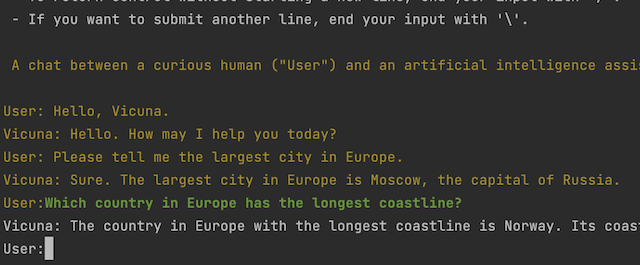
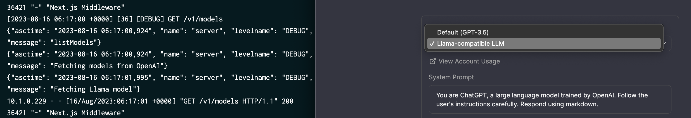
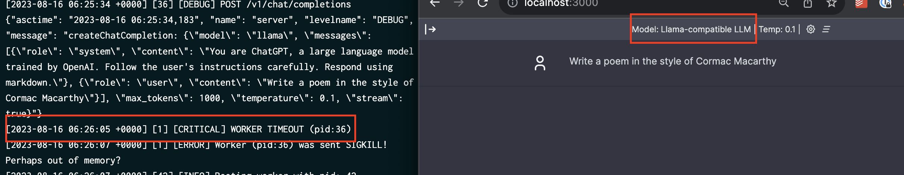
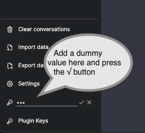

Large Language Models can be a force multiplier for a multitude of use cases. This post focuses on how to 
integrate LLMs in the backend.   

# Introduction 

Large Language Models (LLMs) are the newest and coolest kid on the block. Their core 
function is to understand and produce text in a manner that closely resembles human cognition.  
While the concept of machines processing and producing language isn't new, the scale and accuracy achieved by recent 
LLMs have transformed the discourse around their potential applications.

LLMs trace their origins back [a few years][1].  
As computational power and research methodologies advanced, these models expanded in complexity, evolving from simple 
text predictors to sophisticated language processors capable of tasks ranging from content creation to code assistance.

One notable advancement in the LLM domain was the [release of ChatGPT][2] by OpenAI.  
Its widespread availability marked a significant shift in the AI landscape, providing everyone with unprecedented access 
to top-tier language processing capabilities. This model and its subsequent iterations have
underscored the significance of LLMs and set the stage for their broader adoption in various industries.


In this article, I will provide  
* a brief introduction to the inner workings and key concepts of LLMs, and 
* (most importantly) get our hands dirty in a step-by-step guide.

## Inside an LLM


> Image generated by Bing Image

At their core, Large Language Models (LLMs) are a form of deep learning, leveraging [neural networks][3] to understand and 
generate text.    
Let's look at some basic concepts to get a better understanding.

### The Analogy of Training a model

Training an LLM (or any neural network, for that matter) is akin to teaching a child to recognize patterns. 
Over time, with exposure to various examples, the child begins to understand and predict those patterns.  
LLMs function in a similar way.  
They're exposed to vast amounts of text data and learn to recognize patterns in language. Through this 
process, they develop an understanding of grammar, context, language use, and even nuances like sarcasm and humor.

### Tokens, Model Size, and Context Windows

In LLMs, language is broken down into units called ["tokens"][4]. A token can be as short as one character or as long as one 
word. For example, the phrase "LLMs are amazing" might be divided into tokens like `["L", "L", "M", "s", " are", 
" amazing"]`. Tokens are then mapped to a unique numeric value, like in a dictionary. The numeric value is how the model 
"understands" the text.

Model size, often denoted in billions of tokens, is the neural network's capacity. A larger model size means 
the LLM has been trained on more tokens, making it potentially more knowledgeable and accurate. However, this also means 
more resources are required to operate it.

The "context window" refers to the amount of recent information (in tokens) the model can consider when generating a 
response. For example, if the context window is 10 tokens, the model will only consider the last 10 tokens when 
generating a response. A larger context window means the model can consider more information, i.e. have a longer "memory". 

### Inference and Temperature

"Inference" is the process by which the model generates responses or predictions. Once trained, the LLM doesn't "think" 
or "reason" like humans. Instead, it uses its learned patterns to generate the most likely next sequence of tokens based 
on the input.<sup>[1](#footnote_1)</sup>

"Temperature" is a parameter used during inference. A higher temperature makes the model's output more random, whereas 
a lower temperature makes it more deterministic. Think of it as adjusting the model's level of creativity: too high, 
and it might produce wild results; too low, and it might be too predictable.

## Open- vs closed-source LLMs

In the world of Large Language Models (LLMs), there's a critical distinction to understand: the difference between open 
and closed-source implementations. This distinction is not purely about the accessibility of the code but more about 
the accessibility and distribution of the trained model itself.

### The Two Parts: Code and Weights

LLMs essentially have two primary components: the code and the weights. The code is the blueprint, typically a few 
hundred lines or less, that dictates the architecture and functioning of the neural network. This piece is often 
open-source and can be viewed, modified, and used by anyone.

However, the real essence (the "secret sauce") of an LLM lies in its weights.  
Think of weights as the accumulated knowledge from the training data. They determine how the model responds to 
different inputs. Training an LLM to achieve these weights is where most of the time, data, and computational resources 
are expended.  

### The Cost and Value Proposition

Training a high-quality LLM is not trivial; it demands vast computational resources and large datasets, translating to 
significant costs. For companies like [OpenAI][5] (with models like ChatGPT) and [Anthropic][6], these costs mean that their most 
advanced models' weights remain proprietary and behind paywalls. By keeping the models closed-source (and needing pay 
for their use), they can recoup investment costs and fund future research.

On the other hand, some organizations, like Meta, have taken a different approach by [open-sourcing their model weights][7]. 
This democratizes access to advanced AI capabilities, fostering community-driven enhancements and applications. However, 
it's essential to understand that even with open-sourced weights, using the model at scale will still require 
significant computational resources, which can be costly.

## Chatting with a Model

Conversing with LLMs, like ChatGPT, is fascinating, as through the conversation, the models are able to generate 
contextually accurate replies.

### The Power of Context

Every time you send a chat message to an LLM, it doesn't just see that message in isolation. Instead, it takes into 
account the context, which includes prior messages in the conversation. This context is crucial because it helps the 
model maintain a coherent and relevant dialogue. For instance, if you ask the model a question and then follow up with 
another related query, the model uses the context of the first question to ensure the second response is consistent and 
relevant.  
In simple words, the interface resends the conversation history to the model every time you send a new message.<sup>[2](#footnote_2)</sup> 

### Building on Inferencing

While it might seem like the LLM is "chatting", what's actually happening is a series of inferencing operations. The 
term "inferencing" refers to the process where the model uses its trained weights to generate a response based on the 
provided input (along with context). Each question posed to the LLM triggers an inference, and the response generated 
is the model's prediction of the most appropriate reply based on its training.

### The Importance of History

Remember the "context window" mentioned earlier?  
It plays a vital role in conversations. LLMs have a limit to how much previous conversation they can "remember" or 
consider when generating a response. If a conversation is too long, older parts of it might fall out of this window. 
This is why, in prolonged interactions, an LLM might seem to "forget" earlier parts of the conversation.

With the introduction of basic concepts out of the way, let's move on to...

# Our project

The [UI of ChatGPT][8] has become the de-facto standard for interacting with LLMs.    

In the ChatGPT setup, the single-page application running in the user's browser, calls the OpenAI API to generate 
responses (direct call).

We will build on that and create a backend that will:
* emulate the OpenAI API,
* operate as a proxy to the OpenAI API (e.g. grouping chat operations for a whole team, to reduce token consumption), and 
* allow us to transparently switch between OpenAI and our own LLM implementation. 

From a high level, our prototype will look like the following diagram:


> High level design of our prototype

To keep things simple, I will not implement a chat UI from scratch.  
Instead, I will fork and use the [Chatbot UI][9] from Mackay Wrigley.  

Now that we have a target architecture...

# Let's get coding

The code for this post is split between two repositories:  
* [chatbot-ui](https://github.com/sgerogia/chatbot-ui) - the UI, forked from Mackay Wrigley's [Chatbot UI][9]
* [llm-backend](https://github.com/sgerogia/llm-backend) - the backend service 

As we improve the code in each section below, we will be referring to the corresponding branch (`v1`, `v2`, etc).    
Clone the code and switch to the appropriate branch to follow along.

## v1 - Setup & calling OpenAI  

Switch to the `v1` branch in both projects and install the dependencies as described in the README. You will also need 
to create an OpenAI account and get an [API key][13].

In this initial version, the goal is to create a Python service, which  
* emulates the OpenAI API, and 
* acts as a pass-through proxy for `chatbot-ui`.

The quickest way to achieve this is by using [Connexion][10], a framework to process HTTP requests based on an OpenAPI 
definition.  
We download the [OpenAI API reference][11] and modify the [`operationId`][12] so that Connexion can map to the right 
handler. The [chat handler][14] is the only one implemented and is a simple pass-through to the OpenAI API.

Let's run the 2 services and see them in action.  
From inside the `llm-backend` directory run `OPENAI_KEY_BASE64=<YOUR_OPENAI_API_KEY_IN_BASE64> tilt up`. This will 
start the service and the UI client in a local K8s cluster.  
Then open your browser at `http://localhost:3000` to post a chat in the UI client.<sup>[3](#footnote_3)</sup>    
You can monitor the logs of both services in the [Tilt UI][15]. 


## v2 - Decomposing the OpenAI API

This version of [llm-backend](https://github.com/sgerogia/llm-backend/tree/v2) is functionally identical to `v1`.  
The difference lies in us creating an explicit [set of model classes][16] to represent the OpenAI Chat API. These will 
allow us to plug in our own LLM implementation in the next version.

Feel free to explore the code and run the local tests `make test`

## Brief diversion - Intro to llama.cpp


> Photo by Timothy Eberly on Unsplash

Before we move on to the next version, let's take a brief detour and introduce the LLM implementation we will be using:
[Meta's Llama][7]. 

The release of Llama's weights<sup>[4](#footnote_4)</sup> sparked a huge wave of innovation in the LLMs. An 
industry-strength model, available for all to experiment with.   
There is an [ever-increasing list][18] of fine-tuned models, all using Llama's weights as a starting point. 

Another innovation was the release of [llama.cpp][19], a port of Llama's codebase to C++, allowing the execution of 
inference on a desktop machine, using a [quantised][20] (read memory-compressed) model.  

Let's use llama.cpp offline (or better a Python wrapper over it). We will generate a few responses and see how it performs.  
> Notes: 
> * You will need to have several GB of free RAM to follow along.
> * Detailed instructions can be found [here][21].

The following one-liner  
* fetches a Python wrapper
* compiles the project for a Mac GPU, and
* downloads the [Vicuna][22] 13 billion token 5bit quantised model (>9Gb in size).  
```bash
cd <somewhere_with_enough_space>
git clone https://github.com/fredi-python/llama.cpp.git \
  && cd llama.cpp \
  && make -j LLAMA_METAL=1 \
  && cd models \
  && wget -c https://huggingface.co/CRD716/ggml-vicuna-1.1-quantized/resolve/main/ggml-vicuna-13B-1.1-q5_1.bin
```

With the model downloaded, let's see it in action. Run the following to start it in interactive mode, then type your 
prompt.     
```bash 
./main \
  -m models/ggml-vicuna-13B-1.1-q5_1.bin \
  --repeat_penalty 1.0 \
  --color -i \
  -r "User:" \
  -f prompts/chat-with-vicuna-v1.txt
```

You will get something like the following output.  


Awesome! 🎉

We are now ready to use our own model in our backend service.

## v3 - Integrating with Llama

Let's switch to branch `v3` in both [chatbot-ui](https://github.com/sgerogia/chatbot-ui/tree/v3) and 
[llm-backend](https://github.com/sgerogia/llm-backend/tree/v3).  

In this version of the `llm-backend` code we have:  
* the ability to [configure a local LLM model][25] via an env. variable,
* updating the [models][28] endpoint to inform the frontend on additional models, and 
* separate chat controller classes for [OpenAI][26] and [local Llama][27] processing.

The only (tiny) change we do to `chatbot-ui` is to add our custom [Llama model][29] to the list of options. This will 
allow the frontend to instruct the backend to use our local model.

We can run the test suite with  
```bash
OPENAI_API_KEY=<YOUR_OPENAI_KEY> LLAMA_MODEL_FILE=/path/to/local_quantised_file.bin make test
````  
Notice the performance difference between the OpenAI and the local Llama model tests in the unit test timings printed 
at the end of the execution. You can experiment with different [token batch sizes][33] to see how it affects speed (with 
1 being the extreme).  
Depending on your machine and the size of the model, the local Llama tests may even timeout. In this case you may want
to try with a (much) smaller model, e.g. [Llama2 7Billion 2bit][31].

Fix the [hard-coded model path][30] in the `Tiltfile` and let's see it in action, in our local K8s cluster.<sup>[6](#footnote_6)</sup>  
```bash
`OPENAI_KEY_BASE64=<YOUR_OPENAI_API_KEY_IN_BASE64> tilt up`
```

We can see that the front-end picks up the new model as an option.  


We type our prompt and...  


Nothing!  
The worker times out (on my machine).  
Our local K8s cluster is setup without any mounted GPU, so inference takes too long using only the CPU.

Time to bring out the big guns!

## v4 - Deploying to a GPU cloud


> Photo generated by Bing Image 

Since LLM inference is millions upon millions of numeric calculations, using a GPU it the way to go. 
We will need to make some changes to be able to deploy our service to a GPU cloud.  

Let's switch to branch `v4` in `'llm-backend`.  
We will be using [RunPod][32]<sup>[7](#footnote_7)</sup> as our cloud provider. 

Our code is working fine, so the focus is creating the right Docker image. Namely we need to:  
* have a GPU-enabled base image, and
* ensure that llama-cpp is correctly compiled with GPU support.

Using one of TheBloke's [base images][34] and scripts as a guide, we end up with  
* a Runpod-specific [Dockerfile][35], and
* 


### Performance comparison 

# Parting thought


> Photo by Quino Al on Unsplash


Until next time, excelsior!


# Footnotes

1. <a name="footnote_1"></a>E.g. assuming the model has trained on English kids' songs, then given the input "Mary had a 
   little", it would likely predict " lamb, little lamb, little lamb" as the next few tokens. 
2. <a name="footnote_2"></a>In essence chatting with an LLM is the equivalent of asking the question "Given all these 
   previous conversations between the human and the LLM, what would you say next?".
3. <a name="footnote_3"></a>Add a dummy `OpenAI API key` in the corresponding bottom-left field to enable the interface.    
   
4. <a name="footnote_4"></a>Initially [by mistake][17], but later as a deliberate choice.
5. <a name="footnote_5"></a>You can download any other GGML quantised Llama-compatible model, with any different quantisation,
   like Alpaca, Llama 2,...(e.g. a small list [here][23]). [HuggingFace][24] is a great starting point to search for 
   GGML models.
6. <a name="footnote_6"></a>You may need to wipe out your local cluster first with `tilt down --delete-namespaces`.
7. <a name="footnote_7"></a>I have chosen to deploy to [RunPod][32] only because I found it easier to use. This is not a 
   recommendation nor is there an affiliation with RunPod.


   [1]: https://insidebigdata.com/2023/07/17/brief-history-of-llms/
   [2]: https://openai.com/blog/chatgpt
   [3]: https://www.ibm.com/topics/neural-networks
   [4]: https://learn.microsoft.com/en-us/semantic-kernel/prompt-engineering/tokens
   [5]: https://openai.com/
   [6]: https://www.anthropic.com/
   [7]: https://ai.meta.com/llama/
   [8]: https://chat.openai.com/
   [9]: https://github.com/mckaywrigley/chatbot-ui
   [10]: https://github.com/spec-first/connexion
   [11]: https://github.com/openai/openai-openapi
   [12]: https://github.com/sgerogia/llm-backend/blob/v1/openapi/llm_backend.yaml#L14
   [13]: https://platform.openai.com/account/api-keys
   [14]: https://github.com/sgerogia/llm-backend/blob/v1/llm_backend/controllers/chat.py#L31
   [15]: http://localhost:10350/r/llm-backend/overview
   [16]: https://github.com/sgerogia/llm-backend/tree/v2/llm_backend/models
   [17]: https://www.reddit.com/r/deeplearning/comments/11hezvk/metas_llama_weights_leaked_on_torrent_and_the/
   [18]: https://www.reddit.com/r/LocalLLaMA/wiki/models/
   [19]: https://github.com/ggerganov/llama.cpp
   [20]: https://towardsdatascience.com/4-bit-quantization-with-gptq-36b0f4f02c34
   [21]: https://github.com/sgerogia/llm-backend/blob/v3/LLAMA_MODELS.md
   [22]: https://lmsys.org/blog/2023-03-30-vicuna/
   [23]: https://huggingface.co/TheBloke/Llama-2-13B-chat-GGML/tree/main
   [24]: https://huggingface.co/models
   [25]: https://github.com/sgerogia/llm-backend/blob/v3/server.py#L31
   [26]: https://github.com/sgerogia/llm-backend/blob/v3/llm_backend/controllers/chat.py#L37-L86
   [27]: https://github.com/sgerogia/llm-backend/blob/v3/llm_backend/controllers/chat.py#L89-L160
   [28]: https://github.com/sgerogia/llm-backend/blob/v3/llm_backend/controllers/models.py
   [29]: https://github.com/sgerogia/chatbot-ui/blob/v3/types/openai.ts#L15
   [30]: https://github.com/sgerogia/llm-backend/blob/v3/Tiltfile#L11-L12
   [31]: https://huggingface.co/TheBloke/Llama-2-7B-Chat-GGML/resolve/main/llama-2-7b-chat.ggmlv3.q2_K.bin
   [32]: https://www.runpod.io/
   [33]: https://github.com/sgerogia/llm-backend/blob/v3/llm_backend/services/llama_model_service.py#L47
   [34]: https://github.com/TheBlokeAI/dockerLLM/tree/main/cuda11.8.0-ubuntu22.04-oneclick 
   